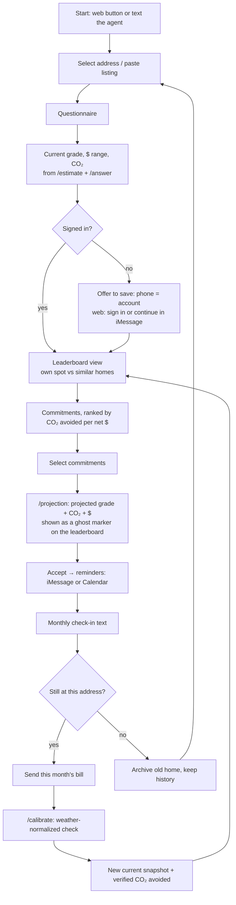

# NEW_CHANGES.md: Hidden Rent Phase 2 (accounts, commitments, verified carbon reductions)

**Status:** proposed design. It is additive to `PLAN.md` and doesn't replace it.
**Merges:** "NEW_CHANGES: persistent accounts, commitments, progress and reminders", the Phase 2 flow sketch, and `web/HOUSE_SCHEMA.md` (on `p3/map-widget`), all as of Oct 4, 2026.
**Audience:** P1–P4 agents and teammates. An agent with zero context should be able to start from this file plus `PLAN.md`, `DEV_STRATEGY.md`, its task file and `notes/`.

> **Rules that still apply.** `PLAN.md` §0 (no secrets, no invented numbers, the agent only says API numbers), the §10 contract (additive changes only, via `notes/contract-changes.md`), directory ownership (P1 `/model`, P2 `/api`, P3 `/web`, P4 `/agent`), mocks-first behind one switch, and the `main`/`dev` branch rules in `DEV_STRATEGY.md`.

> **About numbers in this file.** Every figure is either cited (§24 lists the sources) or written as a placeholder like `‹from /projection›`. Example messages show *shape*, never real values. Anything shown to a user must come from code and data.

---

## Contents
0. [The idea in one page](#0-the-idea-in-one-page)
1. [Why: the sustainability case](#1-why-the-sustainability-case)
2. [Principles](#2-principles)
3. [What exists today and what's missing](#3-what-exists-today-and-whats-missing)
4. [The user journey](#4-the-user-journey)
5. [Identity and accounts](#5-identity-and-accounts)
6. [Building data: footprints, addresses and sources](#6-building-data-footprints-addresses-and-sources)
7. [Data model](#7-data-model)
8. [Commitments](#8-commitments)
9. [Projection: what a commitment *could* do](#9-projection-what-a-commitment-could-do)
10. [Verification and carbon accounting: what actually happened](#10-verification-and-carbon-accounting-what-actually-happened)
11. [Leaderboard: reward reductions, not privilege](#11-leaderboard-reward-reductions-not-privilege)
12. [Messaging cadence: monthly check-ins and task reminders](#12-messaging-cadence-monthly-check-ins-and-task-reminders)
13. [Google Calendar (optional)](#13-google-calendar-optional)
14. [API additions (additive)](#14-api-additions-additive)
15. [Ownership and tasks](#15-ownership-and-tasks)
16. [Mocks and switches](#16-mocks-and-switches)
17. [Integration order and checkpoints](#17-integration-order-and-checkpoints)
18. [Acceptance criteria](#18-acceptance-criteria)
19. [Error states](#19-error-states)
20. [Security and privacy](#20-security-and-privacy)
21. [Language guide](#21-language-guide)
22. [Priorities, cut list and the demo-safe minimum](#22-priorities-cut-list-and-the-demo-safe-minimum)
23. [Decisions needed and open questions](#23-decisions-needed-and-open-questions)
24. [Sources](#24-sources)
- [Appendix A: TypeScript shapes](#appendix-a-typescript-shapes)
- [Appendix B: how the three source notes map into this file](#appendix-b-how-the-three-source-notes-map-into-this-file)

---

## 0. The idea in one page

Phase 1 of Hidden Rent answers one question: **how much energy, money and carbon does this rental hide?** Phase 2 turns that one-time answer into a **loop that cuts real emissions and proves it**.

```text
phone number ─▶ account ─▶ current home ─▶ baseline (grade, $ range, CO₂)
      ▲                                              │
      │                                              ▼
 moved? new baseline         commitments ranked by CO₂ avoided per net dollar
      ▲                                              │
      │                                              ▼
 monthly check-in ◀── reminders ◀── projected effect (labelled "projected")
      │
      ▼
 new bill ─▶ weather-normalized check ─▶ verified CO₂ avoided ─▶ progress + leaderboard
```

**The north-star metric is verified, weather-normalized CO₂ avoided at the same home (kg per year).** The grade, streaks and leaderboard are the motivation layer on top. They're useful only to the extent that they produce that number.

Three states must never be confused, in the API, the web or the agent:

| State | Meaning | Where it comes from | How we word it |
|---|---|---|---|
| **Current** | Our best estimate of the home today | `/estimate`, `/answer`, latest bill check | "Your grade is C" |
| **Projected** | What the model predicts *if* the selected commitments are done | `/projection` (P1's model or ResStock upgrade deltas) | "If you do these, your projected grade is B" |
| **Verified** | A reduction the bills actually show, after adjusting for weather | `/calibrate` history (degree-day fit) | "Your bills show `‹kg›` kg CO₂ less than the weather predicts" |

The product promise:

> **Hidden Rent remembers where you live, shows which fixes cut the most carbon for the money, predicts what they'd do, reminds you to follow through, and then checks your real bills to see whether emissions actually fell.**

---

## 1. Why: the sustainability case

### 1.1 The facts we build on (all from `PLAN.md`; see §24)
- **Buildings are about 68% of Ann Arbor's emissions** (A2ZERO).
- Ann Arbor has about **31,500 rental units**, with a **median build year of 1964**, before Michigan's first energy code (1977). That's **27,544 renter households, 54.5%** of the city.
- **70.7% of Ann Arbor homes heat with gas**, so heating is mostly direct combustion at the home, which is exactly what envelope fixes reduce.
- Same-size homes differ a lot: for 800–1,200 sq ft gas-heated Michigan rentals, simulated annual energy bills run **$1,052 (P10) to $2,254 (P90)** (NREL ResStock). In Ann Arbor's real benchmarking meters, **energy use per sq ft varies about 3×, and heating slope about 6×**.
- **Ann Arbor's Green Rental Housing (GRH) ordinance** took effect Jan 6, 2026. Units need **70 of 308 checklist points through Jul 5, 2028, then 110**. Landlords now have a legal reason to make exactly the fixes renters would ask for.

### 1.2 Theory of impact
1. **Renters don't control most of the carbon.** The biggest levers are the building envelope (air sealing, insulation, windows) and heating equipment, which belong to the landlord. So the most valuable commitment a renter can make is often **"ask my landlord for X"**, backed by a drafted email, the GRH points it earns and the rebates available.
2. **Behavior still matters, but it's smaller and harder to verify.** Thermostat setbacks and similar habits count, but they're ranked honestly below envelope fixes and verified only through bills.
3. **Measurement turns intentions into reductions.** Most "green" apps stop at a pledge. Hidden Rent closes the loop: a bill photo plus degree-day normalization (already in P1's `bill_check`) separates a real reduction from a mild winter.
4. **Scale comes from aggregation.** Each verified reduction feeds a citywide total by neighborhood. That tells the city and landlords where fixes pay off, which supports A2ZERO and GRH enforcement without naming small landlords.

### 1.3 Pitfalls we design against
| Pitfall | Why it matters | Design response |
|---|---|---|
| **Moving to an efficient unit looks like progress** | Your grade improves, but nobody's emissions fell (the PLAN.md objection "picking a better unit just moves emissions") | Reductions only count **within one property**. Moving starts a new baseline; history is kept but never summed as savings. |
| **A mild winter looks like a fix** | Gas use falls with the weather, not with any action | Every comparison is **weather-normalized** with degree-days (§10). Raw bill drops are never called reductions. |
| **Projected savings presented as achieved** | Greenwashing, and it erodes trust | Three labelled states (§0). Projections never reach leaderboards. |
| **Under-heating to win** | Health risk, and it rewards discomfort, not efficiency | Thermostat commitments have safe bounds (§8.4). No leaderboard metric rewards using less heat than the safe bound. |
| **Electrification that raises the bill** | A heat pump can cut CO₂ while costing more at Michigan prices | Always show **CO₂ and dollars side by side**, and rank by CO₂ avoided per net dollar, so dollars never hide carbon. |
| **Shaming small landlords** | Unfair, and against PLAN.md's honesty rules | Leaderboards name only buildings in the city's public benchmarking data; everything else is aggregated by block or neighborhood. |

---

## 2. Principles

1. **Carbon first, money alongside.** Every recommendation shows CO₂ avoided and dollars saved together. The default sort is CO₂ avoided per net dollar after rebates (PLAN.md §4 step 7 already ranks fixes this way).
2. **Three states, three words:** current, projected, verified (§0). If the evidence isn't there, the word isn't either.
3. **Every number comes from code and data,** with its source. Placeholders in mocks are labelled as demo data (the agent already prefixes "[demo data, not a real estimate]").
4. **Effects come from the model, not from a points table.** A commitment changes model inputs or applies a ResStock upgrade delta, and the model re-scores. No "+5 points for sealing windows".
5. **Improvement beats privilege.** Leaderboards rank reductions relative to your own baseline, not how efficient your apartment already was.
6. **The account is optional until it's useful.** Anyone can get a grade. An account is needed to save commitments, progress and reminders (§5.4).
7. **Respect attention.** Messages are opt-in, few and timely. Photon's deliverability rules are product rules (§12).
8. **Privacy by default.** Phone numbers, addresses and bill images are personal data (§20).

---

## 3. What exists today and what's missing

| Area | Built | Partial | Not built |
|---|---|---|---|
| **Web (P3)** | Start button, address selection, questionnaire, grade screen; map widget with citywide footprints (`p3/map-widget`) | Leaderboard bars (mock data); "Sign in to save your scores" (generic OpenID Connect button, no provider configured) | Commitments UI, projected-vs-current bar, change address, enter a new bill, progress history |
| **API (P2)** | `POST /estimate` (real heating + cooling p50 from P1) | Additive fields (`building.address`, `bill.seasonal`, `heating_cooling`, …) | Sessions, `/answer`, score/grade/percentiles, `/calibrate`, `/fixes`, accounts, properties, commitments, projection, history |
| **Model (P1)** | Heating/cooling model (metered, blended and ResStock paths), monthly split, EIA pricing, `bill_check` (degree-day fit), 591-building table | Air-leakage model (P1-09, in review) | Commitment effects, projection, progress comparison |
| **Agent (P4)** | iMessage interview loop, website → iMessage handoff (`?session` → "(ref id)" → `GET /session/{id}`), bill photo → `/calibrate` → `/fixes` → landlord email, onboarding with QR, `add-user`/`doctor`/`remove-user`; mocks behind `USE_MOCK_API` | Everything API-backed is mocked until P2 serves it | Account-aware greeting, commitment flow, projection messages, monthly check-in, address change, reminders |

---

## 4. The user journey

This merges the Phase 2 sketch (frontend, backend, message client and ML layers) with the accounts design. The original sketch image (`phase2-diagram.png`) isn't in the repo yet; this diagram replaces it.



### 4.1 First-time user
1. Scans the table QR or taps "Continue in iMessage" on the web. The onboarding page allowlists the phone with Photon and opens Messages with the first text ready. The agent recognizes "(ref id)" if they came from the web.
2. Sends a listing or address. Gets the current grade, $ range and CO₂, then the questions that narrow the range (Phase 1 loop).
3. Sees **2–3 commitments ranked by CO₂ avoided per net dollar**, each with its projected effect.
4. Picks one or more and sees the **projected** grade and CO₂ ("if completed").
5. Chooses reminders (iMessage by default, Calendar optionally).
6. Gets a monthly check-in. Sends a bill. Sees whether emissions **actually** fell after weather is taken into account.

### 4.2 Returning user (known phone)
```text
"Welcome back. Still living at ‹address›?"
  ├─ yes → "Send this month's bill, or reply 'commitments' to see your list."
  └─ moved → "What's your new address?" → old home archived → new baseline
```

### 4.3 The commitment loop
```text
current grade → ranked commitments → accept → projected effect → reminders
     → marked done (reported) → next bills → weather-normalized check (verified)
     → new current snapshot → projection vs actual compared
```

### 4.4 The leaderboard moment (from the sketch)
Commitments sit **on the leaderboard screen**. Selecting one moves a **ghost marker** to the projected position and shifts the background color toward the projected grade. The solid marker (the user's real position) moves only when a new current snapshot exists. This keeps the sketch's "choosing commitments changes your place" without ever presenting a projection as achieved.

---

## 5. Identity and accounts

### 5.1 Primary identity: the phone number
One normalized E.164 phone number maps to one Hidden Rent account. The agent already normalizes numbers (`/agent/src/photon.ts`, `normalizePhone`), e.g. `6169164734` → `+16169164734`.

### 5.2 What Photon gives us (verified in P4-01)
- Every inbound iMessage carries the sender's handle (`message.sender.id`). On Free/Pro plans that sender must already be an allowlisted **project user**, created with `POST /projects/{id}/users` (`type: "shared"`). So for the hackathon, **"this number texted us" means "this number was allowlisted"**: a reasonable identity primitive.
- Photon's shared user is idempotent per phone number, and a soft-deleted user's slot is reused on re-creation (Photon API docs). Whether the Photon user id itself survives delete/re-add is **unverified** (§23).
- Caveat: Apple can register iMessage to an email instead of a phone number. Then `sender.id` is an email; `debug.photon.codes` reports the real handle. Accounts should key on the handle as received, normalized when it's a phone number.

### 5.3 The web channel
P3's "Sign in to save your scores" is a generic OpenID Connect redirect with no provider configured. Two ways to tie a web visitor to the phone account, best first:
1. **Reuse the existing handoff.** The web links to `‹onboarding URL›/?session=<session_id>`. The visitor's first iMessage carries "(ref <session_id>)", so the backend learns `phone ↔ session` with no new auth system. This is already built on the P4 side.
2. **A one-time code** shown on the web and texted to the agent (or the reverse). Use it only if a web-only sign-in is required.

Don't add passwords.

### 5.4 When to ask for an account (resolving the sketch)
The sketch says "before a grade is given, the backend tells you to sign in if there is no account". That conflicts with PLAN.md's core promise: type an address, get a personal answer in seconds, which judges try at the table. **Proposal:** the grade stays anonymous. Saving commitments, progress and reminders requires an account. In iMessage the phone *is* the account, so texting users never see a sign-in step. **Decision needed** (§23).

### 5.5 Account creation
```text
inbound message → normalize handle → find user
   found     → load account + current property → continue
   not found → create user (display name optional) → ask for an address
```
Never create duplicates from formatting differences. Concurrent first messages must resolve to one user (unique index on `phone_number`).

---

## 6. Building data: footprints, addresses and sources

From `web/HOUSE_SCHEMA.md`; the reference implementation is `web/scripts/build_map_fixture.py` (both on `p3/map-widget`).

### 6.1 Sources (public, no key)
| Data | Service | Fields used | Local cache |
|---|---|---|---|
| Building footprints + height | `a2maps.a2gov.org/.../OSI/BuildingFootprints/FeatureServer/0` | `OBJECTID`, `ABG_BLD_HG`, `Struc_Type`, `Bldg_Name`, `PackedPin`, `STORIES`, `FacilityID` | `model/data/raw/arcgis/a2_footprints.geojson` (P1) |
| Mailing addresses | `a2maps.a2gov.org/.../MailingAddress/FeatureServer/0` | `PROPSTREET`, `TYPE`, point | `web/scripts/.cache/a2_mailing_addresses.json` |
| Block-group outline | TIGERweb `tigerWMS_ACS2023/MapServer/10` | `GEOID`, polygon | none |
| Year built, heating fuel | ACS 5-year via Census Reporter | `B25037`, `B25035`, `B25040` | P1's census cache |

All queries ask for WGS84 (`outSR=4326`), page by `resultOffset` in `OBJECTID` order, and cache the raw response. City services return 403 to Python's default user agent, so send a browser-like one. The footprint metadata says polygons and heights come from 2009 countywide LiDAR and 2005–08 imagery, updated since from construction plans. So "LiDAR height" means "city-recorded height, originally from LiDAR".

### 6.2 Pairing footprints with addresses
1. Build a shapely `STRtree` over every footprint polygon.
2. For each address point: **inside** (`predicate="within"`) → that footprint; else **snap** to the nearest footprint within `1.1e-4°` (address points sit 5–11 m off the roof, per P2-01); else drop.
3. Normalize to a street line: strip everything after ` UNIT | APT | STE | #`, title-case words that don't start with a digit ("912 MARY ST UNIT 2" → "912 Mary St").
4. Per footprint: the label is the most common street line (ties go to the first in `OBJECTID` order), and `units` is the count of matched addresses.

At Ann Arbor (42.28° N), 1° latitude ≈ 110,574 m and 1° longitude ≈ 82,370 m, so `1.1e-4°` is about 12 m north–south and 9 m east–west. Result on the current cache: 25,994 of 35,007 footprints got an address, including 24,427 of 32,572 residential ones; most unmatched residential footprints look like garages.

### 6.3 Floors and units
- `STORIES` is filled for only 12,430 of 32,572 residential footprints (38%). Where it's missing, P1 estimates height ÷ 10 ft. Record which one was used. Don't filter on exact floor count (it silently drops 62% of homes); prefer `height_ft` and `footprint_sqft`.
- **Unit counting differs today:** P2-01 counts only `TYPE = "General Mailing"` (plus `UNIT n` rows); the map script counts every type. **Pick one rule and run it in one place,** P2's pipeline, with `/web` only reading its output (§23).

### 6.4 Why this matters for sustainability
Accounts attach to **buildings**, not just addresses. That lets verified reductions roll up by building, block and neighborhood (§11.4), and lets the GRH angle work per building. Key buildings by `OBJECTID` within a dated snapshot (`"a2_footprints@2026-10-03"`). `FacilityID` looks stable but isn't unique (471 values repeat), so keep it and the centroid for re-matching after a refresh.

### 6.5 Before this goes past the hackathon
- Write a manifest next to each cache: service URL, query, fetch time, record count, sha256.
- Keep the snap distance in metres, not degrees.
- Add a test with known pairs, e.g. 912 Mary St → footprint 1317 (`BLD-001317`), 23.7 ft.

---

## 7. Data model

Logical entities. SQLite, Postgres or Neon is P2's call. The shapes are in Appendix A.

| Entity | Purpose | Key fields |
|---|---|---|
| **Building** | One city footprint: the unit of the map, scoring and aggregation | `id` (OBJECTID), `snapshot`, `facility_id`, `parcel_pin`, `footprint`, `center`, `footprint_sqft`, `height_ft: Sourced`, `stories: Sourced`, `structure_type`, `addresses[]`, `units` |
| **Address** | One mailing address and its match | `street`, `street_line`, `type`, `point`, `building_id`, `match: within/snapped/none` |
| **User** | One per normalized phone | `id`, `phone_number` (unique), `photon_user_id?`, `display_name?`, `current_property_id?`, `timezone?`, `reminder_prefs`, `leaderboard_opt_in`, `alias?` |
| **Property** | A user's home over a period | `id`, `user_id`, `building_id`, `address`, `unit_sqft: Sourced`, `heating_fuel: Sourced`, `active`, `move_in_date?`, `move_out_date?` |
| **ScoreSnapshot** | Current state at a point in time (never projected) | `id`, `property_id`, `source: initial_estimate/questionnaire/bill_regrade/manual_refresh`, `score`, `grade`, `grade_span`, `bill_annual {p10,p50,p90}`, `co2_kg_yr {p10,p50,p90}`, `percentile_peers`, `percentile_city`, `model_version`, `created_at` |
| **Commitment** | An action the user chose | `id`, `user_id`, `property_id`, `catalog_id`, `status`, `evidence: projected/reported/verified`, `target_date?`, `accepted_at`, `completed_at?`, `projection_id`, `reminder_channel: imessage/calendar/none`, `calendar_event_id?` |
| **Projection** | A stored `/projection` result, so later actuals compare against what was promised | `id`, `property_id`, `commitment_ids[]`, `current {…}`, `projected {…}`, `delta {score, usd_saved_yr, co2_kg_saved_yr}`, `method`, `model_version` |
| **BillSubmission** | Evidence | `id`, `property_id`, `source: image/manual`, `period_start`, `period_end`, `therms?`, `kwh?`, `amount_usd?`, `weather_normalized_delta_pct`, `image_ref?` (short-lived) |
| **ImpactRecord** | The north-star ledger: verified reductions only | `id`, `property_id`, `period`, `co2_kg_avoided`, `kwh_avoided`, `therms_avoided`, `usd_saved`, `baseline_snapshot_id`, `method`, `emission_factors {gas, electricity, year}` |
| **CalendarConnection** | Optional | `user_id`, `provider`, token references only (secrets never in git or logs) |

Rules:
- A user has **at most one active property**. Moving sets `move_out_date` and `active=false`, and history stays queryable.
- `ImpactRecord`s are **per property** and are never summed across a move as "savings" (§1.3).
- A `ScoreSnapshot` is never written from a projection.

---

## 8. Commitments

### 8.1 What a commitment is
A concrete action that plausibly reduces energy use and emissions at the current home, that the model can represent, and whose effect bills can eventually show.

### 8.2 The catalog
The sketch says "a few commitments will be hardcoded". That's fine for the **list of actions**. Their **effects must come from the model** (§9). This is the starting catalog; P1 confirms each model mapping before it ships.

| Catalog id | Action | Who acts | Model mapping (P1 to confirm) | GRH link | How bills can verify it |
|---|---|---|---|---|---|
| `air_sealing` | Seal drafts around windows, doors and penetrations | Landlord (renter for weatherstripping) | `in.infiltration` change or the ResStock air-sealing upgrade delta (`upgrades_lookup.json`) | Air sealing is a checklist item | Lower heating slope (gas per degree-day) |
| `attic_insulation` | Insulate the attic to R-50 | Landlord | `in.insulation_ceiling` change or the ResStock upgrade delta | Attic R-50 is a checklist item (PLAN.md §4) | Lower heating slope |
| `wall_insulation` | Insulate walls | Landlord | `in.insulation_wall` change | Walls are a checklist item | Lower heating slope |
| `window_upgrade` | Storm windows or double-pane | Landlord | `in.windows` change | Window items | Lower heating slope |
| `thermostat_setback` | Lower the heating setpoint at night / when away | Renter | Only if ResStock exposes setpoint inputs (verify column names); otherwise **not modeled**, verified by bills only | None | Lower heating slope or base |
| `landlord_request` | Send the drafted email asking for the top envelope fix | Renter → landlord | Inherits the effect of the fix it asks for, applied only when that fix is reported done | Earns points for the landlord | Through the requested fix |
| `heat_pump` | Electrify heating | Landlord | ResStock heat-pump upgrade delta; CO₂ uses the eGRID RFCM factor | Equipment items | Gas falls, electricity rises; net CO₂ from both |

Excluded until modeled: anything the model can't represent (e.g. "unplug chargers"). Show it as a tip with no numbers, not as a scored commitment.

### 8.3 Ranking
Default order: **CO₂ avoided per net dollar** = `co2_kg_saved_yr ÷ max(cost_usd − rebate_usd, ε)`, with renter-doable actions flagged so a renter always sees at least one thing they can do this week. Ties go to the higher `co2_kg_saved_yr`. Show dollars saved and GRH points next to each one.

### 8.4 Safety bounds
Thermostat commitments carry a floor (P1 or P2 to cite a health-based minimum indoor temperature before shipping). No commitment or leaderboard metric rewards going below it.

### 8.5 Status and evidence
```text
status:   suggested → accepted → completed
                    ↘ dismissed   accepted → dismissed
evidence: projected (accepted) → reported (user says done) → verified (bills show it, §10)
```
No silent backward moves. Completing a commitment never changes the current grade by itself; only a new snapshot does.

---

## 9. Projection: what a commitment *could* do

### 9.1 Method (P1)
```text
selected commitments
  → map each to model input changes or a ResStock upgrade delta (§8.2)
  → compose them (below)
  → rerun the bill model → kWh, therms → EIA prices → $ (UtilizationToMoney.md)
  → CO₂ with the factors in §10.3
  → score and grade with the same peer distribution as the current grade
```

### 9.2 Composing several commitments
Effects don't add up. Air sealing plus attic insulation saves less than the sum of each alone. Apply all feature changes **together in one model run** (or chain upgrade deltas on the already-upgraded state), never by summing separate deltas. If two commitments change the same input, the stronger one wins and the projection says so.

### 9.3 Uncertainty
Return `projected.bill_annual {p10,p50,p90}` where the model supports it. If only p50 exists, say "about". Never show a projected range narrower than the current one without a model reason.

### 9.4 Shape of the message (placeholders only)
```text
Current grade: ‹C› (‹score›)
If you complete air sealing + attic insulation, the model projects:
  grade ‹B› · ‹kg› kg CO₂ less a year · about ‹$›/yr saved
  (projected, not yet verified)
```

### 9.5 Honesty tests (P1)
- Zero commitments → no change.
- An unsupported commitment → rejected or ignored, never scored.
- Composition ≤ sum of parts. No double counting.
- Removing a commitment reverses its effect.
- Projection never writes a `ScoreSnapshot`.

---

## 10. Verification and carbon accounting: what actually happened

### 10.1 Weather normalization (existing pieces)
P1's `bill_check` fits gas use against heating degree-days (change-point fit). For a new bill period, compare **actual use** with **expected use for that period's weather** under the pre-commitment fit. A drop versus that expectation is a candidate reduction; a drop in raw use during a mild month is not.

### 10.2 When a reduction counts as "verified"
**Proposal (P1 to confirm):** a reduction is verified when
1. a commitment was reported done before the billing period started,
2. at least one full billing period after completion shows use below the weather-normalized expectation, **and**
3. the shortfall is larger than the fit's typical error (P1 already reports held-out error per path in `accuracy.*`).

Anything less is "early signal". The agent says "your bill is ‹x›% below normal for this weather" (already built) but doesn't write an `ImpactRecord`.

### 10.3 Carbon factors
| Fuel | Factor | Source | Notes |
|---|---|---|---|
| Natural gas | 5.306 kg CO₂ per therm (53.06 kg/MMBtu) | EPA (PLAN.md §6.4) | P1 measures gas in ccf. Convert ccf → therms with the EIA heat content for Michigan for that year, and record the value used. |
| Electricity | eGRID RFCM subregion output emission rate | EPA eGRID (PLAN.md §6.4) | Record the eGRID year. Use the same factor for current, projected and verified figures, so changes reflect use, not the factor. |

Every `ImpactRecord` stores the factors and their year, so totals can be recomputed when factors update.

### 10.4 Actual vs projected
After verification, show both: "projected ‹kg› kg, verified ‹kg› kg so far". This is the honest version of "did it work?" and the most persuasive line in the pitch.

---

## 11. Leaderboard: reward reductions, not privilege

### 11.1 The problem with the current mock
Ranking by absolute efficiency rewards people who already live in efficient buildings, and it can reward moving rather than fixing (§1.3).

### 11.2 Boards
| Board | Metric | Notes |
|---|---|---|
| **Biggest verified cut** (primary) | Verified CO₂ avoided ÷ the home's own baseline (%), weather-normalized | Fair across home sizes; verified only |
| **Most CO₂ avoided** | Verified `co2_kg_avoided` this year | Absolute impact |
| **Weather-beater streak** | Consecutive months below weather-normal | Already in the §10 contract as `streak_months` |
| **Follow-through** | Commitments verified ÷ accepted | Rewards doing, not pledging |
| **Hall of fame** (existing idea) | Most efficient buildings | Only buildings in the city's public benchmarking data (PLAN.md §5) |
| **Neighborhood totals** | Sum of verified CO₂ avoided by neighborhood | The city-scale story |

### 11.3 Projected placement
The sketch's "choosing commitments changes your place" is shown as a **ghost marker** labelled "projected". Projections never enter ranks.

### 11.4 Peer data and privacy
- Peer comparisons ("similar homes") come from P1's scored building table and the ResStock look-alike cloud (already in the map payload), not from other users' private data.
- User entries show an alias (opt-in) and neighborhood only. Never phone numbers, exact addresses or a small landlord's name.
- Minimum group size for any aggregate (proposal: 5 homes) so a single home can't be singled out.

### 11.5 Anti-gaming
Moving resets the board baseline. Only verified evidence counts. Manual bill entry is allowed but flagged, and only photo-verified bills reach the top of a board (proposal).

---

## 12. Messaging cadence: monthly check-ins and task reminders

### 12.1 The tension
The sketch wants **a notification every day** for accepted tasks. Photon's deliverability guide (§24) warns that Apple flags lines for burst sending, broadcasting without exchange, more than 2–3 follow-ups to non-responders, cold outreach and **3 AM sends**. It also sets a hard limit of 5,000 outbound messages per server per day and recommends inbound-first designs. A flagged line ends the demo.

### 12.2 Rules (proposal)
| Message | When | Rules |
|---|---|---|
| **Monthly check-in** (default) | Once a month, at a time the user picked, never at night | Opens with a question ("Still at ‹address›?"). If unanswered, one follow-up a few days later, then pause. |
| **Task reminders** (opt-in) | Daily or weekly, user's choice, only for accepted commitments with a target date | Max one a day; auto-pause after 2 unanswered; "stop" or "pause" works any time |
| **Bill nudge** | When a bill is likely to have arrived | Folded into the monthly check-in, not separate |
| **Results** | Only in reply to the user's bill | Inbound-first by design |

### 12.3 Scheduler
A background scheduler isn't required for the demo. **Demo-safe:** a documented manual trigger (e.g. P4 `npm run checkin -- <phone>`, or a P2 endpoint P4 calls) that sends the check-in to one allowlisted phone. Build a real scheduler only after the core loop works.

---

## 13. Google Calendar (optional)

Calendar is for reminders only, never identity or scoring, and the product must work if it's never connected.

```text
commitment accepted → "Want a reminder?"
  ├─ iMessage (default)            → §12 rules
  └─ Calendar → connected? → yes → create event ("Ask landlord about attic insulation")
                         → no  → connect (OAuth) or fall back to iMessage
```

P2 to verify: OAuth scopes (event creation only), token storage (encrypted, outside git), redirect handling, and whether it fits in the time left. If not, mock it behind one switch and cut it first (§22).

---

## 14. API additions (additive)

All additions go through `notes/contract-changes.md` with consumer acks (DEV_STRATEGY #3). P2 owns the final shapes; the shapes below are proposals. Existing endpoints are **reused**, not duplicated: `/calibrate` is the bill check, `/fixes` is the source of commitment candidates, and `GET /session/{id}` is the web → iMessage link.

### 14.1 Accounts
```http
POST /auth/phone          {"phone": "+16169164734", "photon_user_id": "optional", "session_id": "optional"}
→ {"user_id", "created": bool, "current_property_id": "…|null", "calendar_connected": bool}

GET  /me/{user_id}
→ {"user_id", "phone_masked": "+1******4734", "current_property_id",
   "properties": [{"property_id", "address", "building_id", "active", "move_in_date", "move_out_date"}]}
```
Passing `session_id` links an anonymous web or iMessage session to the account (§5.3).

### 14.2 Properties
```http
POST /properties                 {"user_id", "address" | "url", "unit_sqft?"}
→ {"property_id", "building_id", "estimate": <§10 estimate>, "active": true}
POST /properties/{id}/activate   → previous active property archived
GET  /properties/{id}/history    → {"snapshots": [...], "bills": [...], "impact": [...], "commitments": [...]}
```

### 14.3 Commitments
```http
GET   /commitments/suggested/{property_id}
→ {"commitments": [{"catalog_id", "title", "description", "who_acts": "renter|landlord",
     "projected": {"usd_saved_yr", "co2_kg_saved_yr", "score_delta", "new_grade"},
     "cost_usd", "rebate_usd", "grh_points", "co2_per_net_usd", "method"}]}
POST  /commitments          {"user_id", "property_id", "catalog_id", "target_date?"} → commitment
PATCH /commitments/{id}     {"status": "completed" | "dismissed"}            → commitment
```

### 14.4 Projection
```http
POST /projection   {"property_id", "commitment_ids": [...]}
→ {"projection_id",
   "current":   {"score", "grade", "bill_annual": {p10,p50,p90}, "co2_kg_yr": {p10,p50,p90}},
   "projected": {"score", "grade", "bill_annual": {p10,p50,p90}, "co2_kg_yr": {p10,p50,p90}},
   "delta":     {"score", "usd_saved_yr", "co2_kg_saved_yr"},
   "label": "projected_if_completed", "method": "model_rerun|resstock_upgrade_delta", "model_version"}
```

### 14.5 Bills, verification and impact (extends `/calibrate`)
Reuse `POST /calibrate`. Add to its response (additive): `"bill_id"`, `"verified": bool`, `"impact": {"co2_kg_avoided", "kwh_avoided", "therms_avoided", "usd_saved", "factors": {...}} | null`, and `"snapshot": <new ScoreSnapshot> | null`.

### 14.6 Check-ins and leaderboard
```http
POST /checkins/trigger   {"user_id"}  → {"message_hint": "still_at_address", "property_id"}   (demo trigger)
GET  /leaderboard?board=verified_cut|co2_avoided|streak|follow_through|neighborhood&scope=city|neighborhood
```
`/leaderboard` already exists in §10; this adds a `board` parameter.

### 14.7 Map (already proposed by P3)
`GET /map/{session_id}` → `MapWidgetData` (see `notes/contract-changes.md`).

### 14.8 Calendar (stretch)
`POST /calendar/connect`, `POST /calendar/reminders`, `DELETE /calendar/reminders/{id}`.

---

## 15. Ownership and tasks

Task files follow `TASK_TEMPLATE.md`. Each lists its mocks in the Handoff section.

### P1 `/model`: effects, projection, verification math
| Task | Goal | Done when |
|---|---|---|
| **P1-NC-01** commitment effects | Map each catalog action (§8.2) to model inputs or ResStock upgrade deltas | Each action has a documented basis; unsupported ones are excluded |
| **P1-NC-02** projection | `project_commitments(property_state, commitments)` → projected bill, CO₂, score, grade, deltas | Composition in one run; §9.5 tests pass |
| **P1-NC-03** verification | `verify_reduction(fit, bills, completed_at)` → early signal / verified + kWh, therms, CO₂ avoided | Uses `bill_check`'s degree-day fit and held-out error |
| **P1-NC-04** carbon factors | One place for EPA gas and eGRID RFCM factors, with year | All CO₂ outputs use it |
| **P1-NC-05** pairing rule (with P2) | One unit-counting rule (§6.3) | P2 runs it; `/web` reads output |

### P2 `/api`: persistence and plumbing
| Task | Goal |
|---|---|
| **P2-NC-01** phone accounts | Create-or-load by normalized phone; link `session_id` |
| **P2-NC-02** properties + history | One active property; archive on move; history endpoint |
| **P2-NC-03** commitments | Catalog, suggestions from `/fixes` + P1 effects, status changes |
| **P2-NC-04** projection | Wrap P1-NC-02 in `/projection`; store `Projection` rows |
| **P2-NC-05** bills + impact | Extend `/calibrate`; write `BillSubmission`, `ScoreSnapshot`, `ImpactRecord` |
| **P2-NC-06** leaderboard boards | §11 boards with privacy and minimum group size |
| **P2-NC-07** check-in trigger | Demo trigger endpoint (§12.3) |
| **P2-NC-08** Calendar (stretch) | OAuth + event creation; mock behind a switch |

### P3 `/web`: presentation
| Task | Goal |
|---|---|
| **P3-NC-01** current vs projected | Two bars, projected one visually distinct and labelled; CO₂ and $ together |
| **P3-NC-02** commitments on the leaderboard | Commitment cards (CO₂, $, cost, rebate, GRH points, who acts); ghost marker for projected placement; background color follows projected grade |
| **P3-NC-03** account + property header | Current home, change address, sign-in that links to the phone account (§5.3) |
| **P3-NC-04** progress + impact history | Snapshots over time; verified CO₂ avoided; projected vs verified |
| **P3-NC-05** new bill + address change | Upload a bill (→ `/calibrate`); confirm a move |
| **P3-NC-06** improvement boards | §11 boards replacing the absolute-efficiency mock |

### P4 `/agent`: conversations
| Task | Goal | Builds on (already in `dev`) |
|---|---|---|
| **P4-NC-01** account-aware sender | Resolve sender → account (`/auth/phone`), greet returning users | `normalizePhone`, per-chat state |
| **P4-NC-02** commitment flow | Show top 2–3 commitments, accept/dismiss by text, show projected effect with correct wording | Interview loop, `/fixes` text |
| **P4-NC-03** address change | "I moved" → new address → archive → new baseline | `/estimate` flow |
| **P4-NC-04** monthly check-in | Manual trigger script; "Still at ‹address›?" → bill → verified/early-signal reply | Bill photo → `/calibrate` |
| **P4-NC-05** reminders | Opt-in task reminders within §12 rules; "stop"/"pause" | Photon send |
| **P4-NC-06** Calendar (stretch) | Offer Calendar when connected | — |

---

## 16. Mocks and switches

Same rules as now: mocks live in the owner's directory, match the accepted contract exactly, and switch by configuration only.

| Owner | Switch | Mocks |
|---|---|---|
| P1 | (tests) | Local fixtures for projection and verification |
| P2 | `USE_MODEL_MOCKS=1` (proposal) | Exact `/projection` and verification responses until P1 lands |
| P3 | `NEXT_PUBLIC_USE_MOCKS` (existing) | `/web/mocks/` for every new endpoint |
| P4 | `USE_MOCK_API=1` (existing) | `src/mockApi.ts` extended with accounts, properties, commitments, projection, history; every mock reply labelled demo data |

---

## 17. Integration order and checkpoints

```text
1 P2 accounts ─┐
2 P1 effects + projection ─┼─▶ 3 P2 commitments + /projection ─▶ 4 P3 current-vs-projected + cards
               │                                              └─▶ 5 P4 commitment flow
6 P2/P4 address change ─▶ 7 bills → verification → impact ─▶ 8 progress + impact history
9 reminders (iMessage) ─▶ 10 improvement boards ─▶ 11 Calendar (stretch)
```
Work in parallel against mocks; integrate in this order.

| Checkpoint | Demonstrates |
|---|---|
| **A: identity** | phone → account → current property (and web session linked) |
| **B: commitments** | current grade → ranked suggestions → accept → stored |
| **C: projection** | select → projected grade, CO₂ and $ change, from real model logic |
| **D: verification** | new bill → weather-normalized check → new snapshot → `ImpactRecord` when verified |
| **E: city total** | Neighborhood sum of verified CO₂ avoided on the board |
| **F: reminders** (stretch) | Accepted commitment → reminder (iMessage, then Calendar) |

---

## 18. Acceptance criteria

**Accounts**
- [ ] The same normalized phone always resolves to the same account; formatting never creates duplicates
- [ ] A new phone creates exactly one account, even with two quick first messages
- [ ] A web session links to the phone account through the handoff

**Properties**
- [ ] Moving archives the old home; history stays queryable; exactly one current home
- [ ] A new home gets a fresh baseline; reductions never carry across a move

**Commitments and projection**
- [ ] Suggestions come only from catalog actions with a model mapping
- [ ] Ranked by CO₂ avoided per net dollar, with at least one renter-doable action
- [ ] Accept, dismiss and complete persist
- [ ] Projected values come from one composed model run; removing a commitment reverses it
- [ ] "Projected" appears on every projected figure in the web and the agent; the current grade doesn't change from a projection

**Verification and impact**
- [ ] Every bill comparison is weather-normalized
- [ ] "Verified" appears only when §10.2 holds; otherwise "early signal"
- [ ] `ImpactRecord`s store factors and their year; totals recompute

**Leaderboard**
- [ ] Ranks use verified evidence only; projected placement is a labelled ghost marker
- [ ] No phone numbers, exact addresses or small-landlord names; minimum group size enforced

**Messaging**
- [ ] Check-ins and reminders follow §12; "stop"/"pause" works; no night sends
- [ ] Calendar failure never blocks accepting a commitment

**Everywhere**
- [ ] No invented numbers; every figure traceable to code or data

---

## 19. Error states

| Situation | Behavior |
|---|---|
| Unknown phone | Create the account (or begin signup) and ask for an address |
| Duplicate phone | Resolve to the existing account |
| No current property | Ask for an address |
| Projection unavailable | Show the current grade only and say projection is temporarily unavailable; never estimate one in the agent or web |
| Model unavailable | Never fabricate an improvement |
| Bill photo unreadable | Ask for therms, kWh and the dates by text (`/calibrate` already accepts them) |
| Bill period overlaps a previous one | Keep both, flag it, and don't double-count impact |
| Unsupported commitment | Show it as a tip with no numbers; don't score it |
| Calendar disconnected or failing | Commitment stays accepted; offer iMessage reminders |
| User moves | Archive the home and start a new baseline |
| User texts "stop" | Pause all proactive messages immediately; replies still work |
| Photon line flagged | Stop proactive sends; fall back to inbound-only until Photon recovers the line |

---

## 20. Security and privacy

- Phone numbers, addresses and bill images are personal data. Show phone numbers masked (`+1******4734`, as `npm run doctor` already does).
- Bill images can contain account numbers. Keep them only as long as the vision step needs them; store extracted numbers, not images, after that (proposal).
- Never log secrets or full tokens. `.env` stays out of git; names go in `.env.example`.
- Calendar tokens are encrypted and stored outside the repo.
- Leaderboards: aliases only with opt-in, neighborhood-level location, minimum group size.
- Never send one user's property data to another phone. Chat state is keyed by Photon space, and accounts by normalized handle.

---

## 21. Language guide

| Use | Avoid (unless literally true) |
|---|---|
| Current grade | Your new grade (for a projection) |
| Projected grade / if completed / potential | Guaranteed savings |
| Verified reduction (only when §10.2 holds) | Verified (for early signals) |
| Early signal / below normal for this weather | Points awarded |
| CO₂ avoided, kg a year | Carbon neutral, offset |
| Commitment, progress, monthly check-in | Pledge counted as impact |
| Current home, previous home | — |

---

## 22. Priorities, cut list and the demo-safe minimum

**Must have**
1. Phone → account → current property
2. Commitments ranked by CO₂ avoided per net dollar, from the model
3. Projection with correct labelling
4. Current vs projected on the web and in the agent
5. Bill → weather-normalized check (`/calibrate`)
6. Address change that preserves history

**Should have**
7. Verified `ImpactRecord`s and the "biggest verified cut" board
8. Progress and impact history
9. Monthly check-in (manual trigger)

**Stretch** (cut from the bottom up)
10. Neighborhood CO₂ totals
11. Opt-in task reminders
12. Google Calendar
13. Automated scheduling

**Demo-safe minimum** (about 60 seconds of the pitch):
```text
1. A judge texts from a known phone → "Welcome back, still at ‹address›?"
2. Current grade + CO₂.
3. Two commitments ranked by CO₂ per dollar; the judge picks one.
4. Projected grade and CO₂ appear, labelled "projected"; the web shows the ghost marker move.
5. A real bill photo → "‹x›% below normal for this weather" → early signal or verified.
```

---

## 23. Decisions needed and open questions

### Decisions (owner)
| # | Decision | Proposal | Owner |
|---|---|---|---|
| D1 | Sign in before the grade? (sketch vs PLAN.md) | No: anonymous grade; account to save (§5.4) | Team |
| D2 | One unit-counting rule (§6.3) | P2's `General Mailing` rule, run in P2's pipeline | P1 + P2 |
| D3 | What counts as "verified" (§10.2) | One full post-completion billing period below weather-normal by more than the held-out error | P1 |
| D4 | Daily reminders? (§12) | Opt-in only, capped, auto-pause | P4 + team |
| D5 | Web identity (§5.3) | Reuse the `?session` handoff; no passwords | P2 + P3 + P4 |
| D6 | Thermostat floor (§8.4) | Cite a health-based minimum before shipping the commitment | P1 |
| D7 | Leaderboard minimum group size | 5 homes | P2 |

### Open questions
- **Photon:** does a user's Photon id survive delete/re-add? Is the sender handle always a phone number, or sometimes an email (§5.2)? Does re-registration keep the same routing number?
- **Model:** which ResStock upgrade scenarios match each catalog action? Are setpoint inputs available? How do effects compose in the leakage model (P1-09)?
- **Verification:** how many months before "verified"? How do we handle bills that cover parts of two months?
- **Carbon:** which eGRID year, and which ccf → therm heat content?
- **Calendar:** scopes, token storage, and whether it fits in the time left.
- **Leaderboard:** score delta vs CO₂ delta vs verified savings as the headline board; how to prevent gaming with manual bills.

---

## 24. Sources

| Fact | Source (as cited in PLAN.md and repo docs) |
|---|---|
| Buildings ≈ 68% of Ann Arbor emissions | A2ZERO (PLAN.md §4) |
| ~31,500 rental units, median build year 1964; first MI energy code 1977 | PLAN.md §4 (`results/pivot-round2/`) |
| 27,544 Ann Arbor renter households (54.5%); 45.0M US (34.8%) | PLAN.md §1 (Census) |
| 70.7% of Ann Arbor homes heat with gas | PLAN.md §4 |
| $1,052 (P10) – $2,254 (P90) for 800–1,200 sq ft gas-heated MI rentals | NREL ResStock 2024.2 (PLAN.md §4) |
| Metered energy per sq ft varies ~3×, heating slope ~6× | Ann Arbor benchmarking (PLAN.md §6.3) |
| GRH: effective Jan 6, 2026; 70 of 308 points through Jul 5, 2028, then 110 | a2gov.org news, checklist PDF, FAQ (PLAN.md §4) |
| Gas 5.306 kg CO₂/therm (53.06 kg/MMBtu); electricity at eGRID RFCM | EPA (PLAN.md §6.4) |
| Prices: EIA N3010MI3/N3010MI2 (gas, marginal), EIA-861M (electricity) | `UtilizationToMoney.md`, P1 `model/data_sources/eia.py` |
| ResStock: 18,756 MI homes, simulated; 854 sq ft median 5+ unit apartment; bill columns flagged | `ResStock.md` |
| Footprints, addresses, pairing results, `STORIES` coverage | `web/HOUSE_SCHEMA.md` (`p3/map-widget`) |
| Photon allowlist, shared users, redirect; deliverability rules; 5,000/day limit | photon.codes docs (API reference, iMessage deliverability, troubleshooting) |

---

## Appendix A: TypeScript shapes

```ts
/** Any value shown to a user carries where it came from (PLAN.md §0). */
interface Sourced<T> {
  value: T;
  source: string; // e.g. "city footprint record (STORIES)"
  kind: "city_record" | "lidar" | "census" | "listing" | "renter" | "model" | "default";
}

/** One city footprint: the unit of the map, scoring and aggregation (HOUSE_SCHEMA.md). */
interface Building {
  id: number;                 // footprint OBJECTID within `snapshot`
  snapshot: string;           // e.g. "a2_footprints@2026-10-03"
  facility_id: string | null; // not unique; for re-matching only
  parcel_pin: string | null;
  footprint: GeoJSON.Polygon | GeoJSON.MultiPolygon;
  center: [lon: number, lat: number];
  footprint_sqft: number;
  height_ft: Sourced<number | null>;
  stories: Sourced<number | null>;
  structure_type: "Residential" | "Commercial" | "Office" | "Public";
  addresses: string[];        // normalized street lines, most common first
  units: number;
}

interface Address {
  street: string;             // raw PROPSTREET
  street_line: string;        // normalized
  type: string;               // e.g. "General Mailing"
  point: [lon: number, lat: number];
  building_id: number | null;
  match: "within" | "snapped" | "none";
}

interface User {
  id: string;
  phone_number: string;       // E.164 or the raw iMessage handle; unique
  photon_user_id?: string;
  display_name?: string;
  alias?: string;             // leaderboard, opt-in
  leaderboard_opt_in: boolean;
  timezone?: string;
  reminder_prefs: { channel: "imessage" | "calendar" | "none"; cadence: "daily" | "weekly" | "off"; hour_local?: number };
  current_property_id: string | null;
}

interface Property {
  id: string;
  user_id: string;
  building_id: number | null;
  address: string;
  unit_sqft: Sourced<number>;
  heating_fuel: Sourced<"gas" | "electric">;
  active: boolean;
  move_in_date?: string;
  move_out_date?: string;
}

type Band = { p10: number | null; p50: number; p90: number | null };

interface ScoreSnapshot {
  id: string;
  property_id: string;
  source: "initial_estimate" | "questionnaire" | "bill_regrade" | "manual_refresh";
  score: number;
  grade: string;
  grade_span: string[];
  bill_annual: Band;
  co2_kg_yr: Band;
  percentile_peers: number | null;
  percentile_city: number | null;
  model_version: string;
  created_at: string;
}

interface Commitment {
  id: string;
  user_id: string;
  property_id: string;
  catalog_id: "air_sealing" | "attic_insulation" | "wall_insulation" | "window_upgrade"
    | "thermostat_setback" | "landlord_request" | "heat_pump";
  status: "suggested" | "accepted" | "completed" | "dismissed";
  evidence: "projected" | "reported" | "verified";
  target_date?: string;
  accepted_at?: string;
  completed_at?: string;
  projection_id?: string;
  reminder_channel: "imessage" | "calendar" | "none";
  calendar_event_id?: string;
}

interface Projection {
  id: string;
  property_id: string;
  commitment_ids: string[];
  current: { score: number; grade: string; bill_annual: Band; co2_kg_yr: Band };
  projected: { score: number; grade: string; bill_annual: Band; co2_kg_yr: Band };
  delta: { score: number; usd_saved_yr: number; co2_kg_saved_yr: number };
  label: "projected_if_completed";
  method: "model_rerun" | "resstock_upgrade_delta";
  model_version: string;
}

interface BillSubmission {
  id: string;
  property_id: string;
  source: "image" | "manual";
  period_start: string;
  period_end: string;
  therms?: number;
  kwh?: number;
  amount_usd?: number;
  weather_normalized_delta_pct: number; // percent, e.g. -12 = 12% below normal
  image_ref?: string;                   // short-lived
}

/** The north-star ledger: verified reductions only, per property. */
interface ImpactRecord {
  id: string;
  property_id: string;
  period: { start: string; end: string };
  co2_kg_avoided: number;
  kwh_avoided: number;
  therms_avoided: number;
  usd_saved: number;
  baseline_snapshot_id: string;
  method: string;                       // e.g. "degree-day change-point fit, held-out error ‹x›"
  emission_factors: { gas_kg_per_therm: number; elec_kg_per_kwh: number; egrid_year: number; source: string };
}
```

---

## Appendix B: how the three source notes map into this file

| Source note | Where it went | What changed |
|---|---|---|
| **NEW_CHANGES** (accounts, commitments, projection, reminders) | §0, §2, §4–5, §7–9, §12–23 | Reframed around verified CO₂ avoided; added a third state (verified) and `ImpactRecord`; commitments ranked by CO₂ per net dollar; example numbers replaced with placeholders; endpoints reuse `/calibrate`, `/fixes` and `/session`; daily reminders limited by Photon's deliverability rules |
| **Phase 2 flow sketch** | §3, §4 (diagram), §4.4, §5.4, §8.2, §12 | Leaderboard + commitments + ML loop kept; "sign in before the grade" turned into a decision (D1); "hardcoded commitments" kept as a catalog whose effects come from the model; daily notifications made opt-in and capped |
| **HOUSE_SCHEMA** (`web/HOUSE_SCHEMA.md`) | §6, §7, Appendix A | Building/Address/Sourced shapes kept; tied to properties and impact aggregation; unit-counting conflict raised as D2 |
