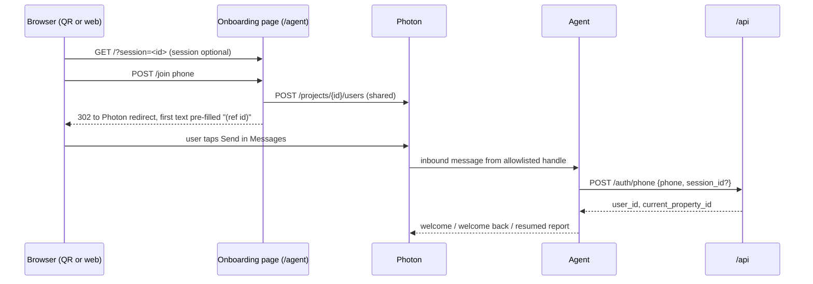
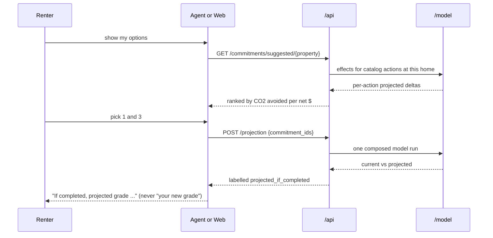
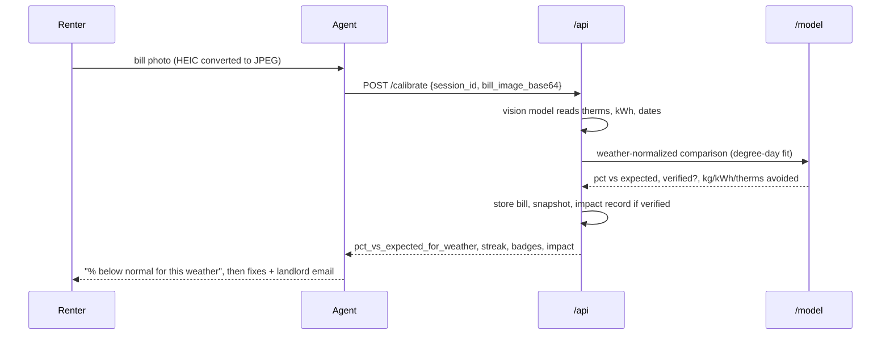

# NEW_CHANGES.md: Hidden Rent Phase 2 system design

**Status:** proposed design, additive to `PLAN.md` (it doesn't replace it). Decisions in §11 carry a proposed default so work can start; the named owner can overturn them.
**Merges:** the "NEW_CHANGES" accounts/commitments note, the Phase 2 flow sketch, `web/HOUSE_SCHEMA.md` (on `p3/map-widget`), the integration findings in `notes/integration.md` and `notes/P*.md`, and P4's open checks, all as of Oct 4, 2026, ~2:30 AM EDT.
**Audience:** P1–P4 agents and teammates. Read with `PLAN.md`, `DEV_STRATEGY.md`, your task file and `notes/`.

> **Rules that still apply.** `PLAN.md` §0 (no secrets, no invented numbers, the agent only says API numbers), the §10 contract (additive only, through `notes/contract-changes.md`), directory ownership (P1 `/model`, P2 `/api`, P3 `/web`, P4 `/agent`), mocks-first behind one switch, and the `main`/`dev` rules in `DEV_STRATEGY.md`.
>
> **Numbers in this file** are either cited (§17) or placeholders like `‹from /projection›`. Example messages show shape, never values.

---

## Contents
1. [Summary](#1-summary)
2. [Goals, non-goals and the north-star metric](#2-goals-non-goals-and-the-north-star-metric)
3. [Requirements](#3-requirements)
4. [Constraints we can't design away](#4-constraints-we-cant-design-away)
5. [Architecture](#5-architecture)
6. [Core flows](#6-core-flows)
7. [Data model and invariants](#7-data-model-and-invariants)
8. [State machines](#8-state-machines)
9. [Domain logic: commitments, projection, verification, carbon](#9-domain-logic-commitments-projection-verification-carbon)
10. [Interfaces (additive API)](#10-interfaces-additive-api)
11. [Decision log](#11-decision-log)
12. [Assumptions and verification plan](#12-assumptions-and-verification-plan)
13. [Risk register](#13-risk-register)
14. [Delivery plan: horizons, ownership, checkpoints](#14-delivery-plan-horizons-ownership-checkpoints)
15. [Acceptance criteria](#15-acceptance-criteria)
16. [Language guide](#16-language-guide)
17. [Sources](#17-sources)
- [Appendix A: TypeScript shapes](#appendix-a-typescript-shapes)
- [Appendix B: building data pipeline (from HOUSE_SCHEMA)](#appendix-b-building-data-pipeline-from-house_schema)
- [Appendix C: where each source note's content went](#appendix-c-where-each-source-notes-content-went)

---

## 1. Summary

Phase 1 answers **"what does this rental hide in energy, money and carbon?"** Phase 2 turns that one-time answer into a loop that **cuts real emissions and proves it**:

```text
phone → account → current home → baseline (grade, $ range, CO₂)
   → commitments ranked by CO₂ avoided per net $ → projected effect (labelled)
   → reminders → monthly check-in → bill → weather-normalized check
   → verified CO₂ avoided → progress + leaderboard → (moved? new baseline)
```

Three states are kept apart everywhere (API, web, agent, database):

| State | Meaning | Produced by | Wording |
|---|---|---|---|
| **Current** | Best estimate of the home today | `/estimate`, `/answer`, latest bill check | "Your grade is C" |
| **Projected** | Model prediction *if* the selected commitments are done | `/projection` | "If you do these, your projected grade is B" |
| **Verified** | A reduction the bills show after adjusting for weather | `/calibrate` history | "Your bills show ‹kg› kg CO₂ less than the weather predicts" |

The design's shape follows from three facts covered later: the biggest carbon levers belong to landlords (§2), weather swings hide or fake reductions (§9.3), and our messaging channel punishes spammy behavior (§4).

---

## 2. Goals, non-goals and the north-star metric

### 2.1 North-star metric
**Verified, weather-normalized CO₂ avoided at the same home, in kg per year.** Grades, streaks and leaderboards are motivation; they matter only insofar as they move this number.

### 2.2 Why this is the right metric (sourced, §17)
- Buildings are about **68%** of Ann Arbor's emissions (A2ZERO).
- About **31,500** Ann Arbor rental units, median build year **1964** (before Michigan's first energy code, 1977); **27,544** renter households (**54.5%**).
- **70.7%** of Ann Arbor homes heat with gas, so heating is mostly on-site combustion, which envelope fixes reduce.
- Same-size homes differ a lot: **$1,052 (P10) to $2,254 (P90)** a year for 800–1,200 sq ft gas-heated Michigan rentals (ResStock); real Ann Arbor meters show energy per sq ft varying about **3×** and heating slope about **6×**.
- Ann Arbor's **Green Rental Housing** ordinance (effective Jan 6, 2026) requires **70 of 308** checklist points through Jul 5, 2028, then **110**, so landlords now have a reason to make the fixes renters ask for.

### 2.3 Goals
1. Persistent identity (phone) with one current home and full history.
2. Commitments ranked by **CO₂ avoided per net dollar**, with effects from the model.
3. Honest projection, clearly labelled.
4. Verification from real bills, normalized for weather.
5. Leaderboards that reward **reductions at the same home**, not already living somewhere efficient.
6. A citywide total of verified reductions by neighborhood (the A2ZERO / GRH story).

### 2.4 Non-goals
Devpost, video, pitch, submission; replacing Photon or the ML stack; production-grade auth; a social network; tokens or offsets; any game mechanic not backed by model output; breaking changes to the §10 contract.

---

## 3. Requirements

### 3.1 Functional
| ID | Requirement |
|---|---|
| F1 | A normalized phone resolves to exactly one account; a web session can be linked to it |
| F2 | One current property per account; moving archives the old one and starts a new baseline |
| F3 | Anyone can get a grade without an account (decision D1); saving needs one |
| F4 | Commitments come from a catalog whose effects the model can represent |
| F5 | `/projection` returns current vs projected grade, $ and CO₂ from one composed model run |
| F6 | A bill (photo or typed) is checked against weather-normalized expectation; reductions are "early signal" until they meet the verification rule (D3) |
| F7 | Verified reductions are recorded per property with their emission factors |
| F8 | Leaderboards rank verified reductions; projections appear only as a labelled ghost marker |
| F9 | Monthly check-in (manual trigger is enough for the demo) and opt-in task reminders |
| F10 | Optional Google Calendar reminders that never block the core flow |

### 3.2 Non-functional
| ID | Requirement | Why |
|---|---|---|
| N1 | **Honesty:** every displayed number traces to code and data; projected and verified are labelled | PLAN.md §0 |
| N2 | **Deliverability:** inbound-first, few proactive texts, never at night, stop on request | Photon/Apple rules (§4) |
| N3 | **Privacy:** phone numbers masked, no exact addresses on boards, bill images short-lived | Personal data |
| N4 | **Demo safety:** every judge-facing flow has a mock and an offline fallback; a flow that can't be verified tonight is cut, not faked | PLAN.md §10 demo checklist |
| N5 | **Latency:** replies within a few seconds when cached; first lookup in a new area can take up to ~3 min (model downloads weather history once), so the agent keeps a typing indicator and never times out early | `notes/integration.md` |
| N6 | **Observability:** contract mismatches are logged (`[contract] …`, already in `/agent`); every API response carries `model_version` | Integration debugging |
| N7 | **Reproducibility:** cached data has a manifest (URL, query, fetch time, count, sha256); factors carry a year | HOUSE_SCHEMA §6 |

---

## 4. Constraints we can't design away

| # | Constraint | Source | Design consequence |
|---|---|---|---|
| C1 | Photon Free plan: **10 allowlisted users**; Pro: 100 | photon.codes pricing | The account system is capped by the plan. Judges' phones consume slots; `remove-user` frees them. Abuse of the public onboarding page can exhaust slots (R5). |
| C2 | Shared line pool: each user may text a **different** Photon number; **no group chats** | Photon routing docs | DM-only design; never assume one agent number; Photon's redirect opens Messages to the right one |
| C3 | Unregistered senders are rejected ("Target not allowed") | Photon troubleshooting | "Texted us" ⇒ "was allowlisted": usable as hackathon identity (D5) |
| C4 | Apple flags lines for bursts, broadcast without replies, more than 2–3 follow-ups to non-responders, cold outreach, 3 AM sends; hard limit **5,000 outbound/server/day**; **50 new conversations/line/day** | Photon deliverability docs | Proactive messaging policy (D4); inbound-first; no daily blasts |
| C5 | First messages from unknown numbers show "Report Junk"; links in a first message are suppressed | Photon deliverability docs | Text-only first message, user sends first (already built) |
| C6 | Android recipients get SMS/RCS fallback (no tapbacks) | Photon pricing | Text-only interactions; no reliance on tapbacks |
| C7 | Photon management API: **5 req/s** per project | Photon API docs | Batch admin scripts; no per-message management calls |
| C8 | Model covers **heating + cooling only**; p10/p90 not yet available; cooling validated less well than heating | `notes/integration.md`, P1 `accuracy.cooling_note` | Label `bill.covers`; projections and verification focus on heating; don't show narrower projected ranges than current |
| C9 | P2-01 data quality: some office footprints typed as homes with huge unit sizes; SFA and 2–4-unit areas include garages; year built is a block-group median | `notes/integration.md` | Plausibility checks before scoring; ask unit size; label medians (already done in `/agent`) |
| C10 | ResStock bill columns flagged inconsistent; prices come from EIA via P1 | `ResStock.md`, `UtilizationToMoney.md` | All $ from P1's pricing, never `out.bills` |
| C11 | Time: hacking ends **12:00 PM Sun Oct 4**, feature freeze **8:00 AM** | PLAN.md §2, §8 | Two delivery horizons (§14.1); everything else is post-hackathon |
| C12 | Onboarding needs a public URL; the free tunnel URL changes on every restart | P4-01 testing | `PUBLIC_URL` is config only; reprint the card and update P3's env after restarts |

---

## 5. Architecture

### 5.1 Components and responsibilities
```text
┌──────────────┐   iMessage    ┌──────────────┐  HTTPS (Spectrum gRPC)  ┌──────────────────────┐
│ Renter phone │ ◀───────────▶ │ Photon cloud │ ◀─────────────────────▶ │ /agent (P4, Node)     │
└──────────────┘               └──────────────┘                         │ conversation engine  │
       │  QR / link                                                      │ onboarding :8787     │
       ▼                                                                 └─────────┬────────────┘
┌──────────────┐  tunnel (cloudflared)  ┌──────────────┐                          │ HTTP JSON
│ Browser      │ ─────────────────────▶ │ /web (P3)    │ ──────────────┐          ▼
└──────────────┘                        │ Next.js :3000│               │  ┌──────────────────────┐
                                        └──────────────┘               └▶ │ /api (P2, FastAPI)   │
                                                                          │ :8000 system of record│
                                                                          │ accounts, properties, │
                                                                          │ commitments, bills,   │
                                                                          │ snapshots, impact     │
                                                                          └─────────┬────────────┘
                                                                                    │ HTTP
                                                     ┌──────────────────┐           ▼
                                                     │ Google Calendar  │  ┌──────────────────────┐
                                                     │ (optional, P2)   │  │ /model (P1) :8001     │
                                                     └──────────────────┘  │ estimate, projection, │
                                                                           │ verification, carbon  │
                                                                           └──────────────────────┘
```

| Component | Owns | Stateless? | Must never |
|---|---|---|---|
| **/model (P1)** | Estimates, commitment effects, projection, verification math, carbon factors | Yes (cached data + pickled models) | Store user data |
| **/api (P2)** | **System of record**: users, properties, commitments, projections, bills, snapshots, impact, leaderboards; Calendar tokens | No (database) | Compute model numbers itself (it calls P1) |
| **/agent (P4)** | Conversation engine (dialog state), Photon I/O, onboarding page, admin scripts | Short-lived dialog state only (D8) | Invent numbers; hold durable user data |
| **/web (P3)** | Presentation: grade, map, leaderboard, commitments, history | Yes | Compute scores or savings |

### 5.2 Trust boundaries
1. **Photon → agent:** the sender handle is trusted because Photon only delivers from allowlisted users (C3).
2. **Public internet → onboarding page:** untrusted; `/join` can allowlist numbers, so it's rate-limited and capped (R5).
3. **Browser → web/api:** untrusted; a web session gains account rights only through the phone link (D5).
4. **Agent/web → api:** internal; the API validates everything anyway (the agent checks responses against the contract too).

### 5.3 Synchronous vs asynchronous paths
- **Synchronous (request/response):** estimate, answer, projection, commitments, history.
- **Slow synchronous:** first lookup in a new area (N5) and bill photo reading by a vision model; the agent shows typing and allows long timeouts (estimate 200 s, calibrate 120 s, already set).
- **Asynchronous / scheduled:** monthly check-ins and reminders. For the demo, a **manual trigger** (D9) instead of a scheduler.

### 5.4 Deployment (hackathon)
Everything runs on teammates' laptops: model :8001, api :8000, web :3000, agent + onboarding :8787, cloudflared tunnel for public pages. **Single points of failure:** the laptop running the agent (Photon delivers there), the tunnel (QR and web handoff), and the model server (every number). Mitigations are in §13.

---

## 6. Core flows

### 6.1 Identity and onboarding


### 6.2 Commitments and projection


### 6.3 Bill verification


### 6.4 Monthly check-in and moving
```text
trigger (manual for demo) → "Still at ‹address›?"
  yes   → "Send this month's bill" → §6.3
  moved → "What's your new address?" → POST /properties (old archived) → new baseline → §6.2
  no reply → one follow-up a few days later → pause (C4)
```

---

## 7. Data model and invariants

### 7.1 Entities (shapes in Appendix A)
| Entity | Purpose |
|---|---|
| **Building** | One city footprint (OBJECTID within a dated snapshot); unit of the map, scoring and aggregation |
| **Address** | Mailing address and how it matched a building (within / snapped / none) |
| **User** | One per normalized handle; reminder preferences; leaderboard opt-in and alias |
| **Property** | A user's home over a period; links to a Building; carries sourced unit size and fuel |
| **ScoreSnapshot** | Current state at a point in time (never written from a projection) |
| **Commitment** | Catalog action chosen for a property; status and evidence level |
| **Projection** | Stored `/projection` result, so actuals can be compared with what was predicted |
| **BillSubmission** | Evidence: period, therms, kWh, weather-normalized delta |
| **ImpactRecord** | **North-star ledger:** verified reductions only, with emission factors and year |
| **CalendarConnection** | Optional token references (never secrets in git or logs) |

### 7.2 Invariants and where they're enforced
| # | Invariant | Enforced by |
|---|---|---|
| I1 | One user per normalized handle | Unique index on `users.phone_number` (P2); normalization in `/agent` and `/api` |
| I2 | At most one active property per user | Partial unique index (P2) |
| I3 | ScoreSnapshots come only from estimates, answers or bills, never projections | P2 write path; P1 test |
| I4 | ImpactRecords exist only for verified reductions and never span two properties | P2 write path |
| I5 | Projected numbers are always labelled | API field `label`; P3/P4 wording tests |
| I6 | Every user-visible number has a source | `Sourced<T>` in the data; `sources[]` in responses |
| I7 | Bill periods don't double-count | Dedupe by (property, period) and image hash (P2) |
| I8 | Factors used in an impact record are stored with it | P2 schema |

### 7.3 Consistency and idempotency
- **Account creation** is idempotent (`POST /auth/phone` returns the existing user). Two quick first messages must not create two users (I1).
- **Commitment acceptance** is idempotent per (property, catalog_id) while accepted.
- **Bill submission** is idempotent per (property, period) (I7); a re-sent photo returns the stored result.
- **Inbound message redelivery** from Photon isn't documented either way (check V9). The agent should tolerate duplicates (answers are idempotent server-side).

---

## 8. State machines

### 8.1 Commitment
```text
status:    suggested ──accept──▶ accepted ──complete──▶ completed
               │                     │
               └──dismiss──▶ dismissed ◀──dismiss──┘
evidence:  projected (on accept) ──user says done──▶ reported ──bills meet D3──▶ verified
```
No silent backward moves. Completing a commitment never changes the current grade; only a new snapshot does.

### 8.2 Property
```text
active ──user moves──▶ archived (move_out_date set; history kept; impact frozen)
```

### 8.3 Conversation (agent dialog state)
```text
idle ──link/address──▶ estimating ──ok──▶ (unit size?) ──▶ asking question ⇄ answering ──locked──▶ idle
idle ──"(ref id)"──▶ resuming session ──▶ asking question
idle/asking ──photo──▶ checking bill ──▶ idle (fixes + email sent)
any ──"fixes"──▶ fixes sent ──▶ back to previous state (open question re-asked)
any ──"stop"──▶ proactive messages paused (replies still work)
check-in sent ──yes──▶ awaiting bill │ ──moved──▶ awaiting address ──▶ estimating
```
Built today: everything except account greeting, check-in, moved, "stop", and commitment selection. Dialog state is in memory; durable state belongs in `/api` (D8).

---

## 9. Domain logic: commitments, projection, verification, carbon

### 9.1 Commitment catalog
A fixed list of **actions** (the sketch's "hardcoded commitments"); their **effects** always come from the model. P1 confirms each mapping before it ships.

| Catalog id | Action | Who acts | Model mapping (to confirm) | GRH link | Bills verify via |
|---|---|---|---|---|---|
| `air_sealing` | Seal drafts | Landlord (renter: weatherstripping) | `in.infiltration` or ResStock air-sealing upgrade delta | Checklist item | Lower heating slope |
| `attic_insulation` | Attic to R-50 | Landlord | `in.insulation_ceiling` or upgrade delta | Checklist item (PLAN.md §4) | Lower heating slope |
| `wall_insulation` | Insulate walls | Landlord | `in.insulation_wall` | Checklist item | Lower heating slope |
| `window_upgrade` | Storm or double-pane windows | Landlord | `in.windows` | Window items | Lower heating slope |
| `thermostat_setback` | Lower setpoint at night/away | Renter | Only if ResStock exposes setpoint inputs (V5); else **not modeled**, bills only | — | Lower slope or base load |
| `landlord_request` | Send the drafted email for the top envelope fix | Renter → landlord | Inherits the requested fix's effect once that fix is reported done | Points for the landlord | Through the fix |
| `heat_pump` | Electrify heating | Landlord | ResStock heat-pump upgrade delta; CO₂ uses eGRID RFCM | Equipment items | Gas down, electricity up; net CO₂ |

Not modeled → shown as a tip with no numbers. Thermostat commitments carry a safety floor (D6); nothing rewards going below it.

### 9.2 Ranking and projection
- **Rank** by `co2_kg_saved_yr ÷ max(cost_usd − rebate_usd, ε)`; ties to higher CO₂; always include at least one renter-doable action. Show $ saved and GRH points alongside.
- **Project** by applying all selected changes **in one model run** (or chaining upgrade deltas on the upgraded state). Effects don't add; never sum separate deltas. Return p10/p50/p90 when the model supports it; otherwise say "about". Never show a projected range narrower than the current one without a model reason.
- **Honesty tests (P1):** zero commitments = no change; unsupported = rejected; composed ≤ sum of parts; removing reverses; projection never writes a snapshot.

### 9.3 Verification
P1's `bill_check` fits gas use against heating degree-days. For each new bill period, compare actual use with the weather-normalized expectation under the **pre-commitment** fit. A reduction is **verified** when rule D3 holds; otherwise it's an "early signal" (the agent already says "‹x›% below normal for this weather"). After verification, show both: "projected ‹kg› kg, verified ‹kg› kg so far".

### 9.4 Carbon accounting
| Fuel | Factor | Source | Rule |
|---|---|---|---|
| Natural gas | 5.306 kg CO₂/therm (53.06 kg/MMBtu) | EPA (PLAN.md §6.4) | P1 measures ccf: convert with the EIA Michigan heat content for that year (V7) and record it |
| Electricity | eGRID RFCM output emission rate | EPA eGRID (PLAN.md §6.4) | Record the eGRID year (V7); use the same factor for current, projected and verified |

Dollars come from P1's EIA pricing (marginal gas price, average electricity price), heating + cooling only (`UtilizationToMoney.md`). Always show CO₂ and $ together so a heat pump that cuts CO₂ but costs more isn't hidden.

### 9.5 Leaderboards
| Board | Metric | Evidence |
|---|---|---|
| **Biggest verified cut** (primary) | Verified CO₂ avoided ÷ own baseline (%) | Verified only |
| Most CO₂ avoided | Verified kg this year | Verified only |
| Weather-beater streak | Consecutive months below weather-normal (`streak_months`) | Bill checks |
| Follow-through | Commitments verified ÷ accepted | Verified only |
| Hall of fame | Most efficient buildings | Only buildings in the city's public benchmarking data (PLAN.md §5) |
| Neighborhood totals | Sum of verified CO₂ avoided | Aggregated, minimum group size (D7) |

Projected placement is a **ghost marker** (the sketch's "choosing commitments changes your place"). Moving resets the board baseline. Peer comparisons use P1's scored building table and the ResStock look-alike cloud, never other users' private data.

### 9.6 Messaging policy (resolves the sketch's daily notifications vs C4)
| Message | When | Rules |
|---|---|---|
| Monthly check-in (default) | Once a month at the user's chosen hour, never at night | Opens with a question; one follow-up, then pause |
| Task reminders (opt-in) | Daily or weekly, user's choice, only for accepted commitments with a target date | Max one a day; auto-pause after 2 unanswered; "stop"/"pause" any time |
| Results | Only in reply to the user's bill | Inbound-first |
| Calendar (optional) | On accept, if connected | Failure never blocks the commitment |

---

## 10. Interfaces (additive API)

All additions go through `notes/contract-changes.md` with consumer acks; P2 owns final shapes. **Reuse before adding:** `/calibrate` is the bill check, `/fixes` feeds commitment candidates, `GET /session/{id}` is the web → iMessage link, `/leaderboard` gets a `board` parameter, `GET /map/{session_id}` is already proposed by P3.

```http
POST  /auth/phone                 {phone, photon_user_id?, session_id?} → {user_id, created, current_property_id, calendar_connected}
GET   /me/{user_id}               → {user_id, phone_masked, current_property_id, properties[]}
POST  /properties                 {user_id, address|url, unit_sqft?} → {property_id, building_id, estimate, active}
POST  /properties/{id}/activate   → previous active property archived
GET   /properties/{id}/history    → {snapshots[], bills[], impact[], commitments[]}
GET   /commitments/suggested/{property_id}
      → {commitments: [{catalog_id, title, who_acts, projected{usd_saved_yr, co2_kg_saved_yr, score_delta, new_grade},
                        cost_usd, rebate_usd, grh_points, co2_per_net_usd, method}]}
POST  /commitments                {user_id, property_id, catalog_id, target_date?} → commitment
PATCH /commitments/{id}           {status: completed|dismissed} → commitment
POST  /projection                 {property_id, commitment_ids[]}
      → {projection_id, current{score, grade, bill_annual, co2_kg_yr}, projected{…}, delta{score, usd_saved_yr, co2_kg_saved_yr},
         label: "projected_if_completed", method, model_version}
POST  /calibrate                  (existing; response adds) bill_id, verified, impact{co2_kg_avoided, kwh_avoided, therms_avoided, usd_saved, factors}|null, snapshot|null
POST  /checkins/trigger           {user_id} → {message_hint: "still_at_address", property_id}      (demo trigger)
GET   /leaderboard?board=verified_cut|co2_avoided|streak|follow_through|neighborhood&scope=city|neighborhood
POST  /calendar/connect · POST /calendar/reminders · DELETE /calendar/reminders/{id}               (stretch)
```
Errors follow the existing shape: `{detail: {code, message, hint?}}` with 422/503, passed to users verbatim by the agent.

---

## 11. Decision log

Each decision has a proposed default so work isn't blocked. "Reversible" means it can change later without migrating data or breaking clients.

| ID | Decision | Options | Proposed default and why | Owner | Reversible | Blocks |
|---|---|---|---|---|---|---|
| **D1** | Sign in before the grade? (sketch vs PLAN.md) | Required / anonymous grade | **Anonymous grade; account to save.** PLAN.md's core promise is an answer in seconds; in iMessage the phone *is* the account | Team | Yes | P3 flow |
| **D2** | Unit-counting rule | P2-01 (`General Mailing` + `UNIT n`) / count every type | **P2's rule, run once in P2's pipeline**; `/web` reads its output | P1 + P2 | Yes (recompute) | Scores, map |
| **D3** | What counts as "verified" | Any drop / weather-normalized drop / drop beyond typical error over ≥1 full period | **≥1 full post-completion billing period below weather-normal by more than P1's held-out error** | P1 | Yes (re-evaluate records) | ImpactRecord, boards |
| **D4** | Daily reminders? | Daily for all / opt-in capped / monthly only | **Opt-in, max one a day, auto-pause after 2 unanswered, never at night** (C4) | P4 + team | Yes | Reminders |
| **D5** | Identity primitive | Photon handle / web OIDC / passwords | **Normalized Photon handle**; web links via the existing `?session` handoff; no passwords | P2 + P3 + P4 | Partly | Accounts |
| **D6** | Thermostat safety floor | None / cited minimum | **Ship `thermostat_setback` only with a cited health-based minimum** | P1 | Yes | That commitment |
| **D7** | Leaderboard minimum group size | None / k homes | **5 homes** for any aggregate | P2 | Yes | Boards |
| **D8** | Where conversation state lives | Agent memory / API | **Durable state in `/api`; agent keeps only short dialog state** (pending question) with rehydration from `/me` + pending check-in after a restart | P4 + P2 | Yes | Restart safety |
| **D9** | Scheduler for check-ins | Cron / queue / manual trigger | **Manual trigger for the demo** (`npm run checkin -- <phone>` in P4, or `POST /checkins/trigger`); real scheduler post-hackathon | P4 + P2 | Yes | Check-in demo |
| **D10** | Database | SQLite / Neon Postgres | **SQLite** tonight (PLAN.md stack); Neon only if P2 already chose it | P2 | Medium | Persistence |
| **D11** | `pct_vs_expected_for_weather` units | Fraction / percent | **Percent** (-12 = 12% below normal); `/agent` already assumes this | P2 confirms | Yes | Bill replies |
| **D12** | `questions[].options` format | Strings / objects | **Strings or `{value, label}`**; `/agent` accepts both | P2 confirms | Yes | Interview |
| **D13** | Bill photo size | Send full / downscale | **Agent converts HEIC → JPEG; API accepts at least ~6 MB base64 or the agent downscales** | P2 + P4 | Yes | Bill flow |
| **D14** | Bill image retention | Keep / extract and delete | **Keep only until extraction; store numbers, not images** | P2 | Yes | Privacy |
| **D15** | Who owns this file | P4 (author) / P2 (owns root docs per DEV_STRATEGY #6) | **P2 owns it after review**; P4 proposes edits through P2 | Team | Yes | — |
| **D16** | Leaderboard headline board | Score delta / CO₂ delta / verified savings | **Verified CO₂ cut (%) vs own baseline**, fair across home sizes | Team | Yes | Board UI |
| **D17** | Onboarding abuse | Open / rate-limited / code-gated | **Rate-limit `/join` per IP and cap total new users per hour; keep a `remove-user` sweep** | P4 | Yes | Slot exhaustion (R5) |

---

## 12. Assumptions and verification plan

Every unverified assumption becomes a check with an owner, a method and the checkpoint it gates. ✅ = verified, ⏳ = open.

| ID | Assumption / thing to check | Method | Owner | Gates | Status |
|---|---|---|---|---|---|
| V1 | Photon delivers inbound texts and our replies on a real iPhone | Real-phone round trip | P4 | A | ✅ (P4-01) |
| V2 | Pasted links and plain addresses are recognized on a real phone | Real-phone test | P4 | A | ✅ (P4-01) |
| V3 | QR onboarding works through a public tunnel | Scan → join → text | P4 | A | ✅ (P4-01) |
| V4 | Real photo attachments arrive and `read()` returns the image (HEIC and PNG) | Send both from an iPhone in demo mode | P4 | D | ⏳ |
| V5 | ResStock exposes heating-setpoint inputs and upgrade scenarios for each catalog action | Inspect parquet columns + `upgrades_lookup.json` | P1 | C | ⏳ |
| V6 | Effects compose sensibly in one run (composed ≤ sum) | P1 tests | P1 | C | ⏳ |
| V7 | Which eGRID year and ccf → therm heat content to use | Pick and cite | P1 | D | ⏳ |
| V8 | Photon user id survives delete/re-add; sender handle is a phone number, not an email | Delete/re-add a test user; check `sender.id` | P4 | A | ⏳ |
| V9 | Whether Photon can redeliver an inbound message | Docs / Photon support | P4 | A | ⏳ |
| V10 | `/api` accepts the bill photo size after HEIC → JPEG | Send a real phone photo to `/calibrate` | P2 + P4 | D | ⏳ |
| V11 | `pct_vs_expected_for_weather` units and `streak_months` meaning (D11) | P2 confirms in `notes/requests.md` | P2 | D | ⏳ |
| V12 | Web → iMessage handoff carries the session end to end | Web button with `?session=` → text → resumed report | P3 + P4 | A | ⏳ (P4 side built) |
| V13 | Unit-size answer re-runs `/estimate` correctly on the live API | Real API + phone | P4 | B | ⏳ |
| V14 | First-lookup latency keeps the typing indicator alive and the reply arrives | New area on the live API | P4 | B | ⏳ |
| V15 | Printed QR card scans from about 2 ft; card looks right on a phone (light and dark) | Print + scan | P4 | A | ⏳ |
| V16 | Google Calendar OAuth scopes and token storage fit the time left | Spike | P2 | F | ⏳ |
| V17 | `/join` rate limit doesn't block a judge queue at the table | Several joins in a row | P4 | A | ⏳ |

---

## 13. Risk register

Likelihood and impact are H/M/L for the demo window.

| ID | Risk | L | I | Mitigation | Owner |
|---|---|---|---|---|---|
| R1 | P2 endpoints (`/answer`, sessions, `/calibrate`, `/fixes`, accounts, projection) aren't ready by the 8 AM freeze | H | H | Exact-contract mocks behind one switch (built in `/agent`); demo the loop labelled "demo data"; cut lines in §14.1 | P2 |
| R2 | Apple flags the Photon line | L | H | Policy D4, inbound-first, no night sends; fallback demo phone; stop proactive sends if flagged | P4 |
| R3 | Agent laptop sleeps or restarts mid-demo; dialog state lost | M | M | Keep it awake and plugged in; D8 rehydration; don't restart during judging | P4 |
| R4 | Tunnel URL changes → QR and web link break | M | H | `PUBLIC_URL` config; reprint card; update P3's env; `npm run doctor` shows the URL | P4 |
| R5 | Public `/join` used to exhaust the 10 Photon slots | M | H | D17 rate limit; `remove-user`; demo phone fallback | P4 |
| R6 | Model server down or cold (≈1 h cold build) | M | H | Warm it before judging; offline fixtures (P2-07); agent sends "try again", never numbers | P1 + P2 |
| R7 | Bad building data (offices as homes, garages in floor area) produces absurd grades on a judge's address | M | H | Plausibility checks; ask unit size; pre-test demo addresses | P2 |
| R8 | Projection presented as achieved (greenwashing) | L | H | Label in API (I5); wording tests in P3/P4; language guide §16 | All |
| R9 | A mild month read as a reduction | M | M | Weather normalization (§9.3); "early signal" until D3 | P1 |
| R10 | Moving to an efficient unit counted as savings | L | M | I4; board baseline resets on move | P2 |
| R11 | Bill photo too large or unreadable | M | M | HEIC → JPEG (built); D13; ask for typed numbers on failure | P2 + P4 |
| R12 | Privacy leak (phone numbers, addresses, bill images) | L | H | Masking; aliases; D14; no secrets in logs (checked in P4) | All |
| R13 | Scope creep before freeze | H | M | Horizons in §14.1; cut from the bottom | Team |

---

## 14. Delivery plan: horizons, ownership, checkpoints

### 14.1 Horizons
| Horizon | Deadline | Scope |
|---|---|---|
| **H0: demo-safe** | 8:00 AM freeze (C11) | Phase 1 loop on the real API where possible; commitments + projection + bill check demoable end to end, real where served and **labelled demo data** where mocked; manual check-in trigger |
| **H1: Phase 2 real** | Post-hackathon | Accounts and properties persisted; real projection from P1; verified impact records; improvement boards; reminders |
| **H2: stretch** | Later | Neighborhood totals, Calendar, scheduler |

**Demo-safe minimum (≈60 s of the pitch):** known phone → "still at ‹address›?" → current grade + CO₂ → two commitments ranked by CO₂ per $ → pick one → projected grade (labelled) with the web ghost marker → bill photo → "‹x›% below normal for this weather".

### 14.2 Integration order
```text
P2 accounts ─┐
P1 effects + projection ─┼─▶ P2 commitments + /projection ─┬─▶ P3 current vs projected + cards
                         │                                  └─▶ P4 commitment conversation
P2/P4 address change ─▶ bills → verification → impact ─▶ history ─▶ boards ─▶ reminders ─▶ Calendar
```

### 14.3 Tasks
| Owner | Tasks |
|---|---|
| **P1** `/model` | NC-01 commitment effects (V5) · NC-02 projection (composition, honesty tests) · NC-03 verification (D3) · NC-04 carbon factors (V7) · NC-05 unit-count rule with P2 (D2) |
| **P2** `/api` | NC-01 phone accounts + session link (D5) · NC-02 properties + history · NC-03 commitments (from `/fixes` + P1 effects) · NC-04 `/projection` · NC-05 bills + impact (extend `/calibrate`) · NC-06 boards (D7, D16) · NC-07 check-in trigger (D9) · NC-08 Calendar (stretch) · confirm D11–D13 |
| **P3** `/web` | NC-01 current vs projected bars · NC-02 commitment cards on the leaderboard + ghost marker · NC-03 account/property header + phone link · NC-04 progress + impact history · NC-05 new bill + address change · NC-06 improvement boards · `?session=` on "Continue in iMessage" |
| **P4** `/agent` | NC-01 account-aware greeting · NC-02 commitment selection + projection wording · NC-03 address change · NC-04 check-in trigger script · NC-05 opt-in reminders + "stop"/"pause" · NC-06 `/join` rate limit (D17) · NC-07 rehydration after restart (D8) · V4, V8, V12–V15, V17 |

### 14.4 Mocks and switches
| Owner | Switch | Covers |
|---|---|---|
| P2 | `USE_MODEL_MOCKS=1` (proposal) | Projection and verification until P1 lands |
| P3 | `NEXT_PUBLIC_USE_MOCKS` (existing) | Every new endpoint, in `/web/mocks/` |
| P4 | `USE_MOCK_API=1` (existing) | Accounts, properties, commitments, projection, history added to `src/mockApi.ts`; replies labelled demo data |

### 14.5 Checkpoints
| | Demonstrates | Gated by |
|---|---|---|
| **A** identity | phone → account → current property; web session linked | V1–V3 ✅, V8, V9, V12, V15, V17 |
| **B** interview on real API | estimate → unit size → narrower range on a phone | V13, V14 |
| **C** commitments + projection | ranked suggestions → accept → projected (real model) | V5, V6 |
| **D** verification | bill → weather-normalized check → snapshot → impact when verified | V4, V7, V10, V11 |
| **E** city total | neighborhood sum of verified CO₂ | D7 |
| **F** reminders (stretch) | accepted commitment → reminder | V16 |

---

## 15. Acceptance criteria

- [ ] **Accounts:** same handle → same account; no duplicates from formatting or two quick messages; web session links through the handoff
- [ ] **Properties:** moving archives and preserves history; exactly one current home; reductions never carry across a move
- [ ] **Commitments:** only modeled catalog actions; ranked by CO₂ per net $ with a renter-doable option; accept/dismiss/complete persist
- [ ] **Projection:** one composed run; removing reverses; "projected" on every projected figure; current grade unchanged by projections
- [ ] **Verification:** every comparison weather-normalized; "verified" only under D3; impact records store factors and year
- [ ] **Boards:** verified evidence only; ghost marker for projections; no phone numbers, exact addresses or small-landlord names; minimum group size
- [ ] **Messaging:** D4 policy; "stop"/"pause" works; no night sends; Calendar failure never blocks a commitment
- [ ] **Operations:** contract mismatches logged; model version on responses; caches have manifests
- [ ] **Everywhere:** no invented numbers

---

## 16. Language guide

| Use | Avoid (unless literally true) |
|---|---|
| Current grade | "Your new grade" (for a projection) |
| Projected grade · if completed · potential | Guaranteed savings |
| Verified reduction (only under D3) | "Verified" for early signals |
| Early signal · below normal for this weather | Points awarded |
| CO₂ avoided, kg a year | Carbon neutral, offset |
| Commitment · progress · monthly check-in | Pledges counted as impact |

---

## 17. Sources

| Fact | Source |
|---|---|
| Buildings ≈ 68% of Ann Arbor emissions | A2ZERO (PLAN.md §4) |
| ~31,500 rentals, median build 1964; MI energy code 1977 | PLAN.md §4 |
| 27,544 renter households (54.5%) | PLAN.md §1 (Census) |
| 70.7% gas heat | PLAN.md §4 |
| $1,052–$2,254 (P10–P90), 800–1,200 sq ft gas-heated MI rentals | NREL ResStock 2024.2 (PLAN.md §4) |
| Energy/sq ft varies ~3×, heating slope ~6× | Ann Arbor benchmarking (PLAN.md §6.3) |
| GRH: Jan 6, 2026; 70 of 308 points through Jul 5, 2028, then 110 | a2gov.org news, checklist, FAQ (PLAN.md §4) |
| Gas 5.306 kg CO₂/therm; electricity eGRID RFCM | EPA (PLAN.md §6.4) |
| Prices: EIA N3010MI3/N3010MI2 (gas, marginal), EIA-861M (electricity) | `UtilizationToMoney.md`; P1 `model/data_sources/eia.py` |
| ResStock: 18,756 simulated MI homes; 854 sq ft median 5+ unit apartment; bill columns flagged | `ResStock.md` |
| Footprints, addresses, pairing results, STORIES coverage | `web/HOUSE_SCHEMA.md` (`p3/map-widget`) |
| Model gaps (heating + cooling only, no p10/p90, cooling less validated), data-quality issues, latency | `notes/integration.md`, `notes/P2.md` |
| Photon: Free 10 users / Pro 100; shared pool, no groups; allowlist; 5,000/day; 50 new conversations/line/day; 5 req/s; deliverability rules | photon.codes docs (pricing, connection & routing, troubleshooting, deliverability, API reference) |
| Hacking ends 12:00 PM Sun Oct 4; feature freeze 8:00 AM | PLAN.md §2, §8 |

---

## Appendix A: TypeScript shapes

```ts
/** Any value shown to a user carries where it came from (PLAN.md §0). */
interface Sourced<T> {
  value: T;
  source: string;
  kind: "city_record" | "lidar" | "census" | "listing" | "renter" | "model" | "default";
}

interface Building {
  id: number;                 // footprint OBJECTID within `snapshot`
  snapshot: string;           // e.g. "a2_footprints@2026-10-03"
  facility_id: string | null; // not unique; for re-matching only
  parcel_pin: string | null;
  footprint: GeoJSON.Polygon | GeoJSON.MultiPolygon;
  center: [lon: number, lat: number];
  footprint_sqft: number;
  height_ft: Sourced<number | null>;
  stories: Sourced<number | null>;
  structure_type: "Residential" | "Commercial" | "Office" | "Public";
  addresses: string[];        // normalized street lines, most common first
  units: number;
}

interface Address {
  street: string;             // raw PROPSTREET
  street_line: string;        // normalized
  type: string;               // e.g. "General Mailing"
  point: [lon: number, lat: number];
  building_id: number | null;
  match: "within" | "snapped" | "none";
}

interface User {
  id: string;
  phone_number: string;       // normalized handle (E.164, or the raw iMessage email handle); unique
  photon_user_id?: string;
  display_name?: string;
  alias?: string;             // leaderboard, opt-in
  leaderboard_opt_in: boolean;
  timezone?: string;          // default America/Detroit
  reminder_prefs: { channel: "imessage" | "calendar" | "none"; cadence: "daily" | "weekly" | "monthly" | "off"; hour_local?: number; paused?: boolean };
  current_property_id: string | null;
}

interface Property {
  id: string;
  user_id: string;
  building_id: number | null;
  address: string;
  unit_sqft: Sourced<number>;
  heating_fuel: Sourced<"gas" | "electric">;
  active: boolean;
  move_in_date?: string;
  move_out_date?: string;
}

type Band = { p10: number | null; p50: number; p90: number | null };

interface ScoreSnapshot {
  id: string;
  property_id: string;
  source: "initial_estimate" | "questionnaire" | "bill_regrade" | "manual_refresh";
  score: number;
  grade: string;
  grade_span: string[];
  bill_annual: Band;
  co2_kg_yr: Band;
  percentile_peers: number | null;
  percentile_city: number | null;
  model_version: string;
  created_at: string;
}

interface Commitment {
  id: string;
  user_id: string;
  property_id: string;
  catalog_id: "air_sealing" | "attic_insulation" | "wall_insulation" | "window_upgrade"
    | "thermostat_setback" | "landlord_request" | "heat_pump";
  status: "suggested" | "accepted" | "completed" | "dismissed";
  evidence: "projected" | "reported" | "verified";
  target_date?: string;
  accepted_at?: string;
  completed_at?: string;
  projection_id?: string;
  reminder_channel: "imessage" | "calendar" | "none";
  calendar_event_id?: string;
}

interface Projection {
  id: string;
  property_id: string;
  commitment_ids: string[];
  current: { score: number; grade: string; bill_annual: Band; co2_kg_yr: Band };
  projected: { score: number; grade: string; bill_annual: Band; co2_kg_yr: Band };
  delta: { score: number; usd_saved_yr: number; co2_kg_saved_yr: number };
  label: "projected_if_completed";
  method: "model_rerun" | "resstock_upgrade_delta";
  model_version: string;
}

interface BillSubmission {
  id: string;
  property_id: string;
  source: "image" | "manual";
  period_start: string;
  period_end: string;
  therms?: number;
  kwh?: number;
  amount_usd?: number;
  weather_normalized_delta_pct: number; // percent: -12 = 12% below normal (D11)
  image_sha256?: string;                // dedupe (I7); the image itself is not kept (D14)
}

/** North-star ledger: verified reductions only, per property (I4, I8). */
interface ImpactRecord {
  id: string;
  property_id: string;
  period: { start: string; end: string };
  co2_kg_avoided: number;
  kwh_avoided: number;
  therms_avoided: number;
  usd_saved: number;
  baseline_snapshot_id: string;
  method: string;
  emission_factors: { gas_kg_per_therm: number; elec_kg_per_kwh: number; egrid_year: number; ccf_to_therm: number; source: string };
}
```

---

## Appendix B: building data pipeline (from HOUSE_SCHEMA)

**Sources (public, no key; WGS84, paged by OBJECTID, raw responses cached):**
- Footprints + height: `a2maps.a2gov.org/.../OSI/BuildingFootprints/FeatureServer/0` (`OBJECTID`, `ABG_BLD_HG`, `Struc_Type`, `Bldg_Name`, `PackedPin`, `STORIES`, `FacilityID`). Polygons and heights come from 2009 countywide LiDAR and 2005–08 imagery, updated since from construction plans.
- Mailing addresses: `a2maps.a2gov.org/.../MailingAddress/FeatureServer/0` (`PROPSTREET`, `TYPE`, point).
- Block-group outline: TIGERweb `tigerWMS_ACS2023/MapServer/10`. Year built and fuel: ACS 5-year via Census Reporter (`B25037`, `B25035`, `B25040`).
- City services return 403 to Python's default user agent; send a browser-like one.

**Pairing:** STRtree over footprints → address point **within** a footprint, else **snap** to the nearest within `1.1e-4°` (≈12 m N–S, ≈9 m E–W at 42.28° N; address points sit 5–11 m off the roof), else drop. Normalize to a street line (strip ` UNIT | APT | STE | #`, title-case). Per footprint: label = most common street line (ties by OBJECTID order); `units` = matched address count. Result on the current cache: 25,994 of 35,007 footprints matched, including 24,427 of 32,572 residential; most unmatched residential footprints look like garages.

**Floors:** `STORIES` exists for 12,430 of 32,572 residential footprints (38%); otherwise height ÷ 10 ft, recorded in `stories.kind`. Prefer `height_ft` and `footprint_sqft` over exact floor counts.

**Keys:** OBJECTID within a dated snapshot; `FacilityID` isn't unique (471 repeats), so keep it and the centroid for re-matching.

**Hardening (H1):** run pairing once in P2's pipeline (D2); manifests next to caches (N7); snap distance in metres; a known-pair test (912 Mary St → footprint 1317, `BLD-001317`, 23.7 ft). Reference implementation: `web/scripts/build_map_fixture.py` (`p3/map-widget`).

---

## Appendix C: where each source note's content went

| Source | Where it lives now | Main changes |
|---|---|---|
| **NEW_CHANGES** (accounts, commitments, projection, reminders) | §1–3, §6–10, §14–16 | Reframed around verified CO₂; added the verified state, ImpactRecord and invariants; commitments ranked by CO₂ per net $; example numbers replaced with placeholders; endpoints reuse `/calibrate`, `/fixes`, `/session`; open questions became decisions (§11) and checks (§12) |
| **Phase 2 flow sketch** (`phase2-diagram.png`, not in the repo) | §6 sequence diagrams, §9.1 catalog, §9.5 ghost marker, §9.6 policy | "Sign in before the grade" → D1; "hardcoded commitments" → catalog with model effects; daily notifications → D4 |
| **HOUSE_SCHEMA** | §7, Appendix A, Appendix B | Building/Address/Sourced kept and tied to properties and impact aggregation; unit-count conflict → D2 |
| **Integration findings + P4 checks** | §4 (C8–C12), §12, §13 | Model gaps, data quality, latency, tunnel and Photon limits turned into constraints, checks and risks |
