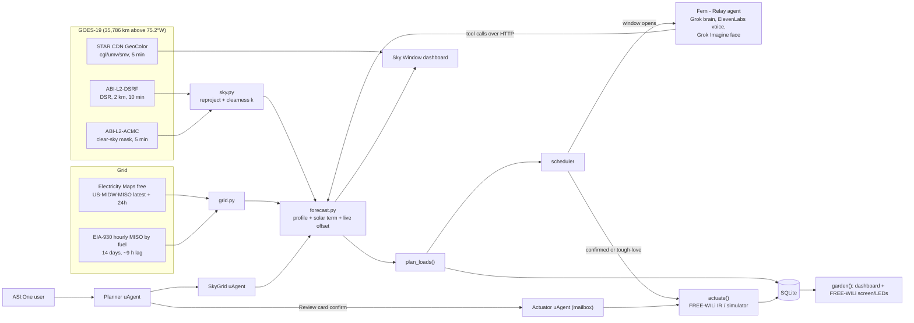

# MHacks 2026 — Strategy Summary

*Written the morning of Sat Oct 3, 2026. Hacking runs 12 PM EDT Oct 3 to 12 PM EDT Oct 4. Devpost lists the deadline as 12:15 PM EDT Oct 4 ([Devpost](https://mhacks-2026.devpost.com/)). The handbook says to submit before 12 PM, with no late submissions ([Hacker Handbook](https://safe-banon-80d.notion.site/2026-Hacker-Handbook-3ca24ca0c81b80fb8adee2e26c8508af)). Treat noon as the deadline.*

*How to read the evidence: every factual claim links to either the original source or the results file that cites it. "Inference" marks reasoning rather than a sourced fact. Every prize probability and expected-value (EV) figure is an inference.*

## Prompt given (excerpt)
> You are the synthesis agent. Read every results file (6 year-research files, 7 main/fun files, 13 sponsor files) and the final three-way debate transcript, then write SUMMARY.md: the recommended MHacks 2026 track combination, what every group of agents found, how the debate went, and a cross-check of the recommendation against six years of MHacks winners.

## TL;DR — recommended combination

| Slot | Recommendation |
|---|---|
| **Main track (exactly one)** | **Sustainability** |
| **Fun tracks** | **Judged by an LLM**, always. **Dumbest Idea**, via a planned 1–1.5 h comic feature that gets cut at midnight if the core isn't working end to end. |
| **Core sponsor tracks** | **FREE-WILi**, **Relay Interactive Agents**, **ElevenLabs**, **Fetch.ai ASI:One**, **SpaceX "Make it Legendary"** |
| **Optional sponsor tracks** | **Figma Best Design**, only if ahead of schedule. **Capital One Nessie**, only as the swap-in if FREE-WILi fails its 2 PM test. **Notability**, only with a free Pro code. |
| **Skip** | Useless AI. The FinTech, AI and Hardware main tracks. SpacetimeDB, Neon, FinchNode. Photon, except as the fallback messaging app. |
| **Project** | **"Clean Hours"**: an energy agent that acts in the physical world. It reads live grid carbon intensity for MISO (the Midwest grid operator) and live GOES-19 satellite sunlight and cloud data, then picks the cleanest hour to run things. It calls you in Relay (in an ElevenLabs voice) or takes a request in ASI:One (Fetch.ai). A FREE-WILi then switches a real fan or LED strip off over infrared. A "Digital Garden" on the device screen grows with every kWh shifted. |
| **Confidence** | About 60% that Sustainability is the right main track (the main/fun judge's figure). About 50% that all five core sponsors survive the day (my estimate), because three gates are unverified: FREE-WILi loaner kits, Relay calls on today's app build, and whether SpaceXAI accepts Earth-observation data. |

**Why.** Every main track pays the same $2,500, and the Grand Prize is $5,000 ([Tracks & Prizes](https://safe-banon-80d.notion.site/Tracks-Prizes-3ed24ca0c81b80579aeff03edfa88af5)). The main-track choice therefore comes down to pool size and fit.
- The identical Sustainability track text drew 15 of 122 MHacks 2025 projects ([Greenprint filter](https://mhacks-2025.devpost.com/submissions/search?prize_filter%5Bprizes%5D%5B%5D=90481)).
- About half of 2025 projects listed an LLM, which makes AI the crowded track.
- FinTech is probably the second-most crowded, and it breaks the SpaceX stack ([main/fun verdict](main-and-fun-tracks/07-debate-and-verdict.md)).

The final three-way debate settled on an energy project that ends in a physical action:
- **Wattson precedent.** The 2025 Sustainability winner, Wattson, was a FREE-WiLi build that also won Best Use of FREE-WiLi ([Wattson](https://devpost.com/software/wattson-5btsyd)).
- **Theme fit.** A device switching off on the judge's table directly serves the theme-fit criterion that the 2026 Devpost publishes ([Devpost](https://mhacks-2026.devpost.com/)).
- **Relay + ElevenLabs** provide the demo moment: the agent calls the judge's phone.
- **Fetch.ai** has the largest sponsor cash pool ($1,250 / $750 / $500), and its brief is about turning intent into action ([hackpack](https://www.fetch.ai/events/hackathons/mhacks-2026/hackpack)).
- **SpaceX** stays because it is the team's top preference, with live GOES-19 satellite data as the space input.

The six-year cross-check below supports this combination. It changes how the team spends its hours and what the pitch leads with, not which tracks to enter.

### Today's decision gates (EDT)

| When | Gate | If it fails |
|---|---|---|
| **11:30 AM, Sponsor Expo (Pierpont)** | Ask SpaceXAI whether satellite Earth-observation data such as GOES-19 counts as "real space data". Ask FREE-WILi whether loaner kits exist, and which model and firmware they run. | SpaceXAI says only orbit or mission data counts, **or** no loaners → build **"Overpass"** instead (wildfire detections plus satellite orbits). Core: Relay, SpaceX, Fetch.ai, ElevenLabs. |
| **12 PM** | A teammate with an iOS 26 phone is confirmed. Grid-carbon API access works. Devpost skeleton started. Discord asked what the LLM judge reads. | No iOS 26 → Photon replaces Relay. |
| **1 PM** | Split up: P1 goes to the Relay workshop (VR Lab), P4 to the FREE-WILi session (Room 3336). The two clash ([schedule](https://docs.google.com/spreadsheets/d/1xqlEyBnKWjYVSMndQPVHYGluyV9PajB5AZdA9BDa5_Q/edit?gid=473102365)). | — |
| **2 PM** | FREE-WILi smoke test: device in hand, LEDs blink, an IR code fires from a laptop. | Keep Clean Hours with a simulated device. Capital One's "Green Fund" becomes the add-on. Do not redesign. |
| **4 PM, SpaceXAI session** | Get the SpaceXAI ruling if the Expo didn't settle it. Relay calls ring a teammate's phone. | SpaceXAI says no → drop SpaceX, don't redesign. Calls fail → switch to Photon. |
| **~6 PM** | ASI:One completes the flow end to end with one real action. | Cut Fetch.ai; P3 moves to polish. |
| **Midnight** | Core works end to end. | Cut the comic feature and untick Dumbest Idea. |
| **6 AM Sun** | Freeze the UI and the joke script. | — |
| **By 11:30 AM Sun** | Fetch video recorded. Fetch's Submission Agent done, with every teammate joined. Devpost submitted. | — |

## How this was produced

- **Agents involved:**
  - **11 year researchers.** Two per year for 2025–2021: Researcher A on winners and projects, Researcher B on judging and signal. Researcher A only for 2020. 2019 and earlier were skipped at the team's request.
  - **6 track advocates (3 main, 3 fun) plus 1 impartial judge.** No advocate argued for FinTech, so the judge ran its own FinTech reality check.
  - **12 sponsor advocates plus 1 impartial judge.** At most 6 advocates ran at once.
  - **A final debate:** 2 rounds, with 3 representatives (main-track, fun-track, sponsor-track).
  - **This synthesis agent, then an ideation agent.**
- The year research ran in parallel with the track analysis and independently of it. This document is the first place the two meet.
- Every agent ran on Claude Opus 5.5 at xhigh effort.
- **Scope notes:**
  - There was no MHacks event in 2022. Both 2022 researchers confirmed this independently ([2022](year-research/2022.md)).
  - Following a relayed user note, the debate representatives used no 2020-dated material.
  - Several year researchers ran out of web-search budget. Their gaps (Michigan Daily coverage, winners' LinkedIn and X posts, ceremony videos) are listed in each year file.

## Lessons from six years of MHacks winners (2020–2025)

### Which events count, and how much

| Year | Event | Format and size | Weight for 2026 |
|---|---|---|---|
| 2025 | MHacks 2025, Sep 27–28 | In person, science-fair judging. 122 submissions, 380 registered; 30 projects won 32 prize slots ([2025](year-research/2025.md)) | **High.** Same venue and the same four criteria. Two sponsors return (Fetch.ai, FREE-WILi). |
| 2024 | MHacks 2024, Sep 28–29; Google x MHacks, Apr 12–14 | In person. 132 submissions and 30 awards. The Google event had 65 projects and required Gemini ([2024](year-research/2024.md)) | **High** / Medium |
| 2023 | MHacks 16 (Nov 18–19); MHacks 15 (Feb 17–19) | MHacks 16: in-person relaunch, 100 submissions, 24 winners, one of four themes required. MHacks 15: online, 61 submissions, judged by the core team ([2023](year-research/2023.md)) | **High** / Low |
| 2022 | None | A fall in-person event was announced on mhacks.org but never ran ([2022](year-research/2022.md)) | n/a |
| 2021 | MHacks 14, Oct 16–17 | Online. 59 projects, $2,400 in prizes. Judged by the core team from write-ups and videos ([2021](year-research/2021.md)) | Low |
| 2020 | MHacks 13 Beta, Aug 22–23 | Online, about 61 projects. 30 of them carry a "Wolfram Top 30" winner badge, so the badge means little. Researcher B skipped ([2020](year-research/2020.md)) | Low |

**Thin-data years:**
- 2022 had no event.
- 2020 had one researcher, no judging research, and inflated winner badges.
- 2021 and MHacks 15 were small online events judged by students.

Judge quotes exist only for 2021, from ceremony auto-captions. Organizer quotes exist only for 2023.

### Winners at a glance

| Year | Top prize | Track and category highlights | Notable sponsor wins |
|---|---|---|---|
| 2025 | **Artificial Sandwich Intelligence** (Grand Award, $4,000). Solo builder: a robot arm running a transformer policy trained at the event and benchmarked against a human ([Devpost](https://devpost.com/software/artificial-sandwich-intelligence)) | Greenprint (Sustainability): **Wattson**, a FREE-WiLi pet that loses health when lights stay on. Lifeline: Dementia Assistant (Snap Spectacles, self-trained face model). Overdrive: Ventura (unfinished, solo). Portal: ScreenWave (sensor glove). Brainrot fun prize: Judy AI (Gemini + ElevenLabs companion) | Fetch.ai: MobiLens, deCluttered.ai, Bazaar. FREE-WiLi: Wattson, Gestura. Embedder Best Hardware: Conductor |
| 2024 | **V²/R** (Grand, $3,000): VR breadboard simulator with its own circuit solver and no LLM ([Devpost](https://devpost.com/software/v-r)). Runner-up **FocusFlow**: a self-trained LSTM plus webcam eye tracking | Sustainability: FarmX (random-forest fertilizer model for Michigan farms). Health: NurseNotes. Accessibility: SignVerse. Interactive Media & Gaming: EscapeMate (Raspberry Pi puzzle box). Optimization: Pixzip (solo GAN) | FREE-WILi: Wili-Party. Groq: The WiLi Watch (FREE-WILi wristband). MLH Streamlit: data-center load shifting to clean-energy hours ([Devpost](https://devpost.com/software/dynamic-load-balancing-for-energy-efficient-cloud-computing)). Google x MHacks 1st: Cosmocook (HoloLens AR) |
| 2023 | **DECO.ai** (MHacks 16 1st): NeRF furniture scanning plus a Rust/Bevy room designer ([Devpost](https://devpost.com/software/deco-ai)). **LumiGUI** (MHacks 15 1st): Arduino touchless hospital forms | MHacks 16: Terminal.AI 2nd (also won Warp), VSAT 3rd (VR), Hardware: ALERT. MHacks 15: Carbon Footprint Extension 2nd | Capital One Best Financial Hack: ZenStock (used Nessie), Aipeiron, WolvWealth |
| 2022 | — | — | — |
| 2021 | **SunLite Sunrise Lamp** (1st): a smart bulb scheduled by text message through Twilio ([Devpost](https://devpost.com/software/sunlite-sunrise-lamp)) | Shadow Clone 2nd, MCall 3rd | Google Cloud 1st: F.L.U.D.D, flood sensors that text you and escalate to a phone call |
| 2020 | **Dystic** (1st): a job finder for people with disabilities, built on about 10 Google Cloud products | we-Learn 2nd. Sportable 3rd; it dropped its broken model from the demo and said so | ApplyAI won 5 prizes by entering every one it qualified for |

### Ten repeating patterns

1. **Physical or immersive demos take the top MHacks-run awards.**
   - In 2025, hardware won 4 of 6 MHacks-run prizes: Grand Award, Greenprint, Lifeline (on Spectacles) and Portal ([2025](year-research/2025.md)).
   - XR (VR and AR) took the top prize at both 2024 events ([2024](year-research/2024.md)).
   - MHacks 15's 1st place was an Arduino build. In 2021, 4 of 5 hardware entries won something ([2021](year-research/2021.md)).
   - The main/fun judge's caveat: on prizes open to everyone, 2025 hardware won 3 of 15 (20%), no better than average. The advantage is at the top only ([verdict](main-and-fun-tracks/07-debate-and-verdict.md)).
2. **Sponsor prizes are most of what can be won, but one project rarely wins two.**
   - Sponsor or MLH prizes were 26 of 32 slots in 2025 and 22 of 30 in 2024.
   - In 2024, 30 prizes went to 30 different projects.
   - In 2025, only Wattson and MobiLens won two. At MHacks 16, only Terminal.AI and ALERT did ([2024](year-research/2024.md), [2025](year-research/2025.md), [2023](year-research/2023.md)).
   - The online years doubled up more: in 2021, 4 of 12 winners took two prizes, and in 2020 ApplyAI won 5.
3. **Sponsor winners build on the sponsor's tech and match the sponsor's own product.**
   - Terminal.AI, a terminal tool, won Warp's prize. ZenStock used Nessie. The UM ITS winners used ITS's own data. Gestura came out of the FREE-WiLi workshop ([2023](year-research/2023.md), [2025](year-research/2025.md)).
   - Exceptions: Warp and Magic Loops judged on the spirit of the category, not tool use ([2024](year-research/2024.md)).
4. **A specific user, a statistic and a local hook.**
   - NurseNotes: 41% of a nurse's shift goes to paperwork. FarmX: Michigan farms. V²/R: U-M's EECS 215 lab.
   - F.L.U.D.D: Southeast Michigan floods. MCall: a Michigan Daily statistic.
   - Every 2020 placement cited a COVID statistic ([2024](year-research/2024.md), [2021](year-research/2021.md), [2020](year-research/2020.md)).
5. **Top prizes go to a technical core the team built itself.**
   - Examples: ASI's trained policy, V²/R's circuit solver, FocusFlow's LSTM, DECO.ai's NeRF pipeline, Dementia Assistant's face model, Pixzip's GAN.
   - In 2023, 14 of 24 MHacks 16 winners called an LLM, so using an LLM didn't set anyone apart. Grounding it in specific data did ([2023](year-research/2023.md)).
6. **Agents that close the loop.** 2025's agent winners sent email, filed GitHub issues, negotiated, or controlled devices. Fetch.ai's 2025 Best Use winner, MobiLens, combined hardware with agents ([2025](year-research/2025.md)).
7. **A demo that works live beats a long feature list, and honest scoping can still win.**
   - BoundaryML's 2024 rubric listed a working live demo first.
   - Aipeiron (2023) cut its latency so the demo fit the 3-minute slot.
   - Ventura (2025) and Sportable (2020) won while admitting what didn't work ([2024](year-research/2024.md), [2023](year-research/2023.md), [2025](year-research/2025.md), [2020](year-research/2020.md)).
8. **Fun prizes go to projects that are funny and finished.**
   - 2025's only fun prize went to Judy AI, a polished companion voiced with Gemini and ElevenLabs.
   - The 2025 Grand Award itself had a joke premise on serious engineering ([2025](year-research/2025.md)).
   - From 2020 to 2024 there was no fun category at all.
9. **Workshops are where ideas come from, and sometimes the only way in.** Gestura's idea came from the FREE-WiLi workshop. Base44's challenge was given only to teams that attended its workshop ([2025](year-research/2025.md)).
10. **Winners document their work.**
    - 22 of 30 2024 winners had a video, and 25 linked GitHub.
    - All 12 of the 2021 winners had a video.
    - MHacks 16 winners' write-ups ran longer: a median of about 505 words versus about 379 ([2024](year-research/2024.md), [2021](year-research/2021.md), [2023](year-research/2023.md)).

### How MHacks judges (the relaunch era, 2023–2025)
- **Format.**
  - Teams stay at their tables and get a pitch of about 3 minutes.
  - The same project may be judged several times by different judges.
  - Sponsors judge their own prizes in the same window.
  - No finalist stage was found in 2023, 2024 or 2025 ([2023](year-research/2023.md), [2024](year-research/2024.md), [2025](year-research/2025.md)).
  - The 2026 handbook describes the same setup: Sun 12:30–2:30 PM, a three-minute window, and teams must be present ([Handbook](https://safe-banon-80d.notion.site/2026-Hacker-Handbook-3ca24ca0c81b80fb8adee2e26c8508af)).
- **Rubric.** Four unweighted criteria: Innovation, Technical Complexity, Usability (including accessibility), and Adherence to Theme. Handbooks add presentation quality. The debate representatives checked that the 2026 Devpost lists the same four ([Devpost](https://mhacks-2026.devpost.com/)).
- **Judges.**
  - The MHacks-run prizes never name judges; Devpost just says "MHacks Judges".
  - In 2024, judges were recruited through a form that asked for company and role, which suggests volunteer industry engineers (inference).
  - Fetch.ai named its 2025 judges: its Chief Development Officer and Chief AI Officer ([2025](year-research/2025.md)).
- **New for 2026.** MHacks' GitHub has MDredd, a judging tool built in 2026. Judges compare two projects at a time, and a project missed three times in a row drops out ([MDredd](https://github.com/mhacks/MDredd)). That it will be used this weekend is an inference.
- **Track rule.** MHacks 16 already required one of four themes plus optional company tracks. That is the same structure as 2026 ([2023](year-research/2023.md)).

### What judges and organizers said (paraphrased)
- **2021** (online; from closing-ceremony auto-captions, [video](https://www.youtube.com/watch?v=YMbf9pfdGZg)):
  - The core team called 1st-place SunLite well-rounded, and the presenter said she would use it herself.
  - 2nd-place Shadow Clone was praised for technical depth and a beautiful UI.
  - The MLH judge singled out a demo video filmed in real life rather than a screen recording.
  - He also seems to have confused two flood and water projects on stage, which argues for a memorable project name (inference, [2021](year-research/2021.md)).
- **2023** (UMich CSE story): organizers stressed how wide the range of projects was. The MLH representative praised the number of creative solutions. No judge commented on specific projects ([CSE, archived](https://web.archive.org/web/20251011140910/https://cse.engin.umich.edu/stories/mhacks-ai-powered-interior-design-assistant-wins-midwests-largest-student-run-hackathon)).
- **2024:** no judge quotes were found.
  - The organizers' Hacker Guide told teams to prepare a short demo, a 3-minute pitch on the problem, what's unique and the impact, and answers about process, challenges and future plans.
  - Google weighted creativity at 30% and "fun / wow" at 15%.
  - Warp said using Warp had no effect on judging ([2024](year-research/2024.md)).
- **2025:** no judge quotes were found.
  - Sponsor rubrics were published with weights. Fetch.ai used 25/20/20/20/15 plus hard requirements, and MemryX gave 30% to going beyond its examples ([2025](year-research/2025.md)).

## Main + fun tracks

### What each advocate argued
- **Sustainability** ([01](main-and-fun-tracks/01-main-sustainability.md)): the same money as any track, against fewer opponents.
  - The identical 2025 track drew 12% of submissions, and the field was weak: mostly carbon calculators.
  - No 2026 sponsor pulls teams into Sustainability, and the event's "Digital Garden" nature-and-technology theme matches it directly ([mhacks.org](https://www.mhacks.org/)).
  - It proposed three projects:
    - "Second Sky": a satellite view of your block.
    - "Gridlock": a FREE-WILi plus a Fetch.ai agent that flips switches during clean-grid hours.
    - "Floor Wars": a SpacetimeDB dorm competition.
  - Self-scores: win 7, competition 8, feasibility 8.
- **Actually Intelligent (AI)** ([02](main-and-fun-tracks/02-main-actually-intelligent-ai.md)):
  - It conceded that AI is the most crowded track: 51–55% of 2024–25 projects listed an LLM, and mentions of "agent" rose from 6% to 35%. It also said the team's FinTech fear was misplaced.
  - It argued that the crowd is shallow, that the track's own text ("not just AI for AI's sake") screens out thin wrappers, and that AI stacks with the most sponsors.
  - It proposed a NASA lessons-learned safety agent, a FinchNode medication agent and a Nessie money agent.
  - Self-scores: win 4, competition 3, stacking 10.
- **Beyond the Code (Hardware)** ([03](main-and-fun-tracks/03-main-beyond-the-code-hardware.md)):
  - It called Hardware the least crowded track with the best MHacks record ("7 of 13" hardware projects won something in 2025).
  - It proposed "Skyward", a servo pointer that tracks satellites, with a Grok Voice agent you can call in Relay.
  - Its condition: only pick this if one teammate owns the electronics from minute one.
- **Useless AI** ([04](main-and-fun-tracks/04-fun-useless-ai.md)): the prize, a mystery prize, isn't worth entering for. The case is that a useless-AI project is the shape that wins personality-driven sponsors. It conceded that Useless AI clashes directly with the AI main track and pairs coherently only with Hardware.
- **Dumbest Idea** ([05](main-and-fun-tracks/05-fun-dumbest-idea.md)):
  - Entry is free and the prize is a Bop It.
  - MHacks rewarded "absurd premise, real engine" twice in 2025 (Judy AI and ASI).
  - It proposed "T-Minus Dinner", a group-chat mission control, and an ISS-pointing turret.
  - It estimated 10–30 genuinely comic rival projects.
- **Judged by an LLM** ([06](main-and-fun-tracks/06-fun-judged-by-an-llm.md)):
  - This is the only fun track that strengthens a serious entry. It rewards a Devpost write-up structured around the rubric, a clean README and measured results.
  - Main-track judges and Fetch.ai require that work anyway, so it costs about 1–2 person-hours.
  - The judging model, its inputs and its rubric are unpublished. Never try prompt injection.

### The judge's checks, ranking and verdict ([07](main-and-fun-tracks/07-debate-and-verdict.md))

**Verified:**
- The prize table and the handbook's judging text.
- 2025 opt-ins out of 122: Greenprint 15, Overdrive 40, Portal 24, Lifeline 15.
- The Digital Garden theme.
- Fetch.ai weights real-world impact at 20%.
- The judge's own tally: 57 of 122 2025 projects (47%) list an LLM.

**Corrected:**
- **Hardware's 54% win rate.** 4 of the 7 hardware winners took only prizes that required hardware: MemryX three times (MemryX doesn't return in 2026) and FREE-WiLi once. On prizes open to everyone, hardware won 3 of 15.
- **Figma's prize.** The brief's "13+ items" for Figma is wrong; the handbook says 7+.

| Track | Win | Competition (10 = least crowded) | Feasibility | Demo | Stacking | Team fit |
|---|---|---|---|---|---|---|
| Sustainability | 6 | 7 | 8 | 6 | 7 | 9 |
| Hardware | 6 | 7 | 4 | 9 | 6 | 6 |
| AI | 3 | 3 | 9 | 7 | 8 | 7 |
| FinTech (no advocate) | 4 | 5 | 8 | 5 | 6 | 3 |

- **Main-track ranking:** Sustainability > Hardware > AI > FinTech.
  - The deciding argument was the "Wattson asymmetry". A FREE-WILi with an IR blaster stands out in the Sustainability pool, but it is the bare minimum in the Hardware pool.
- **Fun-track ranking:** Judged by an LLM > Dumbest Idea > Useless AI.
  - Enter Judged by an LLM.
  - Add Dumbest Idea only if a genuine comic element ships.
  - Skip Useless AI next to a "real problem" pitch.
- **Confidence:** about 60%.

### FinTech reality check (the judge's own research)

| Event | Structure | FinTech share |
|---|---|---|
| MHacks 2025 | No FinTech track | About 11% finance-themed, by keyword |
| LA Hacks 2025 | Pick 1 of 4 tracks; no sponsor behind FinTech | 10% ([filter](https://la-hacks-2025.devpost.com/submissions/search?prize_filter%5Bprizes%5D%5B%5D=84648)) |
| HackNYU 2025 | Pick 1 of 4; Capital One sponsored the FinTech track | 26% ([filter](https://hacknyu-2025.devpost.com/submissions/search?prize_filter%5Bprizes%5D%5B%5D=83231)) |
| HackHarvard 2025, HackGT 12, Technica 2025 | Capital One as an optional sponsor prize | 12.5%, 12%, 20% |

- **Finding.** FinTech is probably the *second*-most crowded track at MHacks 2026, at an estimated 15–25% of submissions. AI is likely 35–50%. Money-track winners at other events paired finance with another domain (wildfire risk, security, agents). None was a plain budgeting app.
- **Verdict: FinTech isn't worth it for this team.** It breaks the SpaceX stack, and it enters a pool roughly 1.5–2× the size of Sustainability's. It becomes the right call only if the team drops SpaceX, prioritizes Capital One + SpacetimeDB + Relay, and has an idea that isn't a budgeting app.
- **Conditions that would flip the main track:**
  - A confirmed electronics owner by noon → Hardware (Skyward), entering all three fun tracks.
  - No climate idea the team likes → AI, with a measured evaluation.

## Sponsor tracks

### All twelve ([13](sponsor-tracks/13-debate-and-verdict.md) unless noted)
- **Rank** is the sponsor judge's ranking of value to this team, assuming Sustainability + Judged by an LLM.
- **Prize values** come from [Tracks & Prizes](https://safe-banon-80d.notion.site/Tracks-Prizes-3ed24ca0c81b80579aeff03edfa88af5) and [Devpost](https://mhacks-2026.devpost.com/).
- **Competition and EV** are inferences.
- **Final status** reflects the debate and this cross-check.

| Rank | Track | Prize | Sponsor-specific hours | Competition (estimate) | Judge's EV | Final status |
|---|---|---|---|---|---|---|
| 1 | **Relay** | 1st: SF trip, a week at the Relay house, merch. 2nd: merch. Both: a shoutout on Advait's X | ~4 | High by count (20–50); 5–10 go beyond the workshop template | ~$175 | **Core.** The hub. Calls go/no-go at 4 PM; Photon is the fallback |
| 2 | **SpaceX** | SpaceXAI mechanical keyboards; a bottle raffle for all entrants | ~5 (mostly product work) | Medium: 15–30 entries, 5–10 built around space data. 45% opted in at DivHacks, 36% at HopHacks | ~$70 (~$45–60 under Clean Hours) | **Core.** Dropped, without redesigning, if SpaceXAI rejects Earth-observation data |
| 3 | **Fetch.ai ASI:One** | $1,250 / $750 / $500 cash plus internship interviews | ~7 | Medium: 15 of 122 opted in at MHacks 2025, and 3 won | ~$180 | **Core.** Cut at ~6 PM if ASI:One doesn't work end to end |
| 4 | **ElevenLabs** | 3 months of Scale per member for best use. Pro tier for the Grand Prize team. A separate MLH prize (earbuds) | ~1 on the Relay path | High: 18.6% opt-in pooled across 35 events; 8–12 serious entries | ~$40 | **Core** (promoted in the debate) |
| 5 | **Capital One Nessie** | $300 / $75 / $25 Giftogram per member (about $1,200 / $300 / $100 for four) | ~4 | Medium: median opt-in 17.7%, about 12% where the prize is named "Best Use of Nessie" | ~$165 as core, ~$75 as an add-on | **Optional.** The "Green Fund" swap-in, only if FREE-WILi fails |
| 6 | **Figma Best Design** | LEGO Trevi Fountain set plus merch (7+ items) for the top 3 | ~3.5 | High by count (34–50% at peer events); 5–10 serious | ~$23, plus a lift to the main-track pitch | **Optional.** Only if ahead of schedule |
| 7 | **SpacetimeDB** | $1,000 / $500 / $200 cash | ~6 (~3 net-new) | Low to medium: 9 of 102 and 11 of 87 at HopHacks | ~$155 | **Skip.** It must be the core of a multi-user product |
| 8 | **FREE-WILi** | A kit per member, up to 4 ($600 retail for the original model, $1,600 for FREE-WILi 2) | ~5, plus an owner | Low: 5 of 122 entered in 2025, and 2 won | ~$120–320 | **Core** (promoted from "skip" in the debate) |
| 9 | **Neon** | $1,000 / $500 / $100 in AI Gateway credits | ~6 gross, ~3 net | Medium: 10–20 entries; 2–5 use more than plain Postgres | ~$85 | **Skip.** "Fullest use" means branching, which this product doesn't need |
| 10 | **Notability** | 1 year of Pro plus 4 merch items per member | ~1.5–2 | Medium: 12–35 opt-ins, 3–10 deliberate | ~$40 gross; negative if Pro has to be bought ($79.99, no trial) | **Optional.** Only with a free Pro code |
| 11 | **Photon** | 1st: $400 + $300 credits + an interview fast-track. 2nd: $200 + $100 credits | ~3 | High: 29 of 65 at DivHacks | ~$70 | **Fallback messaging app only** |
| 12 | **FinchNode** | Apple Watch SE3 / $500 cash / a dev plan | ~4 | Medium: 8–18 | ~$100–130 (under an AI main track) | **Skip.** It pulls the pitch toward health |

#### Highlights from the individual advocate files

**Relay** ([11](sponsor-tracks/11-relay-interactive-agents.md))
- Early today, Relay committed an MHacks workshop cookbook. It builds a character you text and video-call, using Grok Imagine and an ElevenLabs voice. One build therefore covers SpaceX's tooling rule and the ElevenLabs track ([README](https://raw.githubusercontent.com/RelayMessenger/Relay-SDK/main/cookbook/mhacks-workshop/README.md)).
- Red flags:
  - It is iOS 26 only.
  - The vendor has one employee.
  - Its changelog has 14 breaking changes between Sep 1 and Oct 2.
  - The App Store release notes for v1.1 don't mention calls ([App Store](https://apps.apple.com/us/app/relay-agent-messenger/id6789704419)).

**SpaceX** ([07](sponsor-tracks/07-spacex-make-it-legendary.md))
- SpaceX now owns xAI and Cursor, so "must be built with Cursor" means the sponsor's own editor.
- The DivHacks SpaceXAI winner, NOVA, was a rigorous real-data project with Grok voice ([NOVA](https://devpost.com/software/nova-hzgjy0)). The DivHacks Grand Prize winner also opted in, but it used Gemini for imagery and did not win SpaceXAI.
- The r/SpaceX API is dead. Cache CelesTrak, Launch Library 2 and NASA FIRMS data in the first hour.

**Fetch.ai** ([01](sponsor-tracks/01-fetchai-asi-one-agent-challenge.md))
- All 48 verified winners across 11 events completed a real action. Only one was framed around sustainability.
- Hard requirements:
  - Agentverse registration and the Chat Protocol.
  - The full workflow running inside ASI:One.
  - A second submission that every teammate must join.
  - A 3–5 minute video.
- Pin `uagents==0.25.5`. Version 0.26.0 shipped yesterday.

**ElevenLabs** ([02](sponsor-tracks/02-elevenlabs.md))
- Across 35 verified winners, voice was the interface. They used two or more ElevenLabs capabilities and designed around latency.
- None of the 35 was climate-themed.

**FREE-WILi** ([04](sponsor-tracks/04-free-wili.md))
- A finished handheld you drive from Python over USB. No soldering.
- The legacy `freewili` library targets deprecated firmware. The new OneWili library installs from source.
- Go/no-go by 2 PM.

**Capital One** ([12](sponsor-tracks/12-capital-one-nessie.md))
- HTTPS only. Every fresh key starts empty, so seed a household's data yourself.
- This season's winners were logistics, social, housing and game projects, not bank apps.
- At MHacks, unlike most events, using Nessie is the core criterion.

**SpacetimeDB** ([08](sponsor-tracks/08-spacetimedb.md))
- Best cash per competitor.
- But 6 of 7 past winners were multiplayer games or game-like.

**The rest** ([09 Figma](sponsor-tracks/09-figma-best-design.md), [03 Notability](sponsor-tracks/03-notability-trust-the-process.md), [05 Neon](sponsor-tracks/05-neon-backend.md), [06 Photon](sponsor-tracks/06-photon-imessage-agents.md), [10 FinchNode](sponsor-tracks/10-finchnode-healthtech.md)): cheap add-ons or the wrong shape for this project, as the table shows.

### The sponsor judge's recommended stack (before the final debate)
- **Core: Relay + SpaceX + Fetch.ai.** About 16 sponsor-specific hours.
- **Project: "Overpass".**
  - It uses NASA FIRMS wildfire detections from each satellite, plus the live orbits of those same satellites.
  - In Relay you text it or video-call it, and it calls you when there is a new detection.
  - In ASI:One you set up a watch.
  - Six of the twelve advocates independently put FIRMS at the center of their best project sketch.
- **Add-ons, in order:**
  1. ElevenLabs, free on the Relay path.
  2. Figma, about 3.5 h.
  3. Capital One as a "parametric payout" (money paid automatically when a fire is detected), only if the core works by midnight.
  4. Notability, only with a free code.
- **EV.** About $490 for core + ElevenLabs + Figma. A cash-maximizing stack (SpacetimeDB + Fetch + Capital One) would earn about $500, so the team doesn't have to trade its preferences for money.
- **Confidence:** about 55%.

### Verdict on the team's lean
- **SpaceX: keep**, as the domain anchor and for the demo, not for the prize. The prize is keyboards, worth about $70 in EV.
- **Relay: keep** as the hub, once calls are confirmed at the 1 PM workshop. Photon is the fallback by 4 PM.
- **Capital One: demote** from "build around it" to a conditional add-on. It doesn't fit satellite data naturally.

The final debate kept all three of these verdicts, but it swapped the project from Overpass to Clean Hours. That move put FREE-WILi and ElevenLabs into the core.

## Final debate

Three representatives (main-track, fun-track, sponsor-track) read the files and each proposed a full track combination. They reached consensus after **2 rounds**. This section is the only record of the debate.

### Round 1

**Main-track representative.**

*Proposal:* Sustainability; Judged by an LLM; core Relay, Fetch.ai, FREE-WILi, SpaceX; optional ElevenLabs, Figma, Notability, Capital One.

- **Win the $2,500 + $5,000 first.** By the sponsor judge's own math, one point of main-track probability is worth about $25. That is more than several sponsor tracks combined.
- **New fact checked today:** the 2026 Devpost publishes theme adherence as a scored criterion. So the shape of the project alone changes the main-track score.
- **Objection to Overpass:**
  - It was shaped to win SpaceX's keyboards, which are worth about $70 in EV.
  - Against the track text ("rethink energy, climate, and resource systems") it is adaptation, not mitigation.
  - It has no measured CO2 or kWh number and no physical action.
  - He claimed it had no live local demo in October.
  - He accepted that it is on-theme (adaptation projects such as SkySplat and Chilladelphia have won elsewhere). It is the weaker main-track entry, not an invalid one.
- **Counter-proposal, "Clean Hours":**
  - Data: live MISO carbon intensity plus NASA POWER satellite-derived solar irradiance.
  - One shared tool layer: `grid_now`, `solar_outlook`, `plan_loads`, `actuate`, `impact`.
  - A FREE-WILi learns infrared codes from existing remotes and switches a fan or LED strip.
  - Three ways in: Relay calls you when the clean window opens; ASI:One with a Review card; a dashboard designed in Figma.
  - The pitch: the judge's phone rings, the fan goes off, and the screen shows the kWh and grams of CO2 shifted.
  - Judged by an LLM gets a backtest over a simulated week.
- **Ledger (inference):**
  - Main track: +3 to +5 points, about $75–125.
  - SpaceX: odds fall from about 12% to about 6–8%.
  - FREE-WILi: adds about $120–320.
- **Concessions:**
  - Satellite irradiance is a weaker "space data" fit than Overpass's orbits.
  - The HopHacks WaterFlow precedent proves less than it seems, because HopHacks had no space-data rule.
  - Relay as the hub is good for the demo.
  - Fetch stays core only if one teammate owns it, and it is cut at 6 PM if not working.
- **Remaining objections:**
  - If SpaceXAI says no, drop SpaceX rather than redesign.
  - Capital One never goes in the main pitch.
  - No Useless AI.
  - Don't build anything specifically for Dumbest Idea.
  - SpacetimeDB and Neon would split the build.
  - Keep sponsor-specific work at or under about 26 hours.

**Fun-track representative.**

*Proposal:* Sustainability; Judged by an LLM + Dumbest Idea; core Relay, SpaceX, Fetch.ai, ElevenLabs; optional Figma, Capital One, Notability. Kept **Overpass**.

- **What fun tracks are worth:** about $0 in cash (a mystery prize, a Bop It, a prize the LLM picks). The only case for them is spillover: one point of main-track probability is worth about $25, and one point of Grand Prize probability about $50.
- **Use Judged by an LLM as the Devpost spec from hour one.**
  - Headers match the four Devpost criteria, plus "What we measured" and "Limitations".
  - Owned by whoever writes the Fetch README.
- **A planned joke, "Wave at NOAA-21":**
  - A minute before a satellite passes overhead, the agent calls the user in Relay and tells them to go outside and wave.
  - It then texts a Grok Imagine "satellite selfie", labeled as an illustration, next to what the satellite's VIIRS instrument actually recorded: a single 375 m pixel.
  - It reuses the pass predictor, the Relay call, Grok Imagine and the ElevenLabs voice, so it costs about 1–1.5 h.
- **Guardrails for the joke:**
  - Joke about the satellite, never about fires.
  - Lead with climate framing in the first 20 seconds for Sustainability judges.
  - Keep the joke off ASI:One, because Fetch weights real-world impact at 20%.
  - Cut it at midnight if the core isn't working.
- **Odds:** about 3–5% to win the Bop It (inference).
- **Concessions:**
  - Fun tracks never decide the main track or the sponsors.
  - Useless AI isn't entered by default.
  - Judged by an LLM has no stage moment.
- **Remaining objections:**
  - "Add Dumbest Idea only if a comic hook ships" is too passive; an unplanned joke won't get built at 4 AM.
  - ElevenLabs belongs in the core. It is the call voice and costs about 1 h.
  - Whether judges can see fun-track selections is unverified, so ask on Discord.

**Sponsor-track representative.**

*Proposal:* Sustainability; Judged by an LLM; core Relay, SpaceX, Fetch.ai; optional ElevenLabs, Figma, Capital One, Notability. Kept **Overpass** and the sponsor judge's verdict.

- **Sponsor money is real, but the main track is worth more.** Sponsor hours should also improve the main demo. Relay, SpaceX and Fetch do both.
- **Overpass, with every sponsor doing real work:**
  - Today's keyless NOAA-20 FIRMS file had about 1,800 detections in 24 h.
  - Computing satellite orbits makes the "space data" claim unambiguous.
  - Relay's workshop already wires in Grok Imagine and ElevenLabs.
  - Fetch.ai is a second way into the same agent.
- **Answering the Sustainability objection in advance, "carbon accounting from space":**
  - Convert fire radiative power into biomass burned (0.368 kg per MJ, Wooster et al. 2005), then into CO2 using published emission factors.
  - Label the result as an order-of-magnitude estimate. About 2 h of work.
- **Relay, re-checked today:**
  - The App Store version is still v1.1, and it lists no calls.
  - A 2026-10-02 changelog entry adds an error for calling a person whose app can't take calls yet ([changelog](https://docs.relayapp.im/changelog.md)).
- **Concessions:**
  - SpaceX's prize is weak.
  - Relay calls are unverified.
  - Capital One is demoted to a parametric-payout add-on.
  - A wildfire agent reads as adaptation, not mitigation.
  - Fetch costs about 7 h, and main-track judges may never see its text chat.
  - Notability isn't free.
  - All the EV numbers rest on small samples.
- **Remaining objections:**
  - Satellite irradiance is weak space data and would cost the team SpaceX.
  - A joke premise conflicts with Fetch.ai and Capital One.
  - No switch to Hardware without a confirmed electronics owner.
  - A FinTech main track earns about the same as the team's preferred stack and drops SpaceX.
  - Never pitch two messaging apps or two backends.

### Round 2

**Main-track representative.**

*Proposal:* Sustainability; Judged by an LLM + Dumbest Idea; core Relay, SpaceX, Fetch.ai, ElevenLabs, FREE-WILi; optional Figma, Capital One, Notability.

- **What he conceded, including against his own round 1:**
  - **NASA POWER can't drive a live decision.** His probe returned only fill values (−999) for every hourly reading for Ann Arbor from Aug 1 to Oct 3, and the daily series ends Sep 28 ([POWER daily probe](https://power.larc.nasa.gov/api/temporal/daily/point?parameters=ALLSKY_SFC_SW_DWN&community=RE&longitude=-83.74&latitude=42.28&start=20260801&end=20261003&format=JSON)).
  - **He overstated "no live local demo" for Overpass.** Today's 24-hour VIIRS files show detections in a Michigan box: 27 from NOAA-20, 22 from NOAA-21, 10 from Suomi NPP. None is high-confidence, and the largest is 7.2 MW. The data is live; the dramatic story is what's missing.
  - **ElevenLabs moves to core**, and Dumbest Idea is entered with a planned, gated feature.
  - **Innovation may favor Overpass**, since carbon-aware scheduling is the more familiar idea.
- **Fix for SpaceX: replace POWER with GOES-19.**
  - GOES-19 has been the operational GOES-East satellite since April 2025 ([NOAA NESDIS](https://www.nesdis.noaa.gov/news/noaas-goes-19-now-operational-goes-east-providing-critical-new-data-forecasters)).
  - Its Downward Shortwave Radiation files (sunlight reaching the ground, measured from orbit) sit in a public S3 bucket. The 12:00 UTC scan was written at 12:17 ([bucket listing](https://noaa-goes19.s3.amazonaws.com/?list-type=2&prefix=ABI-L2-DSRF/2026/276/)).
  - A Great Lakes GeoColor image had updated 3 minutes before his fetch.
  - This narrows the SpaceX gap but doesn't close it.
- **Why he still claims the main-track edge:** Overpass measures CO2 the product can't change. Clean Hours reports CO2 avoided by an action the product took, on a fan the judge watches switch off. That is the Wattson pattern.
- **New proposal: settle space data at the 11:30 Sponsor Expo, not at 4 PM.** In round 1, all three representatives had scheduled the SpaceX ruling four hours after the design would already be locked.

| Answer at the Expo | Build | Core |
|---|---|---|
| SpaceXAI accepts Earth-observation data (or states no rule against it) **and** FREE-WILi confirms loaners | **Clean Hours** | Relay, SpaceX, Fetch.ai, ElevenLabs, FREE-WILi |
| SpaceXAI says only orbit or mission data counts | **Overpass** | Relay, SpaceX, Fetch.ai, ElevenLabs |
| No FREE-WILi loaners | **Overpass** | Same as above |
| Clean Hours chosen, then the 2 PM smoke test fails | Clean Hours with a simulated device; Capital One "Green Fund" as the add-on | Relay, SpaceX, Fetch.ai, ElevenLabs |

- **Ledger (inference):** about +$180–400 net if both gates pass; roughly break-even if FREE-WILi fails after the team commits.
- **Hours:** about 22 for the core (Relay 4, SpaceX 5, Fetch 7, ElevenLabs 1, FREE-WILi 5), or about 25.5 with Figma.
- **His joke for Clean Hours, "The 3 AM call":** an overly earnest agent phones at the cleanest hour of the night, and the garden wilts if you decline.

**Fun-track representative.**

*Proposal:* the same track list as the main representative. **Switched from Overpass to Clean Hours.**

- **Why he switched:**
  - Judged by an LLM wants a measured number, such as kg of CO2 shifted against a naive baseline.
  - Dumbest Idea works best when the joke *is* the core action.
  - Wattson's own tagline was about nurturing a pet by being sustainable, and that playful loop won Greenprint and FREE-WiLi together ([Wattson](https://devpost.com/software/wattson-5btsyd)).
- **The joke, "Fern":** a houseplant persona that is the garden's voice, with an opt-in "tough love" escalation:
  1. A text: "Grid's on coal. Hold the dryer."
  2. Then a call in an ElevenLabs voice.
  3. If ignored, Fern fires the learned infrared code itself and the fan goes off.
- **Cost of Fern:** a persona prompt, a three-step script, and wilt and bloom images made with Grok Imagine (labeled as illustration). About 1–1.5 h.
- **Plan for Judged by an LLM:**
  - "What we measured": a backtest over a real past week of MISO intensity, plus an actuation log (infrared commands sent, success rate, latency), because an LLM can't see the fan.
  - "Limitations": average versus marginal grid intensity.
- **Conceded Useless AI entirely:** Devpost's prize filters show every team's opt-ins publicly, so ticking a "pointless" box isn't invisible.
- **Offered a cheaper SpaceX hedge:** a live GOES-19 Upper Mississippi Valley GeoColor image as a "window" panel, in place of the CelesTrak hedge. About 1 h.
- **Total:** about 24–24.5 h, under the 26-hour cap. "Wave at NOAA-21" is retired unless the team picks Overpass.

**Sponsor-track representative.**

*Proposal:* the same track list. **Conceded the project shape to Clean Hours**, on sponsor grounds as well:

| Sponsor EV (inference) | Overpass | Clean Hours (with GOES) |
|---|---|---|
| Fetch.ai | ~$180 | ~$180+ (a physical action is the most literal reading of "take meaningful action") |
| Relay | ~$175 | ~$175 |
| FREE-WILi | not entered | ~$120–320 |
| SpaceX | ~$70 (~12%) | ~$45–60 (~8–10%) |
| ElevenLabs + Figma | ~$63 | ~$63 |
| **Total** | **~$490** | **~$585–800** |

- **Correction to the main representative's round-1 plan:** POWER is effectively historical averages. Instead use GOES-19 Downward Shortwave Radiation plus the clear-sky (cloud) mask, which updates every 5 minutes and runs about 4 minutes behind real time. The data sits on a simple 0.5° grid, and he estimated 2–3 h to parse it with `xarray` (untested).
- **Persona:** a melodramatic houseplant drawn as a Rive animation during calls. On 2026-10-01, Relay added Rive characters in calls and an `@relaymessenger/elevenlabs` package that lip-syncs a Rive character to an ElevenLabs voice ([changelog](https://docs.relayapp.im/changelog.md)).
- **Reversed his round-1 objection:** if SpaceXAI rejects Earth-observation data, drop SpaceX; don't redesign.
- **Still open:**
  - If FREE-WILi and Relay calls both fail by 4 PM, Clean Hours loses both of its demo moments and most of its edge. Keep the design anyway.
  - Look-alike risk: FREE-WILi's judges saw Wattson last year, so lead with the agent and the infrared action, not the device.
  - Unverified: loaners and firmware, access to a grid-carbon API, SpaceXAI's view, Relay calls, and the GOES parse time.

### How consensus was reached
- **Round 1: split two to one on the project.**
  - The fun and sponsor representatives kept Overpass, which fits SpaceX better.
  - The main representative argued for Clean Hours, which fits the main track better and adds FREE-WILi.
  - All three already agreed on: Sustainability; Judged by an LLM; Relay + Fetch.ai + SpaceX as the core; Photon as the fallback; skipping SpacetimeDB, Neon, FinchNode and Useless AI.
- **Round 2: converged.**
  - The main representative conceded his weakest point (POWER data is stale) and fixed it with GOES-19.
  - The other two accepted that theme adherence is now a published criterion, and that FREE-WILi only fits an energy-shaped project.
  - What each side won:
    - Fun representative: ElevenLabs in the core, and a planned Dumbest Idea feature.
    - Main representative: Clean Hours, and FREE-WILi in the core.
    - Sponsor representative: the 26-hour cap, and Capital One limited to a swap-in.
- **Remaining differences, and how this summary reconciles them:**
  1. *When to settle the space-data question.* The main representative wants it at the Expo; the others still list 4 PM. Both work: ask at 11:30. If a clear "no" comes before the design is locked at noon, switch to Overpass. If it only comes at 4 PM, drop SpaceX and keep Clean Hours.
  2. *The joke.* The three versions (the 3 AM call, Fern's escalation, a Rive houseplant) are the same persona at different levels of polish. Build Fern's escalation, and add Rive only if it's cheap.
  3. *Hours.* The representatives' totals range from about 22 to 25.5. All accept the 26-hour ceiling.

### The agreed plan
- **Owners:**
  - P1: Relay + ElevenLabs. Needs an iOS 26 phone.
  - P2: SpaceX and data (GOES-19, grid intensity, Cursor + Grok Imagine).
  - P3: Fetch.ai, plus the Judged by an LLM write-up and README.
  - P4: FREE-WILi, design (Figma) and the pitch.
- **Pitch to main-track judges:**
  - The impact number in the first 20 seconds.
  - Then the call.
  - Then the engineering.
  - Fern gets 15 seconds or less at the end.
  - For Relay and ElevenLabs judges, open with the call instead.
  - Keep the persona off ASI:One.
- **Devpost:**
  - Headers for Innovation, Technical Complexity, Usability and Adherence to Theme, then "What we measured" and "Limitations".
  - No hidden instructions to the LLM judge anywhere.

## Cross-check: does the past-winner evidence support the consensus?

The track analysis was run without the past-winner research. Here is how the consensus holds up against 2020–2025.

| Pattern from six years of winners | Evidence | Consensus plan | Verdict |
|---|---|---|---|
| Physical demos take the top MHacks-run awards | 2025: 4 of 6 MHacks-run prizes. MHacks 15 and 2021 1st places were hardware ([2025](year-research/2025.md), [2023](year-research/2023.md), [2021](year-research/2021.md)) | FREE-WILi switches a real device on the table | **Supports** |
| Sustainability + FREE-WILi is a proven double win | Wattson won Greenprint and Best Use of FREE-WiLi in 2025 ([Wattson](https://devpost.com/software/wattson-5btsyd)). FREE-WILi has sponsored 2024–2026 | This exact pairing is the core | **Strongly supports**, but creates a look-alike risk (below) |
| Agents that close the loop win sponsor prizes | 2025 agent winners sent email, filed issues and controlled devices. Fetch.ai's 2025 Best Use winner was hardware + agents (MobiLens) ([2025](year-research/2025.md)) | The agent acts physically, both in ASI:One and over a call | **Supports** keeping Fetch.ai in the core |
| Text, then call, then act has won before | 2021's 1st place was a light bulb scheduled by text. F.L.U.D.D texted, then escalated to a call ([2021](year-research/2021.md)) | Fern's text → call → infrared ladder | **Supports** (2021 was online and small, so weighted lightly) |
| AI is the crowded pool; hardware and sustainability are less contested | 2023: 14 of 24 MHacks 16 winners called an LLM. The 2024 researchers expected AI to be the most crowded ([2023](year-research/2023.md), [2024](year-research/2024.md)) | Sustainability main track; AI and FinTech skipped | **Supports** |
| Fun prizes go to projects that are funny and finished | Judy AI, a voiced ElevenLabs companion, won 2025's only fun prize ([2025](year-research/2025.md)) | Fern, voiced by ElevenLabs, with a midnight cut-off | **Supports**, but the odds are low (about 3–5%) |
| Winners document thoroughly | Most winners have a video and a GitHub link. MHacks 16 winners wrote longer Devposts | Rubric-shaped Devpost from hour one, plus the Fetch video | **Supports** |
| **Winning two prizes is rare in person** | 2024: 30 prizes went to 30 projects. 2025: 2 of 30 winners took two. MHacks 16: 2 of 24 ([2024](year-research/2024.md), [2025](year-research/2025.md), [2023](year-research/2023.md)) | Five core sponsors, optional extras and two fun tracks, with EVs summed to about $585–800 | **Tension.** The summed EV is an upper bound, not an expectation |
| **Top prizes go to a technical core the team built** | ASI's trained policy, V²/R's circuit solver, FocusFlow's LSTM, DECO.ai's NeRF pipeline ([2025](year-research/2025.md), [2024](year-research/2024.md), [2023](year-research/2023.md)) | Mostly integration: grid API + GOES data + LLM agent + infrared | **Gap** for the $5,000 Grand Prize |
| **Innovation is scored, and this idea has been done here** | 2024's MLH Streamlit winner shifted data-center load to clean-energy hours ([Devpost](https://devpost.com/software/dynamic-load-balancing-for-energy-efficient-cloud-computing)). Wattson's on-screen pet thrived when you saved energy | Load shifting with a garden on the FREE-WILi screen | **Tension.** The novelty has to come from the physical action and the call |
| Sponsor tech must be central to the project | Warp, Nessie and UM ITS winners matched the sponsor's own product. Entries that used SpaceXAI as decoration lost at DivHacks and HopHacks ([2023](year-research/2023.md), [SpaceX file](sponsor-tracks/07-spacex-make-it-legendary.md), [sponsor verdict](sponsor-tracks/13-debate-and-verdict.md)) | GOES-19 sunlight data is a supporting input | **SpaceX is the weakest fit**, as the debate already conceded |

**Bottom line.** Six years of winners do **not** contradict the consensus. Every pattern that bears on track choice points the same way: a Sustainability main track, a physical action, FREE-WILi, and an agent that does something. **I would keep the track list unchanged.**

The evidence does argue for five changes in how the team spends its hours and pitches:

1. **Treat sponsor prizes as lottery tickets, not a sum.** In-person MHacks rarely gives one project two prizes, and the only exact precedent for a double win is Sustainability + FREE-WILi. Protect work in this order, and cut from the bottom when hours run short:
   1. The main-track demo: agent, grid data, call, infrared action.
   2. FREE-WILi and Relay/ElevenLabs, which are part of that demo.
   3. Fetch.ai and SpaceX, each under its own gate.
   4. Figma and Fern.
2. **Name one technical core the team built itself.**
   - Make the scheduler plus its backtest the "we built this" piece, and put its numbers on screen: kg of CO2 shifted against a naive "run it now" baseline, over a real past week.
   - If P2 has about 3 spare hours after the GOES parsing, add a small short-term forecaster of MISO carbon intensity that uses GOES cloud and sunlight data as inputs. That would also make the space data central for SpaceX. This is my inference; drop it before it threatens the demo.
3. **Open with a named user, a statistic and a local hook.** For example: a U-M dorm resident, Ann Arbor's A2ZERO carbon-neutrality goal ([a2gov.org](https://www.a2gov.org/sustainability-innovations-home/carbon-neutrality-home/)), and the live MISO number. Winners in every year did this.
4. **Differentiate from Wattson out loud.** Wattson asked you to turn the lights off. Clean Hours turns things off for you at the moment the grid is dirtiest, and calls you first. Lead with the agent and the action. The garden is the payoff, not the premise.
5. **Film the device switching off, in real life, and keep two people at the table.**
   - The video serves the LLM judge (which can't see hardware) and Fetch.ai's required video, and it is a backup if the live demo fails.
   - The 2021 MLH judge said he preferred demo videos shot in real life.
   - Keep two people at the table throughout judging, because projects are judged repeatedly and MDredd may count absences.

## Open questions and risks for the team

| Risk or question | Status | How to settle it | Fallback |
|---|---|---|---|
| Does SpaceXAI accept Earth-observation data (GOES-19) as "real space data"? | Unverified | Expo at 11:30; SpaceXAI session 4–5 PM, VR Lab ([schedule](https://docs.google.com/spreadsheets/d/1xqlEyBnKWjYVSMndQPVHYGluyV9PajB5AZdA9BDa5_Q/edit?gid=473102365)) | Before noon: switch to Overpass. After: drop SpaceX |
| FREE-WILi loaners, model (original vs FREE-WILi 2), firmware and library | Unverified, though loaners existed in each of the past three years | Expo, the 1 PM session, the 2 PM smoke test | Simulated device + Capital One Green Fund |
| Relay calls on the App Store build; an iOS 26 phone | Unverified; the v1.1 notes don't mention calls | Relay workshop, 1 PM | Photon by 4 PM (direct messages only on the free tier; judges must be added to an allowlist) |
| Grid-carbon API access for MISO | Unverified | Noon | Another public grid source, or a recorded week replayed and labeled as such |
| Time to parse GOES-19 NetCDF files | Estimated 1–3 h, untested | P2, first afternoon | Show only the GeoColor image panel |
| Fetch.ai: SDK released yesterday; second submission; every teammate must join | Verified | Pin `uagents==0.25.5`; 2 PM workshop | Cut at 6 PM |
| One project may effectively be capped at one prize | 2024: no project won twice; no written rule found | Ask organizers | Prioritize as in the cross-check |
| Looks too much like Wattson | Real | Pitch framing | Lead with the agent and the infrared action |
| What the LLM judge reads | Unpublished | Discord, first hour | Write for the Devpost text and the README |
| Main-track rule ambiguity: the tracks page lists all 7 under "themes" ([MHacks 26 Tracks](https://safe-banon-80d.notion.site/3e424ca0c81b802b86d4ebacf0cbfc0b)) | Ambiguous | Opening ceremony or help desk | Assume exactly one of the four main tracks |
| Workshop clashes: Relay and FREE-WILi at 1 PM; Fetch and FinchNode at 2 PM | Verified | Split P1 and P4 | — |
| Budget of about 22–26 sponsor-specific person-hours | Inference | Midnight check | Cut from the bottom of the priority list |
| Notability Pro costs $79.99, with no individual trial ([pricing](https://notability.com/pricing)) | Verified | Ask for codes at the Expo | Skip Notability |
| Figma Education verification can take days | Verified | Start now | The free Starter plan is enough |
| Average vs marginal grid intensity | Methodological caveat | State it under "Limitations" | — |

## File index

**Year research** (Researcher A: winners and projects; Researcher B: judging and signal)
- [year-research/2025.md](year-research/2025.md)
- [year-research/2024.md](year-research/2024.md)
- [year-research/2023.md](year-research/2023.md)
- [year-research/2022.md](year-research/2022.md)
- [year-research/2021.md](year-research/2021.md)
- [year-research/2020.md](year-research/2020.md) (Researcher A only)

**Main + fun tracks**
- [01 Sustainability](main-and-fun-tracks/01-main-sustainability.md)
- [02 Actually Intelligent (AI)](main-and-fun-tracks/02-main-actually-intelligent-ai.md)
- [03 Beyond the Code (Hardware)](main-and-fun-tracks/03-main-beyond-the-code-hardware.md)
- [04 Useless AI](main-and-fun-tracks/04-fun-useless-ai.md)
- [05 Dumbest Idea](main-and-fun-tracks/05-fun-dumbest-idea.md)
- [06 Judged by an LLM](main-and-fun-tracks/06-fun-judged-by-an-llm.md)
- [07 Debate and verdict](main-and-fun-tracks/07-debate-and-verdict.md)

**Sponsor tracks**
- [01 Fetch.ai ASI:One](sponsor-tracks/01-fetchai-asi-one-agent-challenge.md)
- [02 ElevenLabs](sponsor-tracks/02-elevenlabs.md)
- [03 Notability](sponsor-tracks/03-notability-trust-the-process.md)
- [04 FREE-WILi](sponsor-tracks/04-free-wili.md)
- [05 Neon](sponsor-tracks/05-neon-backend.md)
- [06 Photon iMessage](sponsor-tracks/06-photon-imessage-agents.md)
- [07 SpaceX "Make it Legendary"](sponsor-tracks/07-spacex-make-it-legendary.md)
- [08 SpacetimeDB](sponsor-tracks/08-spacetimedb.md)
- [09 Figma Best Design](sponsor-tracks/09-figma-best-design.md)
- [10 FinchNode](sponsor-tracks/10-finchnode-healthtech.md)
- [11 Relay](sponsor-tracks/11-relay-interactive-agents.md)
- [12 Capital One Nessie](sponsor-tracks/12-capital-one-nessie.md)
- [13 Debate and verdict](sponsor-tracks/13-debate-and-verdict.md)

**Final debate and ideation**
- [Final debate: full transcript](final-debate/transcript.md) (all six statements, verbatim)
- [First-pass ideas](ideation/first-pass-ideas.md) (an earlier ideation agent's 9 ideas, written before Clean Hours was chosen)

## Project ideas
### Prompt given (excerpt)
> You are the ideation agent. The team has picked Clean Hours — the version driven by live GOES-19 satellite imagery/data — as its MAIN idea. Turn it into a complete, build-ready spec for today (tracks and genuine sponsor use, architecture, satellite data pipeline, 4-person hour-by-hour plan, demo script, risks and fallbacks, go/no-go checks, Devpost write-up plan), grounded in every prior agent's findings; then give ranked alternative ideas.

### Main idea: Clean Hours (satellite-imagery version)

**Tags.** **[V]** I checked it myself today (Sat Oct 3, about 9:30–9:45 AM EDT) at the linked source. **[F]** It comes from a team research file (the file is named, and its claims carry their own citations). **[I]** Inference or estimate. **[U]** Unverified, so ask on site. All times are EDT.

---

#### 0. Read this first (two minutes)

**One-liner.** Fern is a houseplant with a phone line. She watches the Midwest sky through GOES-19, predicts when the grid will be cleanest, and calls you to run the dryer then. If you ignore her during a dirty peak, she switches the device off herself with an IR blast, and her Digital Garden grows with every gram of CO₂ you shift.

**Tracks (final).**
- **Main:** Sustainability.
- **Fun:** Judged by an LLM and Dumbest Idea. Do **not** tick Useless AI.
- **Core sponsors:** Relay, SpaceX "Make it Legendary", Fetch.ai ASI:One, ElevenLabs (which also covers the MLH ElevenLabs prize), FREE-WILi.
- **Optional:**
  - Figma: enter if the build is ahead at 6 PM.
  - Capital One Nessie: only as a swap-in if FREE-WILi fails.
  - Notability: only with a free Pro code.

**Seven facts I checked this morning that change the debate's plan:**

1. **GOES-19 Downward Shortwave Radiation (DSR) is not on a 0.5° lat/lon grid.**
   - It is on the **2-km ABI fixed grid**, full disk only, produced **every 10 minutes** in daylight only. The CONUS and mesoscale versions "are no longer produced" ([GOES-19 SRB provisional ReadMe][SRB]) [V].
   - Today's files are about 30 MB in daytime and 8–12 MB at night. The 13:00 UTC scan was posted at 13:17, and the 13:10 scan at 13:29:59, so expect about **17–20 minutes of latency** ([S3 listing][S3-DSR]) [V].
   - Consequence: the parser needs geostationary projection math (pyproj, about 10 lines, see §4.3). That costs about 1 hour more than the debate assumed [I].
2. **The clear-sky mask (ABI-L2-ACMC, CONUS) arrives every 5 minutes.** Files are about 4.5 MB and land about 3.5 minutes after the scan starts ([S3 listing][S3-ACM]) [V]. It is the fast, light signal.
3. **The GOES-19 GeoColor "window" is live.** The Great Lakes (`cgl`), Upper Mississippi Valley (`umv`) and Southern Mississippi Valley (`smv`) 1200×1200 JPEGs return 200 and were 1–3 minutes old when I checked ([cgl][CDN-CGL], [umv][CDN-UMV], [smv][CDN-SMV]) [V].
4. **No free MISO carbon forecast exists, so the forecast is ours.** That is Technical Complexity we can claim.
   - MISO's old real-time fuel-mix endpoint now returns `"no data"` ([endpoint][MISO-OLD]) [V].
   - Electricity Maps' free tier covers one zone at 50 requests/hour, with latest and history endpoints but no forecast ([Green Web Foundation issue][EM-FREE]; search summary) [U on exact endpoints]. Its API answers 401 without a token, so it is live ([probe][EM-API]) [V].
   - WattTime's free registration gives full data only for `CAISO_NORTH` ([SDK README][WT]) [V]. Its plans page lists "CO2 percentile, all regions" ([plans][WT-PLANS]) [V].
   - EIA-930 hourly MISO generation by fuel works with `DEMO_KEY`, but the latest row was 04:00 UTC when I checked at 13:30 UTC, about **9 hours behind** ([query][EIA-Q]) [V].
5. **Satellite sunlight is genuinely what picks the clean hour in MISO this season.** This is my own calculation from EIA-930 for Sep 26 to Oct 2, using Electricity Maps' IPCC lifecycle emission factors ([factors][EF]) [I, from V data]:
   - Peak MISO solar ran **11.6–18.5 GW**, which is 13–23% of generation.
   - The **cleanest hour was 11 AM–noon on 5 of 7 days**, and **3 AM on the other 2**. Those two days had among the lowest solar peaks (11.6 and 12.0 GW).
   - The daily swing between cleanest and dirtiest hour was 68–148 g/kWh.
   - Over those 7 days, starting a load at the best hour between 8 AM and 10 PM instead of 6 PM cut its intensity by about **10% (41 g/kWh)**.
   - **Pitch:** whether today is a "clean at noon" day or a "clean at 3 AM" day depends on clouds, and GOES-19 sees the clouds before the grid data does.
6. **Sunday is forecast "Sunny, with a high near 69"** for Ann Arbor ([NWS][NWS]) [V]. So the judging window (12:30–3:00 PM) will probably fall in a midday clean window [I: Ann Arbor is not all of MISO]. The natural live beat is therefore **"the grid is clean now, run it"**, with the dirty-hour escalation shown as a labeled replay.
7. **Schedule and Relay status** ([live schedule][LIVE]) [V]:
   - Sponsor Expo 11:30–1:00 (Pierpont Connector Hall). Hacking starts at 12:00.
   - **Relay 1–2 PM (VR Lab) and FREE-WILi 1–2 PM (Room 3336) clash.**
   - FetchAI 2–3 PM (3336). SpaceXAI 4–5 PM (VR Lab). Figma 5:30–6:30 PM (3336). Grok Bot Photo Booth 2–6 PM (Atrium).
   - Sunday: Grok Bot Coffee Cart 9 AM–noon (BBB). **"Submissions Close @12 PM"**, while Devpost says 12:15 PM ([Devpost][DP]), so treat **12:00 as the hard stop**. **Judging is 12:30–3:00 PM in the Duderstadt Basement**; the handbook had said 12:30–2:30.
   - Relay's App Store build is still **v1.1 (Sep 20)**. Its notes list groups, voice notes and attachments but not calls ([App Store lookup][AS-LOOKUP]) [V]. Relay's Oct 2 changelog refuses calls with `422` when none of the person's devices runs a build that can take calls ([changelog][RL-CL]) [V].

**Open choices from the debate, and my pick for each:**

| Open choice | Pick | Why |
|---|---|---|
| Persona | **Fern, the houseplant who *is* the Digital Garden** | One character carries the theme, the comic hook and the voice. Wattson won Greenprint with a "pet you keep alive by being sustainable" ([F] `year-research/2025.md`) |
| Garden display | **Web dashboard and FREE-WILi screen. If the screen push fails, use the 7 RGB LEDs** | Physical and visible at the table. The LED fallback costs nothing ([F] `sponsor-tracks/04-free-wili.md`) |
| Actuation | **FREE-WILi learns the IR code from a cheap IR fan or LED strip and sends it back** | Uses library examples that exist ([send_ir.py][FW-IR], [read_ir.py][FW-EX], OneWili `ir_save_capture` / `ir_send_button` ([ir.py][OW-IR])) [V] |
| Comic feature (Dumbest Idea) | **Fern's three-rung "tough love" ladder: text, then call, then IR off ("I asked nicely")** | It reuses the core call and IR action, and the joke *is* the impact loop. F.L.U.D.D won in 2021 with the same escalation, a text that becomes a phone call after 15 minutes ([F] `year-research/2021.md`) |
| Fern's face on calls | **Grok Imagine looping videos (the Relay workshop path), not Rive** | Same work earns SpaceX's Imagine requirement. Rive needs a hand-built `.riv` file, which is a design sink |
| Call voice | **ElevenLabs `eleven_v4_turbo` with audio tags, plus Voice Design and Sound Effects** | It is the workshop's tested path ([README][RL-WS]) [V]. v4 Turbo supports "Audio tags for fine-grained control" ([docs][EL-TTS]) [V] |
| Space-data hedge | **Add a "Where is GOES-19?" card: CelesTrak elements for GOES 19 (NORAD 60133) give the look angle from Ann Arbor** | 30 minutes of work, and it adds orbital data in case SpaceXAI wants more than Earth observation ([CelesTrak][CT-G19]) [V] |

---

#### 1. The product

**Problem.**
- The same kilowatt-hour emits different CO₂ depending on when you use it. In MISO this week, the cleanest and dirtiest hours of a day differed by 68–148 g/kWh, and which hour was cleanest flipped between noon and 3 AM depending on how much sun there was (§0 fact 5) [I].
- Nobody can act on that by hand.
- Michigan households on DTE's default **Time of Day** rate also pay more from 3–7 PM on weekdays ([DTE pricing options][DTE]) [V that the rate exists; I did not verify exact cents].

**Who it's for.** Michigan students and households with a flexible load: an electric dryer, dishwasher, e-bike or EV charging, or pre-cooling or pre-heating with a window AC or space heater.
- Pitch persona: *"Maya, a U-M junior in an Ann Arbor rental with an electric dryer and a window AC."* She is fictional, so label her as such.

**User story, end to end.**
1. **Onboard (Relay).** Maya scans Fern's QR code and texts her "hi". Relay lets an agent call only someone who messaged it first ([call-a-person][RL-CALL]) [V]. She registers two devices: the dryer (smart plug, or user-entered kWh) and the window AC (IR). She sets the AC to **tough-love mode**, which is opt-in.
2. **Ask (Relay text or ASI:One).** "Dry my laundry today when the grid's cleanest, done by 10 PM." In ASI:One the same request becomes `@cleanhours ...`.
3. **Plan.** The planner builds a 24-hour forecast from three inputs: the grid's 14-day hourly profile, today's live grid reading, and the **GOES-19 sun signal** (DSR and clear-sky fraction over MISO's footprint). It picks the window with the lowest predicted intensity and replies: *"11:40 AM–12:40 PM. About 9% cleaner than running it at 6 PM, roughly 120 g CO₂ for your 3 kWh load."* All numbers are computed live; 3 kWh is user-entered.
4. **Call (Relay plus ElevenLabs).** At 11:40, Maya's phone rings. Fern's Grok Imagine face is on video, and she speaks in her ElevenLabs voice: *"[excited] GOES-19 saw clear skies over the Midwest eighteen minutes ago, MISO solar is up, and the grid's at its cleanest for today. Start the dryer?"* Maya says yes, and the smart plug or IR switches on. In the demo, the fan on the table stands in for the dryer.
5. **Tough love (Dumbest Idea).** At 8 PM the grid is near its daily peak and the AC is still running:
   - Rung 1, text: "Grid's dirty, hold the AC 40 min?"
   - Rung 2, call: "I'm a fern. I photosynthesize for a living. Please."
   - Rung 3, no reply after N minutes: the FREE-WILi fires the learned IR "off" code. *"I asked nicely."*
6. **Verify and grow.** After the run, the backend re-scores the shift using the **measured** grid history, not the forecast, and writes "g CO₂ shifted" to the log. The garden on the dashboard and on the FREE-WILi grows a stage.

**What is new (Innovation).**
- A **satellite solar nowcast feeds a clean-hour forecast for a grid that has no free public forecast** (§0 fact 4).
- The agent **acts physically** rather than advising.
- The impact number is **verified after the fact against measured data**.
- Prior MHacks winners in this space stopped at dashboards: a 2024 project that shifts data-center work to clean hours won MLH Streamlit, and SolarVista used satellite data for solar siting ([F] `year-research/2024.md`).

---

#### 2. Tracks entered, and exactly how the project earns each

| Track | How Clean Hours earns it (real use, no token integrations) | Owner | Sponsor-specific hours [I] |
|---|---|---|---|
| **Sustainability (main)** | The track text is "rethink energy, climate, and resource systems" ([tracks][TR]). Devpost's Adherence to Theme criterion asks for a "clear demonstration of how the project … contributes to the theme" ([Devpost][DP]) [V]. Our headline number is **CO₂ avoided by an action the product took, verified against measured data**. The Digital Garden matches the event theme ([mhacks.org][SITE]) [F]. | All | — |
| **Judged by an LLM (fun)** | The Devpost write-up is built from hour one around the four Devpost criteria, plus *What we measured* (backtest, forecast error, latency, actuation log) and *Limitations* (§8). No hidden text aimed at the judge. | P3 | ≈ 1 net |
| **Dumbest Idea (fun)** | Fern's tough-love ladder (§1 step 5). It gets 15 seconds in the main pitch, after the impact number. **Midnight cut line:** if the core isn't end to end, Fern goes neutral and we untick the box. Never on ASI:One. | P1 | ≈ 1–1.5 |
| **Relay** | Fern is a Relay agent people **text, call and video chat** with: (1) text onboarding and plans; (2) an **agent-initiated call** at the clean hour via `POST /v1/chats/{id}/calls` ([docs][RL-CALL]) [V]; (3) video with Grok Imagine talking and listening loops as Fern's camera ([workshop][RL-WS]) [V]. Stretch: Fern's camera shows the live GOES-19 image during the call, since the agent can publish any frame source ([video][RL-VID]) [F]. The required rule, "Your agent must work in the Relay app", is met ([Tracks & Prizes][TP]) [F]. | P1 | ≈ 4 |
| **ElevenLabs (sponsor + MLH)** | Voice is the interface on every call. That covers four capabilities: (1) `eleven_v4_turbo` TTS with **audio tags** for Fern's moods, (2) **Voice Design** for a custom Fern voice, (3) **Sound Effects** for bloom and wilt stingers, (4) Fern's lines played through the FREE-WILi speaker. Those features are documented ([TTS][EL-TTS], [SFX][EL-SFX], [Voice Design][EL-VD]) [V]. Item (4) follows the AI Social Intrigue Game, which won FREE-WiLi with ElevenLabs lines sent over USB ([F] `sponsor-tracks/04-free-wili.md`). | P1 | ≈ 1 |
| **SpaceX "Make it Legendary"** | **Real space data goes in:** GOES-19 ABI DSR and the clear-sky mask drive the forecast; GeoColor is the "window"; the GOES 19 orbit card is the hedge (§4.3). **Built with Cursor:** all four teammates code only in Cursor from minute one, with a committed `.cursor/rules` and screenshots of Agent sessions. The Figma MCP server runs inside Cursor too ([F] `sponsor-tracks/09-figma-best-design.md`). **Grok Imagine API:** Fern's portrait, the two looping call videos (`grok-imagine-image-2.0`, `grok-imagine-video-1.5-lite` per the workshop), garden-stage renders and the ASI:One reply image. Every output is labeled *AI illustration* and never shown as satellite data ([Imagine docs][XAI-IMG]) [V]. **Bonus:** Grok runs Fern's brain on calls (workshop default `grok-4.20-0309-non-reasoning`), and Grok Bot is used for planning if we can get access [U]. | P2 | ≈ 5 |
| **Fetch.ai ASI:One** | "From Intent to Action" ([hackpack][FH]) [V]. Three uAgents: **Planner**, **SkyGrid** (data) and **Actuator** (a mailbox agent on the laptop wired to the FREE-WILi). The flow: "@cleanhours run my dryer when the grid's cleanest before 10 PM" → a **Review card** (window, g CO₂, Confirm/Edit) → Confirm → the Actuator schedules the job and fires IR at the window → the reply includes a Grok Imagine garden image as a Markdown image ([image agent][FETCH-IMG]) [F]. Required items: Chat Protocol, Agentverse registration, README with addresses and badges, 3–5 minute video, Submission Agent ([hackpack][FH]) [V]. Promo codes are listed as `MHACKS26` and `MHACKSAV`; the page runs them together, so try both [V/U]. | P3 | ≈ 7 |
| **FREE-WILi** | The device is the product's hands and face: (1) **IR learn and send** of the fan or AC code; (2) **garden** on the screen, or on the 7 RGB LEDs; (3) a physical **"I'm leaving" button** that switches every registered IR device off ([read_buttons.py exists][FW-EX]) [V]; (4) Fern's voice through the speaker. Note: the legacy `freewili` package targets deprecated firmware and the new OG firmware uses **OneWili** ([README][FW-README]) [V], so ask at 1 PM which one the loaners run. | P4 | ≈ 5 |
| *Figma (optional)* | A design system plus 3–5 screens (Sky Window, Forecast, Garden), pulled into code through the Figma MCP server in Cursor. Link the file on Devpost. | P4 | ≈ 3.5 |
| *Capital One (swap-in only)* | **"Green Fund."** Only if FREE-WILi fails the 2 PM test. Each verified shift writes a Nessie deposit into a seeded "Green Fund" savings account, sized to the user's estimated Time of Day savings, and Fern reads the balance back. Reads and writes over HTTPS only, and the sandbox starts empty ([F] `sponsor-tracks/12-capital-one-nessie.md`). Never in the main pitch. | P4 | ≈ 4 (replaces FREE-WILi) |
| *Notability (only with a free Pro code)* | A 24-hour lab notebook with transcripts, action items and wireframes, plus 2 or more screenshots. Pro costs $79.99 and has no individual trial ([F] `sponsor-tracks/13-debate-and-verdict.md`). | P3 | ≈ 1.5 |

**Totals.** Core sponsor work is about 22 hours, or about 25.5 with Figma, which stays under the debate's 26-hour cap ([F] debate). Capital One replaces FREE-WILi; it is never added on top.

**Not entered:**
- SpacetimeDB: it needs a multi-user core.
- Neon: "fullest use" would need branching, and SQLite is enough here.
- Photon: it is the fallback surface only.
- FinchNode: it would pull the pitch into health.
- Useless AI: a "gloriously pointless" box contradicts the impact pitch, and Devpost prize filters show opt-ins publicly ([F] debate).

---

#### 3. Why it wins: past MHacks winners and judges' remarks

| What MHacks has rewarded | Evidence (year files) | How Clean Hours matches it |
|---|---|---|
| **A playful sustainability loop on a FREE-WiLi, winning the Sustainability track itself** | Wattson ("a virtual pet … loses health if you leave the lights on") won **Greenprint and Best Use of FREE-WiLi** in 2025 ([Devpost][WAT]; [F] `year-research/2025.md`) | Fern and the Digital Garden on a FREE-WILi, but driven by the live grid and satellite data, and the device *acts* (IR) instead of only scolding. Lead with the agent and the IR action so it doesn't read as a Wattson copy ([F] `sponsor-tracks/13-debate-and-verdict.md`) |
| **Physical builds take MHacks' own top prizes** | 4 of 6 MHacks-run 2025 prizes went to hardware or wearables, including the Grand Award ([F] `year-research/2025.md`). In 2021, 4 of 5 hardware submissions won something, including 1st place ([F] `year-research/2021.md`). LumiGUI (hardware) won 1st at MHacks 15 ([F] `year-research/2023.md`) | A fan on the table switches off when Fern says so. That gives the "10-second it-moved moment" without staking the main track on unknown electronics skills (the Wattson asymmetry in [F] `main-and-fun-tracks/07-debate-and-verdict.md`) |
| **Escalating from an alert to a phone call** | F.L.U.D.D (2021, Google Cloud 1st) "texts you an alert, and **escalates to a phone call** if you don't respond within 15 min", built for SE Michigan flooding ([F] `year-research/2021.md`) | Fern's ladder (text, then call, then IR off) is the same mechanism, applied to a local Michigan grid problem |
| **"Would the judge personally use this?" and "well-rounded"** | 2021 closing ceremony: 1st place SunLite (a smart bulb controlled by text) was called "so well-rounded so well done", and the presenter said she "would definitely use this" ([F] `year-research/2021.md`, captions) | Every judge has run a dryer. Keep the pitch well-rounded: live demo, clean UI, measured impact, honest limits |
| **Grid-aware and satellite-solar projects already win at MHacks, but only at sponsor level** | 2024: *Dynamic Load Balancing for Energy-Efficient Cloud Computing* ("shifts data-center workloads to times when clean energy is available") won MLH Streamlit. *SolarVista* (satellite data for solar siting) won MLH MATLAB ([F] `year-research/2024.md`) | Same idea family, taken further: live satellite data, a real action, voice and a measured result, which is what moves it from a sponsor prize to track-level |
| **A technical core the team built itself beats API glue** | 2024 Grand Prize V²/R wrote its own circuit solver, and Runner-Up FocusFlow trained its own model ([F] `year-research/2024.md`). 2023 1st, DECO.ai, put research-grade NeRF to an everyday use ([F] `year-research/2023.md`) | Ours: geostationary reprojection of 2-km GOES-19 retrievals, a clearness index against a pvlib clear-sky model, and a solar-adjusted carbon forecast backtested on 14 days of EIA-930 (§4.4). Say "we built this ourselves" about it |
| **LLMs grounded in real data beat raw chat** | 2023 winners OneVote (live search "to avoid stale LLM answers") and Pinpoint Ai (vetted PDFs) won by grounding. 14 of 24 MHacks 16 winners already used an LLM, so plain LLM use didn't stand out ([F] `year-research/2023.md`) | Fern may only state numbers returned by the tools (W/m², g/kWh, window). No tool result, no number |
| **Voice central, live demo robust** | 2024 Cartesia rubric scored "how central and impactful text-to-speech is". BoundaryML's first criterion was "does it demo live" ([F] `year-research/2024.md`). The 2025 Brainrot prize went to Judy AI, a voiced Gemini + ElevenLabs companion that "actually worked" ([F] `year-research/2025.md`) | Fern is voice-first (calls), with cached data and a recorded fallback |
| **Fetch winners close the loop, often with hardware** | 2025 Best Use of Fetch.ai went to MobiLens (agents plus smart-home control) ([F] `year-research/2025.md`). Across 48 Fetch winners, "a device moves" counts as a closed loop, and only 1 was sustainability-framed ([F] `sponsor-tracks/01-fetchai-asi-one-agent-challenge.md`) | The ASI:One Review card ends with a physical IR action, a novel domain for Fetch judges |
| **Demo logistics** | 3-minute table pitches, judged several times by different judges, with sponsors judging in parallel ([F] 2023/2024 files). 2026 may use MDredd pairwise judging, where absences count as strikes ([F] `year-research/2025.md`). Aipeiron (2023) optimized fetch latency "that enabled smooth product demonstrations" ([F] `year-research/2023.md`) | Always keep two people at the table. Pre-cache every remote call so the demo runs offline |
| **Honest scope wins** | 2020's Sportable placed 3rd after cutting its broken model and saying so ([F] `year-research/2020.md`). 2025's Ventura and GreenPrint won while admitting gaps ([F] `year-research/2025.md`) | A Limitations section and an on-stage line: "average, not marginal, intensity; the satellite term is daytime only" |

*There was no MHacks event in 2022 ([F] `year-research/2022.md`), so that year has nothing to copy.*

**Main-track odds (inference, carried over from the debate).** Sustainability drew 15 of 122 submissions under the same track text in 2025 ([filter][F25-GP]). The main-track representative estimated Clean Hours at +3 to +5 points of main-track win probability over the wildfire design, worth about $75–125, plus Grand Prize upside ([F] debate transcript in the task). Those numbers are inference; the direction is supported by the published Adherence to Theme criterion.

---

#### 4. Architecture

##### 4.1 Components

**Ponytail rule:** one Python backend, one Node process for Relay, one static web page and one SQLite file. No Neon, no SpacetimeDB, no queue.

| Component | Tech | Runs on | Owner |
|---|---|---|---|
| `brain` API: tools `grid_now`, `sun_now`, `forecast`, `plan_loads`, `actuate`, `impact`, `garden` | Python 3.12, FastAPI, xarray + h5netcdf, pyproj, pvlib, numpy | Demo laptop A, always on power with `caffeinate` | P2 (data) / P4 (actuate) |
| Scheduler (checks every 5 min: is a plan window starting? is a tough-love rung due?) | an `asyncio` loop inside `brain` | Laptop A | P2 |
| **Fern (Relay agent)** | Node 22, `@relaymessenger/sdk` from the MHacks workshop scaffold; Grok text brain; ElevenLabs voice; Grok Imagine loops | Laptop A (calls must be answered within 32 s, so the process must never sleep ([F] Relay advocate)) | P1 |
| **Fetch agents**: Planner, SkyGrid, Actuator | Python `uagents` pinned to the docs' version (`0.25.5` per the ASI guide ([F] Fetch advocate)), mailbox mode | Laptop A, since the Actuator needs USB | P3 |
| FREE-WILi driver plus **simulator** (same interface, prints and animates instead) | `freewili` or OneWili, whichever the loaner firmware supports | Laptop A over USB | P4 |
| Dashboard ("Sky Window") | One static page (Vite/React or plain HTML) polling `brain` every 30 s | Laptop B screen at the table | P4 |
| Storage | SQLite: `readings`, `plans`, `actuations`, `shifts`, `garden` | Laptop A | P2 |

**Tool contract** (freeze this at 12:30 PM; everything else plugs into it):

```text
grid_now()                    -> {g_per_kwh, solar_mw, source, as_of}
sun_now(lat, lon)             -> {dsr_wm2, clear_sky_wm2, k_local, k_miso, scan_time, posted_time, geocolor_url}
forecast(hours=24)            -> [{hour, g_per_kwh_pred, solar_mw_pred}]
plan_loads(device, kwh, minutes, earliest, deadline)
                              -> {plan_id, start, end, g_saved_vs_default, default_start, why}
actuate(device, on|off)       -> {ok, latency_ms, mode: hardware|simulator}
impact(plan_id)               -> {g_shifted_forecast, g_shifted_verified|null}
garden()                      -> {stage 0..4, total_g, image_url}
```

##### 4.2 Data flow



##### 4.3 The GOES-19 pipeline (verified paths)

| Product | Path (public, no key) | Cadence / latency / size today | What we take | Used for |
|---|---|---|---|---|
| **DSR**, Downward Shortwave Radiation at the surface | `https://noaa-goes19.s3.amazonaws.com/?list-type=2&prefix=ABI-L2-DSRF/2026/276/<HH>/` → `OR_ABI-L2-DSRF-M6_G19_s…_e…_c….nc` ([listing][S3-DSR]; [AWS registry][AWS]) | Every 10 min in daylight; ~17–20 min from scan start to posting; ~30 MB in daytime [V] | DSR (W/m²) at Ann Arbor, plus a sample of about 40 points across MISO's footprint, keeping good-quality pixels only (use the file's DQF) | `sun_now`, and the clearness `k` that feeds the forecast's solar term |
| **Clear-sky mask** (CONUS) | `…?list-type=2&prefix=ABI-L2-ACMC/2026/276/<HH>/` ([listing][S3-ACM]) | Every 5 min, ~3.5 min latency, ~4.5 MB [V]. Works day and night [I: IR-based tests] | The binary cloud mask `BCM` (0 = clear, 1 = cloudy) ([NCEI ACM metadata][ACM-NCEI]) [F/V via search] | "Clouds over your house right now," plus the regional cloud trend over the last 30 min (stretch: a 0–2 h nowcast) |
| **GeoColor "window"** | `https://cdn.star.nesdis.noaa.gov/GOES19/ABI/SECTOR/cgl/GEOCOLOR/1200x1200.jpg` (also `umv`, `smv`) ([cgl][CDN-CGL]) | ~5 min, ~0.8 MB [V] | The image and its `Last-Modified` header, shown as "imaged N min ago" | What the judge *sees* |
| **GOES 19 orbit (hedge)** | `https://celestrak.org/NORAD/elements/gp.php?NAME=GOES%2019&FORMAT=json` (NORAD 60133) ([CelesTrak][CT-G19]) [V] | Fetch once and cache (CelesTrak bans repeat downloads ([F] SpaceX advocate)) | Elements, giving the sub-point and look angle | Card: "GOES-19 hangs about 40° above your SSE horizon (azimuth ~167°)" [I: my geostationary look-angle arithmetic for 42.28°N, 83.74°W versus 75.2°W ([NESDIS][G19-OP])] |

**Parsing.** Confirm variable names with `print(ds)` on the first file [U]. The steps:
1. List the latest key from the S3 XML. That is one GET; take the max `<Key>`.
2. Download to `cache/`, refreshing every 20 minutes. That is about 90 MB/h on venue Wi-Fi, which is fine [I]. Do a lazy `s3fs` read only if bandwidth hurts.
3. Open with `xarray.open_dataset(path, engine="h5netcdf")`.
4. Reproject lat/lon to fixed-grid scan angles with the file's own `goes_imager_projection` attributes:

```python
p = ds.goes_imager_projection.attrs; H = p["perspective_point_height"]
geos = pyproj.Proj(proj="geos", h=H, lon_0=p["longitude_of_projection_origin"],
                   sweep=p["sweep_angle_axis"], a=p["semi_major_axis"], b=p["semi_minor_axis"])
X, Y = geos(lon, lat)                       # metres on the geos plane
v = ds["DSR"].sel(x=X / H, y=Y / H, method="nearest")   # x/y are scan angles (rad)
```

5. Compute clearness `k = DSR / GHI_clear`, where `GHI_clear` is pvlib's Ineichen clear-sky model at the same place and time ([pvlib][PVLIB]). Clip `k` to [0, 1.1]. Then `k_miso` = the median `k` over the MISO sample points that have good DQF.

**Self-test (the one runnable check).** `python -m cleanhours.selftest` asserts that (a) Ann Arbor's pixel lies inside the array bounds and DSR is NaN or 0 when the sun is down, and (b) `plan_loads` on a synthetic curve picks the known minimum.

**Gotchas:**
- DSR is **daytime only**, and its maturity is **Provisional**. The ReadMe also warns of occasional missing blocks ([ReadMe][SRB]) [V].
- After sunset (~7:15 PM, my estimate) only cached data exists. **Cache one DSRF per hour from 12–7 PM today** for night development and the backtest.

##### 4.4 Grid data and the forecast (ours, because none is free)

1. **History (EIA-930).**
   - Pull 14 days of hourly MISO generation by fuel ([EIA API v2][EIA-Q], free key ([EIA open data][EIA-OD])).
   - Compute intensity with IPCC lifecycle factors: coal 820, gas 490, oil 650, unknown 700, solar 45, wind 11, hydro 24, nuclear 12 g/kWh ([Electricity Maps defaults][EF]) [V].
   - Derive the hourly profile `Ī[h]`, solar `S̄[h]`, and the clear-day solar envelope `Smax[h]` (90th percentile).
2. **Fit one coefficient.** Least-squares on daytime hours: `I − Ī[h] = β·(S − S̄[h])`. This is about 10 lines of numpy. Expect `β < 0`; show it on Devpost.
3. **Live offset.** Electricity Maps' latest value for `US-MIDW-MISO` is `I_now`. The offset `I_now − model(now)` decays with a 3-hour e-folding time.
   - Fallback 1: no EM key → use the latest EIA hour (about 9 hours old), labeled "as of HH:00".
   - Fallback 2: WattTime's MISO percentile as a "marginal second opinion" only [U whether free covers it].
4. **Today's solar term.** `S_pred[h] = k_miso(now) × Smax[h]`, persisted across the day; the stretch version advects the ACMC cloud trend for 0–2 hours. Then `I_pred[h] = Ī[h] + β(S_pred[h] − S̄[h]) + offset·e^(−Δh/3)`. **At night the satellite term is 0 by construction;** say so.
5. **`plan_loads`.** Search every start time between `earliest` and `deadline` and minimize the sum of `I_pred` over the run. `g_saved_vs_default = kWh × (I_pred[default] − I_pred[chosen])`, where the default is "now" or a user-set habit time.
6. **Verification.** After the run, recompute with **measured** intensity from EM history (24 h), or EIA when it arrives. Only verified grams grow the garden.

**Backtest (feeds "What we measured").**
- Replay the last 14 days, using only data available at each decision time.
- Policies compared: (a) a fixed 6 PM start; (b) ours with the satellite term replaced by "perfect hindsight solar" from EIA (an upper bound on what the satellite can add); (c) ours with `k` from **real archived DSRF**, one file per day at 10 AM (14 files, about 420 MB, run overnight); (d) the oracle.
- Report g/kWh saved, % of oracle captured, and hourly forecast MAE for seasonal-naive versus +solar term.
- Seed result: about 10% (41 g/kWh) for the oracle versus a 6 PM start over 7 days (§0) [I]. Report whatever the real numbers are, even if the satellite term helps little.

##### 4.5 Agent design

- **Fern (Relay).**
  - **System prompt:** a melodramatic but kind houseplant; never states a number the tools did not return; roasts appliances, never people; any "stop" ends tough-love mode.
  - **Tools:** the HTTP contract above.
  - **Calls:** `relay.calls.create(chatId, {to:[handle]})` from the scheduler ([docs][RL-CALL]).
  - **Video:** the workshop's Grok Imagine loops ([README][RL-WS]).
  - **Moods:** pre-generate wilted, normal and blooming portraits and loops with Grok Imagine edits, and pick the one matching the grid state (the workshop's own "Make it yours" prompt does this) [V].
  - **Voice:** `eleven_v4_turbo` with a Voice-Designed Fern voice and audio tags (`[sighs]`, `[excited]`).
- **Fetch (ASI:One).** The Planner takes intent and asks SkyGrid for the forecast. It sends a **Review card**: window, g CO₂, why ("GOES-19: clear over MISO, k = 0.92"), Confirm/Edit. On Confirm it messages the **Actuator** (mailbox agent, USB). The reply includes a Markdown image of the garden. No persona or jokes on ASI:One, because Real-World Impact is 20% of the score ([F] debate).
- **Safety and consent.** Opt-in per device. Only registered devices. A deny-list (never the fridge or medical equipment; heating never below a user floor). Every actuation is logged with its reason.

##### 4.6 Actuation

- **Learn.** Point the fan or LED-strip remote at the FREE-WILi and capture the code: `read_ir.py`, or OneWili `ir_save_capture`. Store the code per device.
- **Send.** `fw.send_ir(bytes)` (legacy example uses NEC ([send_ir.py][FW-IR])), or OneWili `send_ir_data` / `ir_send_button` ([ir.py][OW-IR]) [V].
- **Known-good target.** Buy or borrow a cheap IR fan or IR LED strip before noon. Whether such strips use NEC is an inference ([F] FREE-WILi advocate). The fan on the table **stands in** for the dryer or AC; say so.
- **Garden on the device.** Push the stage image if the library supports it. Otherwise light 1–7 LEDs green for the stage, or red when the grid is dirty. Play Fern's line through the speaker if file playback works.
- **Simulator mode.** The same `actuate()` signature drives an on-screen device, used if the hardware dies (the OmniComm precedent ([F] FREE-WILi advocate)).

##### 4.7 What the judge sees (Sky Window dashboard, one screen)

1. **Left:** the live GOES-19 GeoColor (Great Lakes), captioned "imaged 4 min ago from 35,786 km," with an Ann Arbor pin. Toggle: Upper Mississippi or Southern Mississippi.
2. **Center:**
   - "Sunlight on Ann Arbor: **612 W/m²** (clear-sky 640, k = 0.96), GOES-19 scan 12:10, posted 12:28." These figures are illustrative; the real ones are live.
   - "MISO now: **N g/kWh** (Electricity Maps, 5 min old)."
   - The 24-hour forecast curve with the chosen window shaded.
3. **Right:** Fern's garden stage, total verified g CO₂, and the actuation log (time, device, reason, latency).
4. **Footer:** data sources with timestamps, and a "Where is GOES-19?" card.

---

#### 5. Build plan: 12 PM Sat to 12 PM Sun, 4 people

**Roles**
- **P1, Fern / Relay / ElevenLabs.** Must own the **iOS 26 iPhone**: Relay requires iOS 26 ([App Store lookup][AS-LOOKUP]) [V].
- **P2, Sky + Grid data, forecast, SpaceX owner.** Attends the SpaceXAI session.
- **P3, Fetch.ai agents, README, Devpost (Judged by an LLM), video.**
- **P4, FREE-WILi, dashboard, Figma, pitch lead.**

Everyone codes in **Cursor** from minute one: SpaceX scores Cursor usage, and "the more you use Cursor, the more likely you are to win" ([F] SpaceX advocate, quoting [TP]).

| Time (EDT) | P1: Fern / Relay | P2: Sky + Grid + forecast | P3: Fetch + write-up | P4: FREE-WILi + UI | Gate / note |
|---|---|---|---|---|---|
| **Now–11:30** (no coding before noon ([F] handbook rule via Figma advocate)) | iOS 26 phone ready; install Relay; `npx relaymessenger@latest login`; xAI and ElevenLabs keys (redeem the Creator month) | EIA API key; Electricity Maps free key (zone `US-MIDW-MISO`); optional WattTime registration; Cursor on all 4 laptops | ASI:One and Agentverse accounts, codes `MHACKS26` / `MHACKSAV`; Python 3.12; Discord: "What does the LLM judge read? Can main judges see fun-track picks?" | Figma Education (SheerID can take days, so Starter is fine); **get a cheap IR fan or IR LED strip with its remote** [I: availability] | Teammates must not code before 12:00 |
| **11:30–12:00, Sponsor Expo** | Relay table: "Does the App Store build take calls today, or do we need TestFlight?" | SpaceXAI table: "Does GOES-19 Earth-observation data count as real space data? xAI credits? Imagine or Voice?" | Fetch table: "Who judges? Is the video required?" Notability: "Pro codes?" | FREE-WILi table: "Loaners, ideally 2? OG or FW2? `freewili` or OneWili? macOS caveats?" | **Expo gate** (§6) |
| **12:00–12:30** | All four: repo, `.cursor/rules`, **tool contract (§4.1) frozen**, SQLite schema, Devpost skeleton with the 4 criteria headers | (same) | Post the Discord question if not already done | (same) | Hacking starts |
| **12:30–1:00** (lunch in shifts, 12:30–2 BBB) | Workshop prep: Node 22, `npx skills add RelayMessenger/Relay-SDK --skill relay` | EIA 14-day pull → intensity table, profiles, β fit | Hello-world mailbox agent with Chat Protocol | Head to Room 3336 early | — |
| **1:00–2:00** | **Relay workshop (VR Lab):** steps 1–4 with Fern as the character | `sky.py`: list, download, reproject → **DSR at Ann Arbor**; start an hourly DSRF cache | `@handle` reply working in ASI:One | **FREE-WILi workshop (Room 3336):** device in hand; LEDs blink | — |
| **2:00–3:00** | Fern persona prompt; Voice Design; Sound Effects; does a call ring P1's phone? | pvlib clear-sky → `k_local`, `k_miso`; `sun_now` endpoint | **FetchAI workshop (3336, 2–3 PM)**; pin `uagents` | IR capture of the fan remote → `actuate()` toggles the fan from Python; simulator mode | **2:00 FREE-WILi smoke test** (§6) |
| **3:00–4:00** | Fern ↔ `brain` tool calls (`grid_now`, `sun_now`, `plan_loads`) | `forecast.py` v0: profile + live offset; `plan_loads` | Planner / SkyGrid / Actuator split; **Review card** | `actuate` endpoint; device registry; "I'm leaving" button | **3:00 GOES gate** |
| **4:00–5:00** | Scheduler → `relay.calls.create` at window start | **SpaceXAI session (VR Lab)**, P2 attends; ask the §6 questions | Actuator ↔ `actuate()` over localhost | Dashboard skeleton: GeoColor, numbers, curve | **4:00 Relay-calls gate; SpaceX re-confirm** |
| **5:00–6:00** | Grok Imagine wilted/bloom variants (labeled) | Solar term (β·ΔS) in the forecast; first real plan | **ASI:One end to end** with IR firing | **Figma workshop 5:30–6:30** | **6:00 Fetch gate** |
| **6:00–7:00** | Text onboarding flow; QR code | `impact()` plus verification from EM history | Agentverse README, @handle, avatar, badges; teammates start the ≥10 interactions | Figma: tokens + 3 screens | Sunset ~7:15 [I]: stop live DSR, keep the cache |
| **7:00–9:00** (dinner in shifts, The Grove) | Fern call script and audio tags | Backtest harness (14 days) | Devpost sections drafted (§8) | Garden on FREE-WILi screen or LEDs | — |
| **9:00–12:00** | **Tough-love ladder** (text → call → IR off) with opt-in and "stop" | Backtest numbers; forecast MAE table; latency stats | README architecture (mermaid), run instructions | Dashboard polish; Figma → code through MCP in Cursor | — |
| **12:00 AM** | **Midnight gate:** forecast → call → IR → verified grams → garden, end to end | | | | §6 |
| **12:00–3:00** | Stretch: GOES image as Fern's video camera ([video][RL-VID]) | Stretch: ACMC cloud trend; backtest with archived DSRF (one file per day at 10 AM) | "Where is GOES-19?" card (CelesTrak) | Stretch: Fern lines played on the FREE-WILi speaker | Cut order applies (below) |
| **3:00–6:00** | Sleep in pairs: P1 + P3 sleep 3:00–4:30, P2 + P4 sleep 4:30–6:00. The pair awake babysits the always-on agents | | | | Laptops plugged in, `caffeinate` on |
| **6:00 AM** | **UI and Fern-script freeze.** Bug fixes only from here | | | | |
| **6:00–9:00** | Record a fallback video of a live call | Freeze the data cache (offline demo mode) | **Record the Fetch 3–5 min video**; Submission Agent; every teammate joins with the Team ID | Devpost images; pitch rehearsal ×3 | — |
| **9:00–11:00** | Rehearse all three pitch variants (§7); Grok Bot Coffee Cart (BBB, 9 AM–12 PM) | Final numbers into Devpost | Devpost text final (600–1,000 words) | Table setup plan (fan, FREE-WILi, 2 laptops, phone on a stand) | — |
| **11:00** | **Devpost submitted** with all prizes ticked; keep editing until the deadline | | Fetch status shows "Submitted" | | **11:00 gate** |
| **12:00 PM** | Hard stop ("Submissions Close @12 PM" ([LIVE][LIVE])) | | | | |
| **12:30–3:00 PM** | **Judging, Duderstadt Basement.** At least two people at the table at all times (MDredd strikes ([F] 2025.md)) | | | | — |

**Cut order if behind.** Cut from the top down. Never cut the bottom block.

1. Notability, then Figma polish beyond the three screens, then Capital One (unless it is the FREE-WILi swap-in).
2. All stretches: GOES image as the call camera, ACMC nowcast, archived-DSRF backtest, the GOES-19 orbit card, speaker playback.
3. The β solar regression. Fall back to profile + live offset, with GOES `k` shown and used only as a tie-break between equal windows. **This weakens SpaceX, so cut it only after 2.**
4. Fern's mood variants. Keep one portrait and the two loops.
5. Tough-love rung 3 (IR off). Keep text and call; untick Dumbest Idea if the whole ladder goes.
6. Fetch multi-agent becomes a single agent with the Review card.
7. Relay calls become text plus voice notes. Switch to Photon only if Relay itself is unusable.

**Never cut:** GOES-19 DSR inside the decision, the live clean-hour call or action, the verified g CO₂ number, the backtest table.

---

#### 6. Go/no-go checkpoints and fallbacks

| Time | Check | Pass | Fail → fallback |
|---|---|---|---|
| **11:30 Expo** | SpaceXAI: does satellite Earth-observation data count as "real space data"? | Keep SpaceX core | "Orbit/mission data only" → add the GOES 19 orbit card at once (30 min) and re-ask at 4 PM. If still no, **drop the SpaceX tick and keep the design** (debate rule). Grok Imagine stays: it's Fern's face anyway |
| **11:30 Expo** | FREE-WILi loaners exist, plus which firmware and library | Core | No loaners → simulator device + **Capital One Green Fund** swap-in decided at noon (P4 takes Nessie, ≈4 h) |
| **12:00** | One teammate has iOS 26 and Relay installed | Relay | No iOS 26 → Photon from the start (same tools, iMessage surface) ([F] Photon advocate) |
| **12:30** | Keys work: EM free (`US-MIDW-MISO` latest), EIA, xAI, ElevenLabs | Live data | No EM → EIA latest hour (≈9 h lag, labeled) for "now"; the forecast is unchanged |
| **2:00** | **FREE-WILi smoke test** (30-minute timebox): LEDs blink **and** the learned IR code toggles the fan from our Python | Core | Fail → simulator plus Green Fund swap-in. **Stay on Clean Hours; do not redesign** (debate rule) |
| **3:00** | **GOES gate:** DSR at Ann Arbor is plausible (0 ≤ k ≤ 1.1) and matches the GeoColor image | Solar term on | Fail → use **ACMC clear fraction** as `k` (smaller file, simpler binary mask), still GOES-19. If that also fails, GeoColor plus EIA solar only, and state it honestly |
| **4:00** | **Relay calls:** `calls.create` rings P1's phone; no `422` code `1005` ([changelog][RL-CL]) | Call is the demo moment | Text + voice notes inside Relay (still "works in the Relay app"); the clean-hour moment becomes a Relay push plus the fan |
| **4:00** | SpaceXAI session re-confirms the data rule; ask how Cursor usage is judged and whether they prefer Imagine or Voice | — | See the Expo row |
| **6:00** | **Fetch:** ASI:One completes the flow end to end with one real action (IR or simulator plus log) | Fetch core | Cut Fetch. P3 moves to the write-up, backtest and Figma |
| **12:00 AM** | **Core end to end:** forecast → call → action → verified grams → garden | Keep Fern's ladder; Dumbest Idea ticked | Fern goes neutral, untick Dumbest Idea, all hands on core |
| **6:00 AM** | UI freeze | — | — |
| **11:00 AM** | Devpost submitted; Fetch Submission Agent shows "Submitted" (all teammates joined ([F] Fetch advocate)) | — | Submit the minimum now and edit after |

---

#### 7. Demo script (3:00, at the table)

**Setup.** Laptop B shows the Sky Window. The FREE-WILi sits next to the IR fan. P1's iPhone is on a stand with Relay open. Before 12:30 Sunday, P1 texts Fern so the call path is warm.

| Time | Who | Beat | On screen / on table |
|---|---|---|---|
| 0:00–0:15 | P4 | "**Sustainability track.** Same kilowatt-hour, different hour, different CO₂. This week MISO's cleanest hour was noon on five days and 3 AM on two; it flips with the clouds." | Forecast curve |
| 0:15–0:35 | P2 | "So we watch the clouds. This is GOES-19, imaged *N* minutes ago from 35,786 km. Its sunlight retrieval says **X W/m²** on Ann Arbor, and across MISO the sky is *k* of clear. That moves MISO's ~12–18 GW of solar, and our forecast says the cleanest window is **now**." | GeoColor, DSR card, shaded window |
| 0:35–1:20 | P1 + judge | The phone rings. Hand it to the judge on speaker. Fern, with her Grok Imagine face on video and ElevenLabs voice: "[excited] Clear skies over the Midwest, the grid's at its cleanest for today, start the dryer?" The judge says "yes," the **fan on the table spins up**, and the log shows the actuation latency. | Phone, fan, log |
| 1:20–1:50 | P3 | "Same brain, second front door: in ASI:One you type the intent, get a Review card, confirm, and the Actuator agent fires the IR." Show the shared-chat replay or run it live. | ASI:One |
| 1:50–2:25 | P2 | "Under the hood: we reproject GOES-19's 2-km retrievals, compute a clearness index against a clear-sky model, and add a solar term to a carbon forecast that MISO doesn't publish for free. Backtested on 14 days: **Y%** less CO₂ per shifted load; Z% of the best possible." | Backtest table |
| 2:25–2:45 | P4 | "Every verified gram grows Fern's garden," on screen and on the device. Then the **15-second Fern closer:** replay last night's 8 PM, labeled REPLAY: text → call ("I photosynthesize for a living") → the fan cuts off: "I asked nicely." | Garden, LEDs, fan |
| 2:45–3:00 | P4 | "Limits: average, not marginal, intensity; the satellite only helps in daytime. Next: smart plugs and a DTE time-of-day mode." | — |

**Variants.** Projects "may be judged more than once by different judges" ([F] handbook).
- **Relay / ElevenLabs judge:** open with the call (0:00). Show text, call and video, the audio-tag mood switch, and the Sound Effects stinger.
- **SpaceXAI judge:** open with GeoColor and the pipeline. Show Cursor Agent screenshots, Grok Imagine assets labeled, and the GOES-19 look-angle card.
- **Fetch judge:** open in ASI:One with the Review card and the physical action. Point to the multi-agent trace and the README.
- **FREE-WILi judge:** the device first, covering IR learn and send, the button, and the garden on the screen or LEDs. Avoid the "it's Wattson again" read by leading with the agent and the IR action ([F] debate).

**60-second fallback** (venue Wi-Fi down): offline mode from the frozen cache, plus the recorded call video and the fan toggled locally.

---

#### 8. Devpost write-up plan (built for "Judged by an LLM", read by humans too)

**Owner:** P3. Start the skeleton at 12:00 PM, not at 11 AM Sunday.

**Format**
- About 600–1,000 words.
- Headers mirror the published criteria ([Devpost][DP]) [V].
- Numbers instead of adjectives.
- **No hidden or white text aimed at an LLM.** Organizers can disqualify at their discretion ([F] handbook via Judged-by-an-LLM advocate).
- The model and its inputs are unpublished ([F] `main-and-fun-tracks/06-fun-judged-by-an-llm.md`), so mirror the key numbers in the README and say them aloud in the video.

**Skeleton**
1. **Inspiration / problem.** Two sentences and one statistic, e.g. "MISO's cleanest hour moved between noon and 3 AM this week; daily spread 68–148 g/kWh" (our EIA-930 calculation, with method linked).
2. **What it does.** Three bullets: forecast → call → act → garden.
3. **Innovation.** No free MISO carbon forecast exists, so we built one with a satellite solar term. The agent acts physically. The impact number is verified after the fact.
4. **Technical complexity.** GOES-19 2-km fixed-grid reprojection; clearness against pvlib Ineichen; β fit on EIA-930; multi-agent ASI:One flow; Relay calls with ElevenLabs; FREE-WILi IR learn and send. Link the README mermaid diagram and the 3 files that matter.
5. **Usability.** Three steps (text Fern, say yes, done). Voice *and* text for accessibility. Opt-in tough-love mode and a "stop" override.
6. **Adherence to Theme.** Sustainability: shifts energy use and reports CO₂ avoided by our own action. MHacks Digital Garden: Fern's garden grows only on verified grams.
7. **What we measured** (table below).
8. **Limitations.** Average lifecycle intensity, not marginal; EIA ~9 h lag; DSR is Provisional maturity ([ReadMe][SRB]); `k` is persisted, not advected (unless the stretch shipped); MISO sample points are not weighted by plant location; no satellite information at night; the demo fan stands in for a dryer; Electricity Maps free tier is non-commercial.
9. **Sponsor integrations.** One line each, saying why it is core (Relay, ElevenLabs, SpaceX/Cursor/Grok Imagine, Fetch.ai with agent addresses, FREE-WILi, and Figma / Notability if entered).
10. **How we used Cursor and Grok**, with screenshots.
11. **Built with.**

**"What we measured" table (fill with real numbers; never round in our favor)**

| Metric | Baseline | Ours | n / window |
|---|---|---|---|
| CO₂ intensity of chosen start vs fixed 6 PM start (g/kWh, %) | 6 PM start | forecast-chosen | 14 days, EIA-930 replay |
| Share of oracle savings captured | 0% | ?% | 14 days |
| Hourly forecast MAE (g/kWh) | seasonal-naive | + GOES solar term | daytime hours |
| GOES-19 data age at decision (median min) | — | ~20 for DSR, ~4 for ACMC | all decisions during hacking |
| Decision → phone ringing (s) | — | ? | n calls |
| IR actuations: sent / visually confirmed / median latency (ms) | — | ? / ? / ? | rehearsal log |

**Fetch extras.** README with agent names and addresses, plus the badges `` and ``; a 3–5 minute video; ASI:One shared-chat URLs ([hackpack][FH]) [V].

---

#### 9. Risks and mitigations

| Risk | Likelihood [I] | Mitigation |
|---|---|---|
| Relay calls don't work on today's build (v1.1 notes list no calls; `422` code `1005`) | Medium | Ask at the Expo and the 1 PM workshop. 4 PM gate → text and voice notes in Relay. Photon only if Relay is unusable |
| FREE-WILi loaners, firmware or library mismatch (legacy `freewili` targets deprecated firmware) | Medium | Ask at the Expo; 2 PM smoke test; the simulator shares `actuate()`; Green Fund swap-in |
| GOES parse is slower than planned (fixed grid, not lat/lon) | Medium | P2 starts at 1 PM; ACMC fallback; cache files; confirm variable names with `print(ds)` |
| DSR missing blocks, Provisional quality, daytime-only | Medium | Use good-DQF pixels only; take the median over many MISO points; label night as "no satellite term" |
| SpaceXAI rejects Earth-observation data | Low–medium | GOES 19 orbit card; if still rejected, drop the tick and keep the design |
| Electricity Maps key delayed or limited (50 req/h) | Medium | Poll every 5 min (12/h) and cache; EIA fallback, labeled |
| Venue Wi-Fi and per-IP limits (CelesTrak bans repeat downloads; EIA `DEMO_KEY` limits) | High | One download per source, then cache; offline demo mode; a phone hotspot as backup |
| Grok Imagine or xAI costs without credits | Low | Generate assets once and cache them. The SpaceX advocate estimated the worst case at ≈$15 ([F]) |
| Fern's joke hurts the Sustainability pitch | Low | 15 seconds, after the impact number; never on ASI:One; roast appliances, not people (the handbook bans "hateful or toxic" messages ([F])) |
| Forecast shows little benefit from the satellite | Medium | Report it honestly. The value of GOES is deciding *which kind of day* it is (noon vs 3 AM), which the 7-day data supports. Show the "perfect solar" upper bound |
| Look-alike with Wattson for FREE-WILi judges | Medium | Lead with the agent, the satellite and the IR action. The garden is the reward, not the product |
| Laptop sleeps, so calls ring out (32-second answer rule) | Medium | `caffeinate`, power, a second laptop with the same `.env`, plus the recorded call video |
| Judging runs to 3 PM, longer than the handbook's 2:30 | — | Two people at the table in shifts until 3:00 ([LIVE]) |
| Shared-IP or credential sloppiness | — | Keys in `.env` only and never committed. The Nessie sandbox data is fake, since every team can read it ([F] Capital One advocate) |

---

### Part 2: Other ideas (ranked backups)

The ranking reflects how well each idea fits this team (SpaceX first, Relay, avoid FinTech, unknown hardware skills) and how much of the Clean Hours work it reuses if a pivot is needed in the first hours. Win odds are inference.

#### 1. Overpass: the satellites watching your sky, on call
- **One-liner.** A wildfire-and-smoke agent that reads NASA FIRMS detections from each satellite, propagates those same satellites' orbits (CelesTrak + SGP4), and calls you through Relay: "NOAA-21 detected this fire at 01:32; NOAA-20 looks again in 47 minutes."
- **Tracks.** Sustainability; Judged by an LLM and Dumbest Idea ("Wave at NOAA-21" satellite selfie); Relay, SpaceX, Fetch.ai, ElevenLabs. Capital One parametric payout is optional.
- **Why it could win.**
  - F.L.U.D.D (2021, Google Cloud 1st) won with a local disaster alert that escalates to a phone call, and Water Monitor (2021) won with Great Lakes environmental data ([F] `year-research/2021.md`).
  - The SpaceXAI precedent WaterFlow was an environmental satellite project ([F] `sponsor-tracks/13-debate-and-verdict.md`).
  - It has the **most unambiguous "real space data"** of any idea.
- **Core stack.** FIRMS 24-hour CSVs (keyless) + CelesTrak `weather` group + satellite.js; same Fern / Relay / ElevenLabs / Fetch shell as Clean Hours.
- **Biggest risk.** It reads as climate *adaptation*, which is weaker on Adherence to Theme. There is also no dramatic live Michigan fire: today's VIIRS files had only low or nominal-confidence detections in Michigan ([F] debate transcript).
- **Test it first (1 h).** Download the NOAA-20 24-hour CSV, pick one detection, and compute NOAA-21's next pass over it with satellite.js. Check that it lines up with a later FIRMS timestamp.

#### 2. Grid Garden: a multiplayer version of the same engine
- **One-liner.** Dorm floors or friend groups share one live garden that grows or wilts with their combined load shifting. Each member's shifts, weighted by the same GOES-19-informed carbon forecast, update shared state in real time.
- **Tracks.** Sustainability; Judged by an LLM, Dumbest Idea; **SpacetimeDB** ($1,000 / $500 / $200 cash ([F] debate)), SpaceX (GOES), Relay (one-to-one nudges), Figma. FREE-WILi nodes are optional.
- **Why it could win.**
  - Wattson's playful loop won Greenprint ([F] `year-research/2025.md`).
  - Real-time multiplayer state won a sponsor prize in 2020 (Connect.us) ([F] `year-research/2020.md`).
  - SpacetimeDB has the best cash per competitor ([F] `sponsor-tracks/13-debate-and-verdict.md`).
  - **It reuses 70%+ of Clean Hours** (sky.py, grid.py, forecast), so it is the natural pivot if FREE-WILi and Relay calls both fail.
- **Core stack.** SpacetimeDB module (garden, players, shifts tables) + Clean Hours `brain` + web clients.
- **Biggest risk.** SpacetimeDB must be *the* core backend of a genuinely multi-user product, and Relay chats are one person each ([F] Relay advocate). It also means a new learning curve mid-hack.
- **Test it first (1.5 h).** Run the SpacetimeDB quickstart with a `garden` table and two browser clients syncing a counter.

#### 3. Payback: a Green Fund that pays for your home's electrification
- **One-liner.** Seed a realistic Michigan household in Nessie (90 days of DTE-style bills and fuel purchases), compute its energy spend and emissions, size rooftop solar from GOES-19 sunlight, and have the agent **open a Nessie "Green Fund" and schedule transfers** so a heat pump pays for itself.
- **Tracks.** Sustainability (or FinTech); Capital One core, Relay, Fetch.ai, SpaceX (conditional on Earth observation counting), Figma.
- **Why it could win.**
  - ZenStock used Nessie and won Capital One's Best Financial Hack at MHacks 16 ([F] `year-research/2023.md`).
  - The 2026 Nessie winner LoadCheck read *and* wrote to Nessie ([F] `sponsor-tracks/12-capital-one-nessie.md`).
  - No energy-themed entry appeared in 55 recent Nessie entries ([F] same file).
- **Core stack.** Nessie (HTTPS only, seed script), GOES-19 DSR or pvlib, Relay call, Fetch Review card.
- **Biggest risk.** "Carbon footprint from transactions" is a familiar idea, Nessie's data is thin and fake, and SpaceX gets weaker ([F] Capital One advocate; debate).
- **Test it first (1 h).** Get a Nessie key, seed 1 customer with accounts and 90 days of bills, then write a deposit and read the balance back.

#### 4. Skyward: a desk instrument that points at the satellites (Hardware flip)
- **One-liner.** A pan/tilt pointer (servos, or a FREE-WILi used as a "sky radar" with tilt-to-find). It aims at GOES-19 (always about 40° up, SSE from Ann Arbor) or the ISS on its pass, announces passes with a voice, and shows a Grok Imagine postcard.
- **Tracks.** Beyond the Code (Hardware); all three fun tracks; SpaceX (most space-native), FREE-WILi, Relay, ElevenLabs.
- **Why it could win.**
  - Physical builds took the 2025 Grand Award, Greenprint and Portal ([F] `year-research/2025.md`).
  - Cosmic Cleaner (servos + space theme) won MLH's Space app prize in 2021 ([F] `year-research/2021.md`).
  - LumiGUI won 1st at MHacks 15 ([F] `year-research/2023.md`).
- **Core stack.** CelesTrak + skyfield or satellite.js, servos from the MLH hardware lab or a FREE-WILi, Grok Imagine, ElevenLabs or Grok Voice.
- **Biggest risk.** It needs an **electronics owner committed from noon**, and parts are first-come, first-served ([F] main/fun verdict). In the Hardware pool, a FREE-WILi is the floor, not a differentiator.
- **Test it first (2 h).** Compute ISS azimuth and elevation in skyfield and drive one servo to the elevation, with a "face north" calibration (the OG FREE-WILi has no magnetometer ([F] FREE-WILi advocate)).

#### 5. Leftovers: a campus free-food rescue agent (Relay's own idea)
- **One-liner.** Event hosts text Fern-style "Leftovers" a photo of trays. A vision model estimates servings and kg diverted, and nearby opted-in students get a Place card or a call ("free sandwiches at Pierpont until 3"). Run it on MHacks' own catering all weekend.
- **Tracks.** Sustainability; Judged by an LLM; Relay, Fetch.ai (Payment Protocol: a refundable $1 no-show deposit), ElevenLabs. **SpaceX is lost.**
- **Why it could win.**
  - Relay's own idea list includes "Food: dining halls, free food" ([F] Relay advocate).
  - Fastr Food (2021) won with UMich dining-hall wait times ([F] `year-research/2021.md`), and CampusCloset (2023) won Caterpillar's business-value prize ([F] `year-research/2023.md`).
  - Real weekend traction is the strongest pitch to a founder-judge ([F] Relay advocate).
- **Core stack.** Relay agent + vision LLM + Fetch agents (host, matcher, claim).
- **Biggest risk.** It drops SpaceX, the team's top sponsor, and traction depends on real users showing up.
- **Test it first (1 h).** Build a Relay text agent that takes a photo and replies with a Place card and a serving estimate.

#### 6. T-Minus Dinner: mission control for your group chat (comedy build)
- **One-liner.** A group-chat agent that treats "boba at 8?" as a crewed launch. It runs a GO/NO-GO poll, scrubs the launch on real launch weather rules from Launch Library 2, makes a Grok Imagine mission patch, and has a flight director phone the latecomer.
- **Tracks.** Actually Intelligent (AI); Dumbest Idea, Useless AI, Judged by an LLM; SpaceX, Relay (or Photon), ElevenLabs.
- **Why it could win.**
  - The 2025 Grand Award went to an absurd premise on real engineering (Artificial Sandwich Intelligence), and the fun prize went to the voiced companion Judy AI ([F] `year-research/2025.md`).
  - It is pure software, so feasibility is high.
- **Core stack.** LL2 (15 requests/hour per IP, so cache), Grok text + Imagine, Relay calls, ElevenLabs.
- **Biggest risk.** The AI track is the largest pool (47% of 2025 projects listed an LLM) and its text says "not just AI for AI's sake" ([F] main/fun verdict). The joke may cap main-track odds.
- **Test it first (1 h).** Pull the latest LL2 launch's `weather_concerns` and wire a Grok-backed Relay text agent that runs a 3-option GO/NO-GO poll.

#### 7. Orbital Commons: who is crowding the sky?
- **One-liner.** A 3D globe of the CelesTrak catalog with SOCRATES close approaches, and a voice "orbital traffic controller" you can interrupt. The pitch is that orbit is a finite shared resource, and the climate satellites fly in it.
- **Tracks.** AI (or Sustainability framed as space sustainability); SpaceX (strongest appeal: Starlink is SpaceX's own data), SpacetimeDB (shared mission-control view), Relay.
- **Why it could win.**
  - Immersive, visual demos took the 2024 Grand Prize (V²/R) ([F] `year-research/2024.md`).
  - It speaks SpaceXAI's language ([F] SpaceX advocate).
- **Core stack.** CelesTrak GP + SOCRATES, satellite.js, three.js or a globe library, Grok Voice or Imagine.
- **Biggest risk.** It is the weakest fit with the Sustainability text ("lasting impact on our planet"), and the AI pool is crowded.
- **Test it first (1.5 h).** Render 500 active satellites from one cached CelesTrak download and list SOCRATES' top 10 conjunctions.

**Pivot map.**
- FREE-WILi **and** Relay calls fail early → #2 Grid Garden.
- SpaceXAI insists on orbit or mission data → #1 Overpass (shares the Fern / Relay / Fetch shell).
- The team decides Capital One matters more than SpaceX → #3 Payback.
- An electronics owner appears and wants the Hardware track → #4 Skyward.

---

### Sources (project ideas)

**MHacks 2026 (official)**
- [DP] MHacks 2026 Devpost (deadline Oct 4 12:15 PM EDT; criteria incl. Adherence to Theme; prizes): https://mhacks-2026.devpost.com/
- [LIVE] Live schedule (event JSON in page source; Expo, workshops, "Submissions Close @12 PM", Judging 12:30–3:00 PM Duderstadt Basement): https://www.mhacks.org/live
- [SITE] mhacks.org (Digital Garden theme): https://www.mhacks.org/
- [TP] Tracks & Prizes: https://safe-banon-80d.notion.site/Tracks-Prizes-3ed24ca0c81b80579aeff03edfa88af5
- [TR] MHacks 26 Tracks (track texts): https://safe-banon-80d.notion.site/3e424ca0c81b802b86d4ebacf0cbfc0b
- [HB] 2026 Hacker Handbook: https://safe-banon-80d.notion.site/2026-Hacker-Handbook-3ca24ca0c81b80fb8adee2e26c8508af
- [F25-GP] MHacks 2025 Greenprint opt-ins (15/122): https://mhacks-2025.devpost.com/submissions/search?prize_filter%5Bprizes%5D%5B%5D=90481

**GOES-19 / satellite data (all checked today)**
- [S3-DSR] DSRF listing, day 276: https://noaa-goes19.s3.amazonaws.com/?list-type=2&prefix=ABI-L2-DSRF/2026/276/
- [S3-ACM] ACMC listing, day 276: https://noaa-goes19.s3.amazonaws.com/?list-type=2&prefix=ABI-L2-ACMC/2026/276/
- Bucket product prefixes: https://noaa-goes19.s3.amazonaws.com/?list-type=2&delimiter=/
- [AWS] AWS Open Data registry, NOAA GOES: https://registry.opendata.aws/noaa-goes/
- [SRB] GOES-19 ABI L2+ SRB (DSR/RSR/PAR) Provisional ReadMe (2-km fixed grid, 10-min, FD only, daytime): https://www.ospo.noaa.gov/operations/goes/product-quality-overview/ps-pvr/goes-19/ABI/Shortwave%20Radiation%20Budget/Provisional/GOES-19_ABI_L2_SRB_Provisional_ReadMe.pdf
- PUG L2+ Vol 5 (format reference): https://www.goes-r.gov/products/docs/PUG-L2+-vol5.pdf
- [ACM-NCEI] Clear Sky Mask metadata (BCM, 2 km fixed grid): https://www.ncei.noaa.gov/access/metadata/landing-page/bin/iso?id=gov.noaa.ncdc%3AC01503
- [G19-OP] GOES-19 operational as GOES-East: https://www.nesdis.noaa.gov/news/noaas-goes-19-now-operational-goes-east-providing-critical-new-data-forecasters
- [CDN-CGL] https://cdn.star.nesdis.noaa.gov/GOES19/ABI/SECTOR/cgl/GEOCOLOR/1200x1200.jpg · [CDN-UMV] https://cdn.star.nesdis.noaa.gov/GOES19/ABI/SECTOR/umv/GEOCOLOR/1200x1200.jpg · [CDN-SMV] https://cdn.star.nesdis.noaa.gov/GOES19/ABI/SECTOR/smv/GEOCOLOR/1200x1200.jpg · sector page: https://www.star.nesdis.noaa.gov/GOES/sector.php?sat=G19&sector=cgl
- [CT-G19] CelesTrak GOES 19 elements: https://celestrak.org/NORAD/elements/gp.php?NAME=GOES%2019&FORMAT=json
- [PVLIB] pvlib clear-sky models: https://pvlib-python.readthedocs.io/en/stable/user_guide/modeling_topics/clearsky.html
- [NWS] NWS forecast, Ann Arbor (Sunday "Sunny, high near 69"): https://api.weather.gov/gridpoints/DTX/42,30/forecast

**Grid data**
- [EIA-Q] EIA API v2 hourly fuel-type data (MISO): https://api.eia.gov/v2/electricity/rto/fuel-type-data/data/ · [EIA-OD] keys: https://www.eia.gov/opendata/ · Grid Monitor: https://www.eia.gov/electricity/gridmonitor/
- [EF] Electricity Maps default lifecycle emission factors (IPCC 2014): https://github.com/electricitymaps/electricitymaps-contrib/wiki/Default-emission-factors
- [EM-API] Electricity Maps API (401 without token = live): https://api.electricitymap.org/v3/carbon-intensity/latest?zone=US-MIDW-MISO · zone: https://app.electricitymaps.com/datasets?zone=US-MIDW-MISO
- [EM-FREE] Electricity Maps free tier limited to one zone: https://github.com/thegreenwebfoundation/grid-aware-websites/issues/21 · https://developers.thegreenwebfoundation.org/grid-intensity-cli/explainer/providers/
- [WT] WattTime SDK README (basic access = CAISO_NORTH): https://github.com/WattTime/watttime-python-client · [WT-PLANS] https://watttime.org/docs-dev/data-plans/
- [MISO-OLD] Old MISO fuel-mix endpoint (returns "no data"): https://api.misoenergy.org/MISORTWDDataBroker/DataBrokerServices.asmx?messageType=getfuelmix&returnType=json · https://www.misoenergy.org/markets-and-operations/rtdataapis
- [DTE] DTE residential pricing options (Time of Day 3–7 PM): https://www.dteenergy.com/us/en/residential/service-request/pricing/rate-options/residential-pricing-options.html

**Sponsor tech**
- [RL-WS] Relay MHacks workshop README: https://raw.githubusercontent.com/RelayMessenger/Relay-SDK/main/cookbook/mhacks-workshop/README.md
- [RL-CALL] Relay call a person: https://docs.relayapp.im/calls/call-a-person.md · [RL-VID] video calls: https://docs.relayapp.im/calls/video.md · ElevenLabs bridge: https://docs.relayapp.im/calls/elevenlabs.md · [RL-CL] changelog: https://docs.relayapp.im/changelog.md
- [AS-LOOKUP] Relay App Store lookup (v1.1, 2026-09-20, iOS 26): https://itunes.apple.com/lookup?id=6789704419 · listing: https://apps.apple.com/us/app/relay-agent-messenger/id6789704419
- [XAI-IMG] xAI Grok Imagine API: https://docs.x.ai/docs/guides/image-generations
- [EL-TTS] ElevenLabs TTS models (v4 Turbo, audio tags): https://elevenlabs.io/docs/overview/capabilities/text-to-speech.md · [EL-SFX] https://elevenlabs.io/docs/overview/capabilities/sound-effects.md · [EL-VD] https://elevenlabs.io/docs/eleven-api/guides/how-to/voices/voice-design.md
- [FH] Fetch.ai MHacks 2026 hackpack: https://www.fetch.ai/events/hackathons/mhacks-2026/hackpack · [FETCH-IMG] Markdown images in ASI:One: https://innovationlab.fetch.ai/resources/docs/examples/chat-protocol/image-generation-agent · cards: https://innovationlab.fetch.ai/resources/docs/interactive-cards/asi-interactive-cards
- [FW-IR] FREE-WILi send_ir example: https://github.com/freewili/freewili-python/blob/master/examples/send_ir.py · [FW-EX] examples (read_ir, read_buttons, set_board_leds, play_audio_*): https://github.com/freewili/freewili-python/tree/master/examples · [FW-README] deprecation notice: https://github.com/freewili/freewili-python · [OW-IR] OneWili IR menu: https://github.com/freewili/onewili/blob/main/python/onewili/menus/ir.py

**Past winners cited**
- [WAT] Wattson: https://devpost.com/software/wattson-5btsyd · F.L.U.D.D: https://devpost.com/software/f-l-u-d-d · SunLite: https://devpost.com/software/sunlite-sunrise-lamp · Dynamic Load Balancing: https://devpost.com/software/dynamic-load-balancing-for-energy-efficient-cloud-computing · SolarVista: https://devpost.com/software/solarvista · Judy AI: https://devpost.com/software/judy-ai-4vc9ah · MobiLens: https://devpost.com/software/mobilens · Artificial Sandwich Intelligence: https://devpost.com/software/artificial-sandwich-intelligence · V²/R: https://devpost.com/software/v-r · OneVote: https://devpost.com/software/onevote-lsp7eu · Aipeiron: https://devpost.com/software/aipeiron-ang4v2 · Sportable: https://devpost.com/software/sportable · ZenStock: https://devpost.com/software/zenstock · Fastr Food: https://devpost.com/software/fastr-food · Cosmic Cleaner: https://devpost.com/software/spacejunk · LumiGUI: https://devpost.com/software/lumigui

**Team research files**
- `/Users/anvaytodkar/Code/mhacks/results/sponsor-tracks/13-debate-and-verdict.md` · `/Users/anvaytodkar/Code/mhacks/results/main-and-fun-tracks/07-debate-and-verdict.md`
- Sponsors: `01-fetchai-asi-one-agent-challenge.md`, `02-elevenlabs.md`, `03-notability-trust-the-process.md`, `04-free-wili.md`, `07-spacex-make-it-legendary.md`, `09-figma-best-design.md`, `11-relay-interactive-agents.md`, `12-capital-one-nessie.md` (all in `/Users/anvaytodkar/Code/mhacks/results/sponsor-tracks/`)
- Fun tracks: `/Users/anvaytodkar/Code/mhacks/results/main-and-fun-tracks/05-fun-dumbest-idea.md`, `06-fun-judged-by-an-llm.md`, `01-main-sustainability.md`
- Years: `/Users/anvaytodkar/Code/mhacks/results/year-research/2020.md`, `2021.md`, `2022.md`, `2023.md`, `2024.md`, `2025.md`

*Method note. "My calculation" numbers come from EIA-930 hourly MISO data for Sep 26–Oct 2, 2026, pulled today with `DEMO_KEY` and multiplied by Electricity Maps' default lifecycle factors. They are average, not marginal, intensities. Rerun them with the team's own key before quoting them on Devpost.*

[ACM-NCEI]: https://www.ncei.noaa.gov/access/metadata/landing-page/bin/iso?id=gov.noaa.ncdc%3AC01503
[AS-LOOKUP]: https://itunes.apple.com/lookup?id=6789704419
[AWS]: https://registry.opendata.aws/noaa-goes/
[CDN-CGL]: https://cdn.star.nesdis.noaa.gov/GOES19/ABI/SECTOR/cgl/GEOCOLOR/1200x1200.jpg
[CDN-SMV]: https://cdn.star.nesdis.noaa.gov/GOES19/ABI/SECTOR/smv/GEOCOLOR/1200x1200.jpg
[CDN-UMV]: https://cdn.star.nesdis.noaa.gov/GOES19/ABI/SECTOR/umv/GEOCOLOR/1200x1200.jpg
[CT-G19]: https://celestrak.org/NORAD/elements/gp.php?NAME=GOES%2019&FORMAT=json
[DP]: https://mhacks-2026.devpost.com/
[DTE]: https://www.dteenergy.com/us/en/residential/service-request/pricing/rate-options/residential-pricing-options.html
[EF]: https://github.com/electricitymaps/electricitymaps-contrib/wiki/Default-emission-factors
[EIA-OD]: https://www.eia.gov/opendata/
[EIA-Q]: https://api.eia.gov/v2/electricity/rto/fuel-type-data/data/
[EL-SFX]: https://elevenlabs.io/docs/overview/capabilities/sound-effects.md
[EL-TTS]: https://elevenlabs.io/docs/overview/capabilities/text-to-speech.md
[EL-VD]: https://elevenlabs.io/docs/eleven-api/guides/how-to/voices/voice-design.md
[EM-API]: https://api.electricitymap.org/v3/carbon-intensity/latest?zone=US-MIDW-MISO
[EM-FREE]: https://github.com/thegreenwebfoundation/grid-aware-websites/issues/21
[F25-GP]: https://mhacks-2025.devpost.com/submissions/search?prize_filter%5Bprizes%5D%5B%5D=90481
[FETCH-IMG]: https://innovationlab.fetch.ai/resources/docs/examples/chat-protocol/image-generation-agent
[FH]: https://www.fetch.ai/events/hackathons/mhacks-2026/hackpack
[FW-EX]: https://github.com/freewili/freewili-python/tree/master/examples
[FW-IR]: https://github.com/freewili/freewili-python/blob/master/examples/send_ir.py
[FW-README]: https://github.com/freewili/freewili-python
[G19-OP]: https://www.nesdis.noaa.gov/news/noaas-goes-19-now-operational-goes-east-providing-critical-new-data-forecasters
[LIVE]: https://www.mhacks.org/live
[MISO-OLD]: https://api.misoenergy.org/MISORTWDDataBroker/DataBrokerServices.asmx?messageType=getfuelmix&returnType=json
[NWS]: https://api.weather.gov/gridpoints/DTX/42,30/forecast
[OW-IR]: https://github.com/freewili/onewili/blob/main/python/onewili/menus/ir.py
[PVLIB]: https://pvlib-python.readthedocs.io/en/stable/user_guide/modeling_topics/clearsky.html
[RL-CALL]: https://docs.relayapp.im/calls/call-a-person.md
[RL-CL]: https://docs.relayapp.im/changelog.md
[RL-VID]: https://docs.relayapp.im/calls/video.md
[RL-WS]: https://raw.githubusercontent.com/RelayMessenger/Relay-SDK/main/cookbook/mhacks-workshop/README.md
[S3-ACM]: https://noaa-goes19.s3.amazonaws.com/?list-type=2&prefix=ABI-L2-ACMC/2026/276/
[S3-DSR]: https://noaa-goes19.s3.amazonaws.com/?list-type=2&prefix=ABI-L2-DSRF/2026/276/
[SITE]: https://www.mhacks.org/
[SRB]: https://www.ospo.noaa.gov/operations/goes/product-quality-overview/ps-pvr/goes-19/ABI/Shortwave%20Radiation%20Budget/Provisional/GOES-19_ABI_L2_SRB_Provisional_ReadMe.pdf
[TP]: https://safe-banon-80d.notion.site/Tracks-Prizes-3ed24ca0c81b80579aeff03edfa88af5
[TR]: https://safe-banon-80d.notion.site/3e424ca0c81b802b86d4ebacf0cbfc0b
[WAT]: https://devpost.com/software/wattson-5btsyd
[WT-PLANS]: https://watttime.org/docs-dev/data-plans/
[WT]: https://github.com/WattTime/watttime-python-client
[XAI-IMG]: https://docs.x.ai/docs/guides/image-generations
